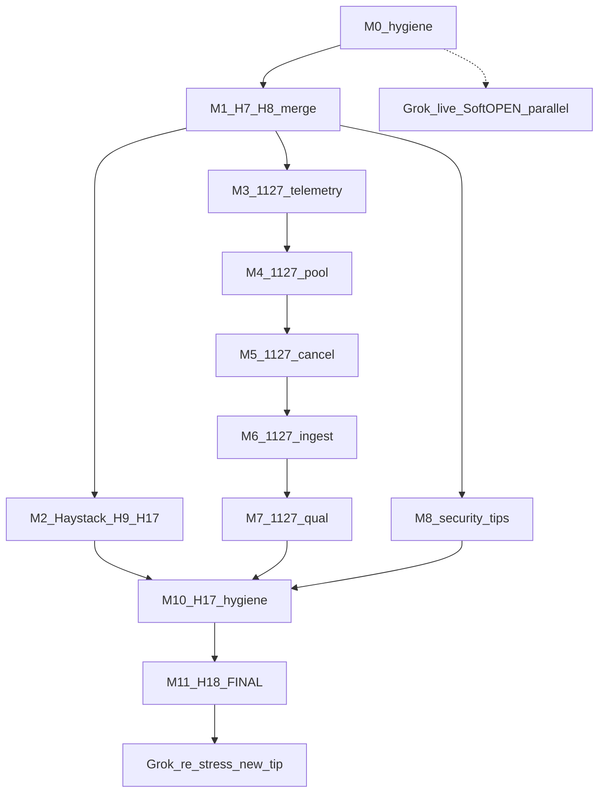

# Master finish train → H18 GHCR closeout (2026-10-04)

**Status:** **DONE** (2026-10-04). Tip `sha-215e159` / **3.5.65**. Cursor product train stopped. **Left = Soft-OPEN / Grok live only** (see handoff) — not unchecked M0–M11.

**Supersedes as finish orchestrator (do not duplicate work blindly):**
- [`.cursor/plans/haystack_rdf_sparql_c2c6_audit_train_20261004.plan.md`](haystack_rdf_sparql_c2c6_audit_train_20261004.plan.md) — H0–H6 done; H7–H18 leftover sequence absorbed here; **H18 moved to train-final**
- [`.cursor/plans/issue1127_memory_ingest_resilience_sol61_20261004.plan.md`](issue1127_memory_ingest_resilience_sol61_20261004.plan.md) — full Sol audit (present; not reconstructed)
- [`.cursor/plans/patch_all_open_issues_master.plan.md`](patch_all_open_issues_master.plan.md) — prior mega train; `sha-4251505` GHCR done; Grok Soft-OPEN still pending
- [`.cursor/plans/pr_haystack_rdf_track_wrapper.plan.md`](pr_haystack_rdf_track_wrapper.plan.md) — C1–C3 historically landed; C4–C6 still open via audit train
- [`.cursor/plans/security_profiles_post5d_astra_20261003.plan.md`](security_profiles_post5d_astra_20261003.plan.md) — Soft-OPEN leftovers only (#999 live / Nessus / AF auth)
- Agent store: `docs/grok-handoff-sha-4251505.md` · `internal/haystack-audit-train-progress.md`

## Snapshot at plan write (2026-10-04)

| Item | Value |
| --- | --- |
| `origin/master` tip | `5591410a5ae2393748898c78b5c86eee60af3991` — #1126 C3 audit repair merged |
| Dirty primary checkout | `/home/ben/Desktop/open-fdd` at `4251505c` on local `master` — **do not reset** |
| Prior GHCR Soft-OPEN pin | `sha-4251505` / VERSION **3.5.64** (Grok live stress tip; may lag master after #1126) |
| Master VERSION | still **3.5.64** on `5591410a` (no bump yet for Haystack tips) |
| Open PRs | **#1128** H7 CAS · **#1129** H8 central RDF · **#1133** security gate false-green |
| Open issues | **14** (see triage table) |
| Worktrees | `.worktrees/haystack-c2-cas-1000` @ `ec2a18a3` · `.worktrees/haystack-c4-central-rdf-1002` @ `67561681` |
| #1127 evidence | `reports/issue1127_memory_audit_20261004/` present (metrics SHA-256 `79c8cef3…`) |
| Bot review noise | CodeRabbit on #1128/#1129 (actionable CAS/cache notes); no separate “Grokbot” GitHub login on open issues — Soft-OPEN asks are operator/Grok comments under #999/#1070/#1125/#1127 |

## Goal

Finish remaining Cursor-owned product work (Haystack audit leftovers + #1127 memory/ingest resilience + security false-green tip + triage), run H17-style hygiene, then execute **H18-style closeout once**: tiny VERSION bump → GHCR publish → newest-by-created pin → delete train branches → free bensbench disk via aggressive `cargo clean` / worktree `target/` removal. Hand live Soft-OPEN stress back to Grok. No FQ claim from this train alone.

## Hard locks

1. **Planning file is authoritative** for later execution; this task was plan-only.
2. **H18 is FINAL** — only after Haystack leftovers green **and** #1127 non-substitutable acceptance **and** Cursor-blocking Soft-OPEN engineering (#1133 + decided header tips) meet their gates. Mid-Haystack VERSION/GHCR is forbidden.
3. **Local-first verify OK**; do not block every tip on `gh pr checks --watch`. Glance PR-event; merge when convenient. H17 hygiene before H18.
4. **bensbench:** one `cargo` at a time; `cargo clean` after verify batches; no local stack `docker build`.
5. **Preserve dirty primary checkout**; implement only in worktrees.
6. **Cookbooks sacred**; no casual `[docs-guard-bypass]`; Haystack docs stay under modeling/ops/spec.
7. **#1127 acceptance quotes (cannot substitute):**
   - *Correct output ≠ memory release*
   - *Timeout ≠ cancellation*
   - *Actions delete ≠ worker death*
8. **MQTTS durability** and **local HTTP 200 + Committed + positive `persisted_rows`** must not regress; broker PubAck / client enqueue is not the commit oracle.
9. **Grok owns live Soft-OPEN stress** (MEGA, gate39/#1070, live AF/Nessus, FQ) unless operator reassigns. **Cursor owns impl + local/CI verify.**
10. Never `docker compose down -v`; never delete `workspace/`; never print secrets.

## Wall-clock sequence

```text
M0     Hygiene inventory (now)
M1     Haystack H7+H8 merge (#1128/#1129)
M2     Haystack H9–H17 leftovers
M3–M7  #1127 phases P0→P4 (telemetry → pool → cancel/materialize → durable ingest → pressure/qual)
M8     Soft-OPEN security Cursor tips (#1133, #1130–#1132 triage)
M9     Other-issue triage comments
M10    H17 hygiene (branches/Actions)
M11    H18 FINAL VERSION + GHCR + pin + disk clean + Grok handoff
```

Haystack and #1127 may parallelize in **separate worktrees** after M1 lands H7/H8 foundations, but **H18 waits for both**. Soft-OPEN live Grok work runs in parallel and **does not block H18**.



---

## Track 1 — M0 Hygiene now

**Do immediately at execution start (still no product edits beyond inventory comments if needed):**

1. Re-list open PRs/issues/Actions failures/worktrees; refresh SHAs vs this snapshot.
2. Cancel superseded duplicate Actions runs (keep tip-head diagnostics).
3. Confirm primary `/home/ben/Desktop/open-fdd` remains dirty/untouched.
4. Confirm worktrees:
   - H7: `.worktrees/haystack-c2-cas-1000` → `feat/haystack-c2-cas-lifecycle-1000` @ `ec2a18a3`
   - H8: `.worktrees/haystack-c4-central-rdf-1002` → `feat/haystack-c4-central-rdf-1002` @ `67561681`
5. Note failed tip Actions on #1129 (Rust Stack CI + AppSec / Security+qualification) — must be fixed before merge.
6. Do **not** delete user’s dirty files or prune `workspace/`.

---

## Track 2 — Haystack finish (M1–M2)

**Source progress:** `internal/haystack-audit-train-progress.md` (reboot checkpoint). Child detail remains in the C2–C6 audit train plan; this master only orchestrates leftovers.

### Already done (do not redo)

| Step | Evidence |
| --- | --- |
| H0–H1 | plan lock + source verify |
| H2–H6 C3 | **merged #1126** @ `5591410a` |
| H7 local | CAS in `semantic_meta.rs`; edge clippy + `semantic_meta::` 9/9; PR **#1128** open |
| H8 code | central dataset routes + edge dataset; SPARQL/catalog honest **501 UNAVAILABLE**; PR **#1129** open |

### M1 — close open Haystack PRs

1. **#1128 H7** — CI currently green (as of plan write). Address CodeRabbit majors that are real (delete-order head-before-tip; parent `sync_all` after rename) if still open; merge; delete remote+local branch/worktree.
2. **#1129 H8** — **resume first:**
   ```bash
   cd .worktrees/haystack-c4-central-rdf-1002
   cargo clippy -p openfdd-central --bin openfdd-central -- -D warnings
   cargo test -p openfdd-central --bin openfdd-central haystack_rdf::
   ```
   Fix CI failures (clippy unused method noted by CodeRabbit; Security+qualification unit tests). Fix cache key to include inventory/tenant if still valid. Merge when tip green; delete branch/worktree.
3. Rebase/stack later tips onto post-merge master. Option B `UNAVAILABLE` **cannot** close #1002 — H9+ required.

### M2 — H9–H17 leftovers (from audit train)

Execute remaining audit-train todos in order (detail + KATs live in the child plan):

| ID | Work | Closes toward |
| --- | --- | --- |
| H9 | Server SPARQL templates → typed binding contract | #1002 / #1123 |
| H10 | One DataFusion FDD path + one Python ECM path on bindings | #1002 |
| H11 | History/#1017 bind approved provider/series only | #1002 / #1017 Soft-OPEN bind |
| H12 | ZIP→RDF/SPARQL→bindings→Parquet integration KATs; dual-tenant ACL; decoy negatives | #1123 |
| H13 | Gate-36 required-set + negatives (no soft greenwash) | #1003 |
| H14 | Perf budgets then measure; skipped large = PARTIAL | #1003 |
| H15 | C6 candidate tip smoke + rollback; close #997 only with evidence | #1004 / #997 |
| H16 | Docs/skills/ADR/profile/SESSION_LOG/MILESTONES (history preserved) | — |
| H17 | Push all tips; fix Actions; merge; delete branches (**stop before H18**) | — |

**Architecture locks preserved:** `openfdd_package_v1` ZIP authoring; MQTTS first-class; RDF derived from committed authority + pinned Haystack defs; cookbooks untouched; edge prototype ≠ package graph.

**Issue state note:** #1000/#1001 closed early by prior tips; audit train may keep conformance Soft-OPEN under #1123/#997 until H12–H15 evidence is real — do not greenwash closed children.

---

## Track 3 — #1127 memory + ingest resilience (M3–M7)

**SoT:** full plan [`issue1127_memory_ingest_resilience_sol61_20261004.plan.md`](issue1127_memory_ingest_resilience_sol61_20261004.plan.md) · handoff [`.cursor/agents/issue1127_memory_ingest_resilience_handoff.md`](../agents/issue1127_memory_ingest_resilience_handoff.md) · published audit [issuecomment-5981855374](https://github.com/bbartling/open-fdd/issues/1127#issuecomment-5981855374).

**Verdict lock:** cause **UNKNOWN**; memory pressure **strongly supported** (24 GB Railway ceiling hit); source defects independent and must be fixed. Raising RAM alone is not the plan.

**Deployed incident tip:** `4251505c…` / 3.5.64. Relevant memory/session/admission/ingest paths unchanged on master `5591410a` (Haystack projection only). Locked: DataFusion 55.1.0, Arrow/Parquet 59.3.0, Tokio 1.53.1.

### Phase count: **5 bounded implementation phases** (+ evidence + qual/smoke)

Mapped to Sol sequence (do not reorder casually):

| Phase | Master todo | Sol todos | Deliverable |
| --- | --- | --- | --- |
| **P0** | M3 | `incident-evidence` + observability slice of bootstrap | Preserve metrics; seek exit/OOM reason; cheap resource/task/small-file telemetry |
| **P1** | M4 | `governor-bootstrap` + `shared-compute` | cgroup discovery; explicit envelopes; **one aggregate DF pool**; process-wide admission; wire unused `OPENFDD_DATAFUSION_*` tuning with clamping |
| **P2** | M5 | `cancellation` + `bounded-materialization` | Worker-owned cancel; stream bulk; row+**byte** budgets; import admit-before-staging |
| **P3** | M6 | `durable-ingest` (+ absorb #1125) | Bound queues; compact live receipts; correct MQTT transport/app ACK; spool only after declared durability; fix dual-local receipt tenant scope |
| **P4** | M7 | pressure + `qualification` | Adaptive defer/protect-ingest; isolated combined-load qual; **then** operator-controlled candidate smoke |

### Non-substitutable acceptance (must appear in PR evidence)

Quote in every #1127 tip checklist:

> Correct output alone does not prove memory release. A timeout response alone does not prove cancellation. Building SessionBook flags and deleted/reclaimed Actions do not prove worker termination.

Required gate classes (full table in Sol plan): discovery fixtures · aggregate pool · effective tuning · real admission · cancellation with ownership witnesses · spill/failure · materialization bytes · analytics correctness gold · durable ingest under contention · long-lived receipt state · deployment capacity matrix. HTTP 200 / capacity gate 24 / AFDD flood gate 19 **cannot** substitute.

### Contract preservations

- Local HTTP **200 + Committed + positive `persisted_rows`**; **202/503** keep edge spool.
- MQTT: broker accept / client enqueue ≠ historian commit.
- Canonical Parquet + shared writer thread; no pandas product fallback.
- Tenant/building isolation and type-first equipment selection unchanged.

### Execution constraints

- Isolated worktree; bounded PRs; coordinate with Haystack tips (rebase, don’t war).
- Heavy Rust verify on CI capacity when bensbench disk tight; still one local cargo at a time + clean.
- No Railway limit change as “fix”; higher RAM may be temporary ops mitigation only after gates.

---

## Track 4 — Soft-OPEN / Grok / security (M8)

### Cursor-owned (blocking for H18 if still open)

| Item | Action |
| --- | --- |
| **#1133** | Merge when green — refuse false greens from gates 25/25b/26 (#999 Phase-1 verdict integrity). CI green at plan write. |
| **#1130 / #1131 / #1132** | ZAP Medium/Low on `sha-4251505`: CSP `style-src unsafe-inline`, Google Fonts missing SRI, HSTS absent on `/api/analytics`. Prefer small product/header tips before H18; if deferred, Soft-OPEN with explicit evidence and **not** treat as FQ blockers. |
| Astra engineering | #1113–#1121 already merged per prior master; do not reopen. Remaining R04 Nessus strictness / live AF scanner-origin `/api/auth/me` = tooling Soft-OPEN under #999. |

### Grok-owned parallel — **does NOT block H18**

| Item | Why parallel |
| --- | --- |
| Live tip stress / MEGA on current pin | Wall-clock; Cursor ships next tip |
| **#1070** gate39 ≥24h publish-ledger | Soft-OPEN; instrumentation/soak honesty |
| **#999** live authenticated AF + Nessus license | Operator pen-test comments show scanner-origin `/api/auth/me` still missing; own-building controls empty/soft 200; Nessus license Soft-OPEN |
| FQ / `fully_qualified=true` | Forbidden from merge-only evidence |

**Verdict for parent:** Grok Soft-OPEN **does not block H18**. Cursor must still merge #1133 and finish #1127 acceptance before H18. Live re-stress after H18 pin is Grok’s job on the new tip.

Handoff packet after H18: refresh `docs/grok-handoff-sha-4251505.md` → new sha/semver (do not leave Grok on stale `sha-4251505` after refresh).

---

## Track 5 — Other open issues triage (M9)

**Open issue count at plan write: 14.**

| Disposition | Count | Issues |
| --- | --- | --- |
| **Absorb into this train** | **8** | #997, #1002, #1003, #1004, #1123 (Haystack) · #1127 · #1125 (with #1127 P3) · #999 Cursor slice via #1133 (+ optional #1130–#1132) |
| **Soft-OPEN parallel (Grok / wall-clock)** | **2** | #1070 gate39 · #999 live/Nessus/AF prove (beyond #1133) |
| **Defer with reason** | **3** | #985 community ECM help-wanted · #1010 agent custom rules Soft-OPEN (not tip-proved by `sha-4251505`) · #1130–#1132 if not absorbed as header tips (count in absorb when tips land) |
| **Close as done** | **0** now | None newly closable without evidence; #1000/#1001 already closed (conformance tracked under #1123) |

Refined absorb vs defer for ZAP headers: treat **#1130–#1132 as absorb-preferred** (3) inside M8; if operator chooses Soft-OPEN, move them to parallel and document. Net absorb target **8–11** depending on header choice.

Closed Soft-OPEN that still matter as context (not reopen unless regression): #1064 MT MQTTS tenant env (closed) · prior Wave U stress rows — Grok re-proves on tip, Cursor does not reopen casually.

---

## Track 6 — M10 H17 hygiene + M11 H18 FINAL

### M10 — H17-style hygiene (before any VERSION bump)

- Every train tip has a GitHub PR (no local-only tips).
- Tip-head Actions green; cancel superseded failures; no rotting red on active branches.
- Merge clean tips; `git push origin --delete <branch>`; remove local branches + `git worktree remove`.
- Primary dirty checkout still preserved.
- `cargo clean` in used worktrees; remove leftover `target/` trees aggressively.

### M11 — H18 FINAL closeout gate

**HARD STOP until M1–M10 acceptance checkboxes are true.** Then, with explicit operator go if desired (default: this master plan *is* the go once gates pass):

1. Tiny workspace **patch** `VERSION` bump (3.5.64 → next) + Cargo workspace align so sidebar `semver+shortsha` moves.
2. Merge VERSION tip to master; wait GHCR publish jobs (stack/web/mqtt/fieldbus as applicable) — glance, don’t busy-watch forever.
3. Pin **newest-by-created**, not `:nightly` name sort:
   ```bash
   ./scripts/ghcr_newest_by_created.py openfdd-central openfdd-web openfdd-mqtt openfdd-fieldbus
   ```
4. Document tip SHA/semver; update Grok handoff; **stop product work**.
5. Disk: `cargo clean` everywhere used; `rm -rf .worktrees/*/target` and other lab `target/` dirs; prefer keep `~/.cargo/registry`.
6. **Never** `docker compose down -v` / **never** delete `workspace/`.
7. Grok re-stress on **new** tip; Cursor does not claim FQ.

---

## Open PRs / issues cited

### Open PRs
- [#1128](https://github.com/bbartling/open-fdd/pull/1128) — H7 C2 CAS (`feat/haystack-c2-cas-lifecycle-1000` @ `ec2a18a3`)
- [#1129](https://github.com/bbartling/open-fdd/pull/1129) — H8 C4 central RDF (`feat/haystack-c4-central-rdf-1002` @ `67561681`) — CI red at plan write
- [#1133](https://github.com/bbartling/open-fdd/pull/1133) — security gate false-green refusal (#999)

### Open issues
- [#985](https://github.com/bbartling/open-fdd/issues/985) — community ECM (defer/help-wanted)
- [#997](https://github.com/bbartling/open-fdd/issues/997) — Haystack master tracking
- [#999](https://github.com/bbartling/open-fdd/issues/999) — Security Scan Tooling Soft-OPEN
- [#1002](https://github.com/bbartling/open-fdd/issues/1002)–[#1004](https://github.com/bbartling/open-fdd/issues/1004) — Haystack C4–C6
- [#1010](https://github.com/bbartling/open-fdd/issues/1010) — agent mapping Soft-OPEN (defer)
- [#1070](https://github.com/bbartling/open-fdd/issues/1070) — gate39 Soft-OPEN (Grok)
- [#1123](https://github.com/bbartling/open-fdd/issues/1123) — Haystack audit refinements
- [#1125](https://github.com/bbartling/open-fdd/issues/1125) — dual local ingest receipt scope
- [#1127](https://github.com/bbartling/open-fdd/issues/1127) — Railway memory restarts
- [#1130](https://github.com/bbartling/open-fdd/issues/1130)–[#1132](https://github.com/bbartling/open-fdd/issues/1132) — live ZAP header findings

### Recently merged / closed (context)
- [#1126](https://github.com/bbartling/open-fdd/pull/1126) C3 → master `5591410a`
- [#1000](https://github.com/bbartling/open-fdd/issues/1000)/[#1001](https://github.com/bbartling/open-fdd/issues/1001) closed (conformance still via #1123)

---

## Success definition

- Haystack H7–H17 complete with evidence; #997/#1123 closed or Soft-OPEN with named gaps only.
- #1127 phases P0–P4 landed; non-substitutable cancellation/memory/ingest gates green; #1125 fixed or absorbed with proof.
- #1133 merged; #999 live Soft-OPEN explicitly Grok-owned; ZAP headers fixed or Soft-OPEN.
- No stale open train PRs/branches; tip Actions not rotting red.
- H18: new VERSION + GHCR newest-by-created pin documented; bensbench `target/` cleaned; Grok handoff updated.
- Sacred cookbooks untouched; MQTTS + local Committed contracts intact; no FQ from this train alone.

## Out of scope for this master

- Implementing any tip during the planning pass that wrote this file.
- Competing Open-FDD ontology / cookbook rewrites.
- Claiming confirmed OOM without platform exit evidence.
- Live OT ActiveScan / Nessus license assessment / BACnet writes without human/Grok window.
- Local heavy stack image builds on bensbench.
