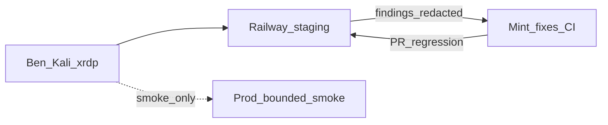

> **SUPERSEDED by Wave U** — do not play. Active master: [`docs/operations/WAVE_U_MASTER.md`](../../docs/operations/WAVE_U_MASTER.md) · [`.cursor/plans/wave_u_security_hardening_master.plan.md`](wave_u_security_hardening_master.plan.md). Retained as historical/child detail only.

---
name: Wave Kali Pen Test Learn
overview: "Separate from Soft park / TTL. Ben drives Kali (xrdp LAN). Staging-first Railway pen test + learning track. Mint implements fixes + regression. Never ActiveScan prod OT; prod = bounded smoke only."
todos:
  - id: k0-setup
    content: "K0: xrdp LAN ready; chmod-600 handoff dir; written scope (staging URL + stop rules)"
    status: pending
  - id: k1-staging-env
    content: "K1: Prefer disposable/staging Railway (or confirm staging); seed Admin + Tenant A/B + Viewer + Agent; identical building IDs"
    status: pending
  - id: k2-surface
    content: "K2: External surface map — public hosts/ports/routes/headers/CORS/security.txt; confirm central/mqtt/mcp private"
    status: pending
  - id: k3-auth
    content: "K3: Auth — login/logout/expiry/rate-limit/enumeration; safe from= redirect; fail-closed JWT/admin config"
    status: pending
  - id: k4-isolation
    content: "K4: HIGHEST — Tenant A↔B IDOR on all data paths; admin-only cross-tenant; no claim elevation"
    status: pending
  - id: k5-api-abuse
    content: "K5: Staging-only API abuse — IDOR/BOLA, uploads, ZIP, XSS, pagination, error leakage"
    status: pending
  - id: k6-mcp-agent
    content: "K6: Agent JWT short-lived/scoped; MCP not browser-reachable; writes need confirm; no token in bundles"
    status: pending
  - id: k7-mqtt
    content: "K7: Staging MQTTS mTLS + ACL — A cert denied on B topics; identity bound server-side"
    status: pending
  - id: k8-supply-chain
    content: "K8: Railway/GHCR/Actions checklist — secrets, digests, public surface, volumes"
    status: pending
  - id: k9-browser
    content: "K9: CSP/HSTS/nosniff/frame/CORS/security.txt; retest V1–V3 pre-auth contracts"
    status: pending
  - id: k10-resilience
    content: "K10: STAGING ONLY — bounded concurrency/rate-limit; no prod DoS; alerts/rollback noted"
    status: pending
  - id: k11-report-retest
    content: "K11: Finding report + Mint fix PRs + regression tests; Soft → CLOSED or stay Soft"
    status: pending
  - id: learn-track
    content: "Learning: PortSwigger/HTB labs parallel; Open-FDD staging as authorized private lab only"
    status: pending
isProject: false
---

# Wave Kali — Railway pen test + learning

**Not** the Data Model TTL tip. **Not** a Soft bug product train. Softs that this closes when green: `kali-zap-af`, `p2c-mqtt-acl-staging` ([wave_s_soft_inventory_parked.md](wave_s_soft_inventory_parked.md)).

**Disposition:** Ben **drives Kali** (xrdp from Mint on LAN). Cursor/Mint **checklists, triage, product PRs, CI regression**. Agent SSH to Kali = optional scripted smoke only — not for teaching or AF scans.

**Skill:** [openfdd_agent_spec/skills/openfdd-mt-security/SKILL.md](../openfdd_agent_spec/skills/openfdd-mt-security/SKILL.md)

## Scope matrix

| Target | Allowed | Forbidden |
|--------|---------|-----------|
| **Staging / disposable Railway** | Full Codex outline (AF ZAP, IDOR, MQTT ACL, abuse, resilience) | Leaking secrets into chat/transcripts |
| **Prod hub** (`openfdd-web-production…`, OPS PINNED) | Bounded smoke: lean health, headers, unauth 401 on V1–V3 routes, auth matrix | ActiveScan, DoS, OT writes, MQTT fuzz, live ACME abuse |
| **Mint isolated candidate** | `run_isolated_zap_af.sh` | Claiming Railway PASS from local |

## K0 — Setup (you now)

- [ ] Kali xrdp + XFCE; Remmina from Mint on LAN
- [ ] Handoff dir chmod 600 (passwords/JWTs file-only — never paste into Cursor)
- [ ] One-page **authorization**: in-scope hosts, out-of-scope (customer OT, third parties), stop rules, staging vs prod
- Children: [wave_kali_learning_track.md](wave_kali_learning_track.md) · [wave_kali_finding_template.md](wave_kali_finding_template.md)

## K1 — Staging identities + seed

- Admin, Tenant A, Tenant B, Viewer, Agent
- Seed **non-sensitive** data; **identical building/object IDs** across A and B (IDOR gold)
- Confirm `multi_tenant=true` on staging

## K2–K4 — Core (do these first)

1. **Surface** — public web only; central/mqtt/mcp private networking
2. **Auth** — rate limit, no enum oracles, safe `from=` redirects
3. **A↔B isolation** — every list/get/export/FDD/analytics/mapping/session/command path; error/timing side channels

Retest must-stay-fixed **V1–V3** (tenants/capabilities/CSP/security.txt).

## K5–K10 — Staging depth

API abuse, MCP/agent, MQTT mTLS+ACL, Railway/GHCR supply chain, browser harden, **staging-only** resilience.

## K11 — Report → Mint → retest

Every finding: template in [wave_kali_finding_template.md](wave_kali_finding_template.md). Mint opens tiny PRs + `preauth_disclosure` / gate 31–34 extensions. Retest on staging; update BUG_REPORT Soft rows.

## Prod smoke (optional, last)

After staging confidence: curl/browser checklist only on prod web — no ZAP AF. Cite health version pin.

## Never

- ActiveScan or load-kill **production** or live ACME OT
- Paste JWT/passwords/PEMs into agent chat or public issues
- Trust agent-supplied `tenant_id` / `building_id` in tool args without server ACL
- Claim bug-bounty credit on Open-FDD unless a public program exists (this is **authorized private lab**)
