> **SUPERSEDED by Wave U** — do not play. Active master: [`docs/operations/WAVE_U_MASTER.md`](../../docs/operations/WAVE_U_MASTER.md) · [`.cursor/plans/wave_u_security_hardening_master.plan.md`](wave_u_security_hardening_master.plan.md). Retained as historical/child detail only.

---
name: Wave S master
overview: "Master Cursor plan for Wave S: security tip 3.5.30 → Camber/ADR → PyPI M&V → data-model/graph/ECM (S5) → SQL twins FQ. Full Railway MEGA FQ only after S1 and S4; mid-tips smoke only. Handoff evidence stays visible until PASS."
todos:
  - id: s1-security-350
    content: "Execute S1: 3.5.30_security_tip plan → GHCR + FQ MEGA"
    status: completed
  - id: s2-create-plan
    content: Execute wave_s2_camber_agent_spec_lock (ADR + Camber + DM-06 matrix) → GHCR + smoke
    status: completed
  - id: s3-create-plan
    content: Soft-OPEN wave_s3_pypi_mv_camber_oracle (PyPI M&V ports) — see BUG_REPORT
    status: cancelled
  - id: s5-data-model
    content: "S5 P1 DONE sha-3cd3745 smoke; Soft-OPEN DM-04..10/ECM/Pages/gate"
    status: completed
  - id: s4-create-plan
    content: Soft-OPEN wave_s4_sql_oracle_twins_fq (SQL/UI/FQ) — see BUG_REPORT
    status: cancelled
isProject: false
---

# Wave S master — security tip + Camber oracle + data model

## How Cursor master / sub-plans work

1. **This file is the master** — tracks order, stress policy, and child links. Do not re-run FQ MEGA from the master itself.
2. **Each child is its own** `.cursor/plans/<name>.plan.md` with its own YAML `todos`. Execute one child at a time (new agent session per child is fine).
3. **To add a child later:** create `wave_sN_….plan.md`, link it in the table below, add a master todo `sN-*`.
4. **Existing child to adopt:** [`3.5.30_security_tip_642cfaaf.plan.md`](/home/ben/.cursor/plans/3.5.30_security_tip_642cfaaf.plan.md) becomes **S1** (do not duplicate its body here — follow that file).
5. **Supersedes leftovers:** [`patch_cycle_3.5.29_openfdd.plan.md`](/home/ben/Desktop/open-fdd/.cursor/plans/patch_cycle_3.5.29_openfdd.plan.md) `xyz-suites` + `evidence-table` → owned by S1.
6. **Data-model handoff:** [`wave_s_data_model_graph_review_handoff.md`](/home/ben/Desktop/open-fdd/.cursor/plans/wave_s_data_model_graph_review_handoff.md) → child **S5** + evidence matrix. Do **not** duplicate S1 or launch an extra FQ MEGA for the handoff alone.

```mermaid
flowchart LR
  S1[S1_security_3.5.30]
  S2[S2_Camber_ADR]
  S3[S3_pypi_mv_oracle]
  S5[S5_data_model_graph_ECM]
  S4[S4_sql_twins_FQ]
  S1 -->|GHCR_plus_FQ_MEGA| S2
  S2 -->|GHCR_smoke| S3
  S3 -->|GHCR_smoke| S5
  S5 -->|GHCR_smoke_model_gate| S4
  S4 -->|GHCR_plus_FQ_MEGA| Done[Wave_S_OPS_PINNED]
```



## Stress policy (optimize cost)

| When | What |
|------|------|
| **Every child tip** | GH hygiene → PR merge → wait GHCR Publish → `check_ghcr_tip_stack.sh` → backup → Railway re-pin → fieldbus up → **ingest live** |
| **S1 and S4 only** | Full `run_railway_hub_stress.sh` + `OPENFDD_SECURITY_EXECUTE=1` → `fully_qualified=true` (gates 19+35+25/25b; 26 N/A OK). S4 **must** include the S5 model/ECM gate. |
| **S2 / S3 / S5** | Smoke only: hub health + edges + optional gate 25 dry-run / one synth spot — **not** FQ MEGA |
| **Never** | Cite older-pin stress for a newer tip; local cargo/docker build on bensbench; Python in product central/web; second FQ just because the data-model handoff arrived |

Hard locks ([`openfdd_agent_spec/ARCHITECTURE.md`](openfdd_agent_spec/ARCHITECTURE.md)): product FDD/analytics = DataFusion SQL; Camber/`open_fdd` pandas = PyPI oracle + stress only. Engineering capacities → `open_fdd.ecm_engineering` outside product HTTP.

---

## Evidence (incomplete stays visible)

**Matrix:** [`wave_s_data_model_evidence.md`](/home/ben/Desktop/open-fdd/.cursor/plans/wave_s_data_model_evidence.md)

Track every handoff requirement (ADR-1, DM-01..10, SEC-ML, JSON-PARITY, SPARQL-SEM, PERF-1, EQ-*, ECM-ADAPT, DOCS-PAGES, STRESS-GATE, UI-MV) with implementation + test artifact. Rows stay **BLOCKED** until tip SHA + command output exist. Missing live SPARQL on central = **unavailable**, not empty-list PASS.

---

## Child plans

### S1 — Security tip 3.5.30 (FQ MEGA)

**Plan file:** [`3.5.30_security_tip_642cfaaf.plan.md`](/home/ben/.cursor/plans/3.5.30_security_tip_642cfaaf.plan.md)  
**VERSION:** `3.5.29` → `3.5.30`  
**Does:** hygiene, stability audit + bug patches, X/Y/Z suite expand, evidence doc, PR, GHCR, re-pin, fieldbus, **FQ MEGA**, agent_spec OPS pin.  
**Exit:** hub `3.5.30+…`, stress dir `fully_qualified=true`, 0 open PRs.

### S2 — Camber lock + data-model ADR (docs tip)

**Plan file:** [`wave_s2_camber_agent_spec_lock.plan.md`](/home/ben/Desktop/open-fdd/.cursor/plans/wave_s2_camber_agent_spec_lock.plan.md)  
**VERSION:** tiny patch `3.5.32` (docs + skill so sidebar moves; 3.5.31 = S1 FQ datasets ACL).  
**Does:**
- Document Camber ([Apache-2.0](https://github.com/yroussev/camber)) as external PyPI-oracle reference — not product runtime
- **ADR** shared vocab vs tenant instances; vendor≠tenant; Parquet/DataFusion for telemetry/FDD; RDF for relationships (handoff §1 / ADR-1)
- **Consumer/route matrix** SPA/central/edge/MCP/exports (DM-06); honest “unavailable” where central lacks `/api/model/sparql`
- Forbidden: Camber in GHCR request path; Camber OT adapters; `camber serve` as product UI

**Stress:** smoke only. **Exit:** ADR + matrix merged; tip pinned; evidence ADR-1/DM-06 rows updated.

### S3 — PyPI M&V / oracle ports (smoke after GHCR)

**Plan file:** [`wave_s3_pypi_mv_camber_oracle.plan.md`](/home/ben/Desktop/open-fdd/.cursor/plans/wave_s3_pypi_mv_camber_oracle.plan.md)  
**VERSION:** `3.5.33` if stress scripts/cookbooks ship in-repo; always bump **PyPI** `open-fdd`.  
**Does:** IPMVP change-point + G14 into `open_fdd.ecm_engineering` / analytics; cookbook + dual catalog; role alias note Camber↔SQL. Align calculator contracts with S5 §7 before forking APIs.  
**Stress:** smoke only. **Exit:** wheel published; Soft-OPEN unfinished Camber families.

### S5 — Data model / graph / engineering quantities (smoke after GHCR)

**Plan file:** [`wave_s5_data_model_graph_ecm.plan.md`](/home/ben/Desktop/open-fdd/.cursor/plans/wave_s5_data_model_graph_ecm.plan.md)  
**Handoff:** [`wave_s_data_model_graph_review_handoff.md`](/home/ben/Desktop/open-fdd/.cursor/plans/wave_s_data_model_graph_review_handoff.md)  
**Evidence:** [`wave_s_data_model_evidence.md`](/home/ben/Desktop/open-fdd/.cursor/plans/wave_s_data_model_evidence.md)  
**VERSION:** `3.5.34` (graph + vocab + gate wire).  
**Does (bounded):**
1. Fix reproduced DM-01/02/03 + permanent regressions; then DM-04..10 / SEC-ML / JSON-PARITY / SPARQL-SEM as scoped in child
2. Engineering quantity vocabulary + package persistence + typed adapter into existing `open_fdd.ecm_engineering`
3. GitHub Pages modeling/ECM docs + agent instruction updates
4. Wire model/ECM stress gate + fix gate 25b “BLOCKED without EXECUTE” hole — **CI + smoke here; FQ only on S4**
5. Measure before claiming PERF-1 wins (baseline table in evidence)

**Stress:** smoke only after GHCR/re-pin. **Do not** FQ MEGA for this tip.  
**Exit:** evidence matrix updated (PASS or visible BLOCKED); model gate callable; tip pinned.

### S4 — DataFusion twins + UI + FQ MEGA closeout

**Plan file:** [`wave_s4_sql_oracle_twins_fq.plan.md`](/home/ben/Desktop/open-fdd/.cursor/plans/wave_s4_sql_oracle_twins_fq.plan.md)  
**VERSION:** `3.5.35` (product SQL + Metering UI).  
**Does:**
1. Thin SQL surface for M&V/change-point covered by S3 oracle
2. Metering / new-radio M&V charts (UI-MV)
3. Stress compare PyPI oracle vs `/api` on same seed
4. Include **S5 model/ECM gate** in FQ MEGA
5. GHCR → re-pin → fieldbus → **FQ MEGA** `OPENFDD_SECURITY_EXECUTE=1`
6. Closeout: BUG_REPORT, agent_spec OPS pin, fill remaining evidence rows

**Exit:** `fully_qualified=true` on tip pin; Wave S master complete.

---

## Execution order (agents)

```text
S1 (FQ) → S2 (smoke) → S3 (smoke) → S5 (smoke) → S4 (FQ + model gate)
```

One child open PR at a time. Mid-wave = smoke. **ONE** enhanced FQ per product milestone (S1 and S4 only). Handoff work rides S2 (ADR/matrix) + S5 (fixes/vocab/Pages/gate) + S4 (FQ evidence).

## Soft-OPEN (do not tip)

Stage C IdP/MFA; Kali ZAP AF; MQTT ACL staging; local BACnet FEC Soft-OPEN; Camber UI/OT/serve; wholesale Camber vendoring into GHCR; RDF-authoritative migration (needs separate contract).

## Anti-patterns

- FQ MEGA after every child tip or solely for the data-model handoff
- Claiming Camber proves product security or product FDD
- Marking PLANNED security routes or empty SPARQL lists as tested PASS
- PyPI oracle deleted because SQL exists (or reverse)
- Inventing capacities/units/parent AHUs to greenwash FDD
