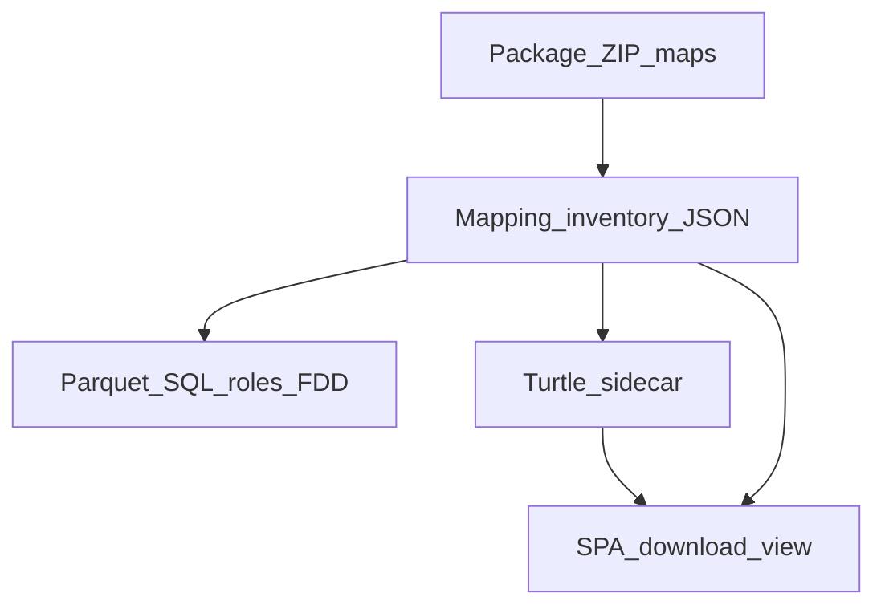

> **SUPERSEDED by Wave U** — do not play. Active master: [`docs/operations/WAVE_U_MASTER.md`](../../docs/operations/WAVE_U_MASTER.md) · [`.cursor/plans/wave_u_security_hardening_master.plan.md`](wave_u_security_hardening_master.plan.md). Retained as historical/child detail only.

---
name: Wave Soft Park + Data Model TTL
overview: "Wave R OPS PINNED stays. Soft-OPEN + MQTT pause remain parked. Active work = Wave S Data Model TTL export/view (sidecar from package inventory, not FDD SoT) + unit tests + docs + ONE mega hub stress closeout."
todos:
  - id: soft-park
    content: Soft-OPEN ≤ Stage C stay parked (IdP/MFA, UTIL, ACME reject, Kali AF, tenant path)
    status: pending
  - id: mqtt-pause-later
    content: Park MQTT edge pause/resume UI (Option A) — see child plan; not this tip
    status: pending
  - id: s1-ttl-builder
    content: "S1: openfdd_data_model_v1 → Turtle builder (TS + mirror Rust/central); vitest/unit"
    status: pending
  - id: s2-spa-export-view
    content: "S2: MappingPage Export TTL + View TTL as text (new tab); keep JSON export/view"
    status: pending
  - id: s3-central-ttl-api
    content: "S3: GET mapping TTL for building (JWT+ACL) from same inventory as JSON; no SPARQL on FDD path"
    status: pending
  - id: s4-docs-tests
    content: "S4: PACKAGE_AUTHORING + Data Model docs; MappingPage/vitest + central tests"
    status: pending
  - id: s5-mega-stress
    content: "S5: tip GHCR + Railway re-pin if central/web changed → ONE run_railway_hub_stress.sh fully_qualified"
    status: pending
isProject: false
---

# Wave Soft Park + Data Model TTL (Wave S polish)

## Locked from Wave R

- Hub **OPS PINNED** `3.5.22` / `sha-4d3a6b0` · stress `reports/nightly-ot-bench_20260916T011952Z/` **`fully_qualified=true`**
- Soft-OPEN ≤ Stage C — **do not** open a Soft bug tip for IdP/MFA, UTIL-INTERVAL, ACME `ingest_reject`, Kali ZAP AF, tenant path migrate
- MQTT pause/resume UI — **parked** (Option A). Child: [wave_s_mqtt_pause_parked.md](wave_s_mqtt_pause_parked.md)

## Architecture lock (non-negotiable)



- **SoT for FDD / AI zips:** package maps → `columns.csv` roles → DataFusion. Unchanged [`docs/agent/PACKAGE_AUTHORING.md`](docs/agent/PACKAGE_AUTHORING.md) pact.
- **TTL / JSON exports:** derived views of the **same** site inventory. Never invent roles in RDF that the zip does not have.
- **SPARQL:** optional later over Oxigraph for model QA only — **not** on FDD/analytics request path this wave.

## Active tip — Data Model TTL export / view

Child plan: [wave_s_data_model_ttl_export.md](wave_s_data_model_ttl_export.md)

Today Mapping already has **Export site data model** (JSON) and **View as text** ([`MappingPage.tsx`](frontend/web/src/pages/MappingPage.tsx) + `buildMappingManifest`).

Add:

1. **Export TTL** — download `data_model_<building>.ttl` (`text/turtle`)
2. **View TTL as text** — `window.open` blob tab (same pattern as JSON view)
3. Projection: `openfdd_data_model_v1` equipment/roles/columns → compact Turtle (`@prefix ofdd:` / `hs:`), one subject per equipment + role triples pointing at column refs
4. Central: `GET` TTL for `building_id` with existing mapping JWT + `allow_building` ACL (agents/MCP can fetch without SPA)
5. Vitest + Rust/central unit tests; docs note “TTL is export-only”

## Soft inventory (parked — no tip)

Child: [wave_s_soft_inventory_parked.md](wave_s_soft_inventory_parked.md)

## Exit (S5)

After S1–S4 merge + GHCR (web and central if API shipped) + Railway re-pin when images change:

```bash
./scripts/nightly-ot-bench/run_railway_hub_stress.sh   # no SKIP_ZAP
```

Cite new `reports/nightly-ot-bench_*` · `fully_qualified=true` · Soft-OPEN still ≤ Stage C · 0 open wave PRs. Update [`BUG_REPORT_WAVE_P.md`](docs/operations/BUG_REPORT_WAVE_P.md) / SESSION_LOG.

## Never

- Replace package maps with Brick/SPARQL for FDD
- Edit `expected_faults.csv` to chase TTL
- Stop fieldbus container in the parked MQTT pause feature (pause streaming only when that wave opens)
- Put Oxigraph SPARQL on Overview / FDD Plots request path
