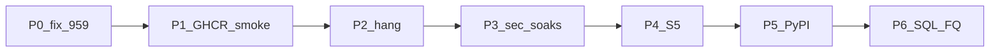

> **SUPERSEDED for Soft-OPEN scheduling** by [`wave_u_remainder_patch_cycles.plan.md`](wave_u_remainder_patch_cycles.plan.md) (V1–V8 remainder cycles after hub FQ). Keep this file for historical Soft-OPEN TODO labels only; do not treat as active master.

---
name: Wave U patch Soft-OPEN closeout
overview: "SUPERSEDED by wave_u_remainder_patch_cycles.plan.md. Historical Soft-OPEN TODOs after #959; [later] items deferred/greyed."
todos:
  - id: p0-ci-959-rust
    content: "BUG ci-959-rust: fix #959 rustfmt/clippy/tests (fieldbus tip)"
    status: completed
  - id: p0-ci-959-fdd
    content: "BUG ci-959-fdd-engine: fix FDD DataFusion Engine CI on #959"
    status: completed
  - id: p0-merge-ghcr-smoke
    content: "Merge #959 → GHCR sha-* → check_ghcr_tip_stack → Railway smoke (no FQ) — owned by Wave U FQ closeout"
    status: cancelled
  - id: soft-acme-fdd-run-hang
    content: "Soft-OPEN acme-fdd-run-hang: root-cause beyond 20m reclaim; ACME FDD terminal + rules_failed=0"
    status: completed
  - id: soft-standalone-https
    content: "REOPENED under independent acceptance audit UA-02: actual standalone candidate, verified TLS and peer exposure; prior component soak retained"
    status: pending
  - id: soft-fieldbus-failclosed
    content: "Soft-OPEN fieldbus-mgmt-failclosed: prove non-loopback without key refuses"
    status: completed
  - id: soft-mqtt-acl
    content: "REOPENED under UA-03/08: required live observer, real product-generated ACL/identity and effective key permissions"
    status: pending
  - id: soft-zap-af
    content: "REOPENED under UA-04: actual candidate authenticated coverage, evaluated scanner outcomes and artifact hygiene"
    status: pending
  - id: soft-trivy
    content: "REOPENED under UA-05: scan acquisition exists; remediate and verify required image findings before readiness acceptance"
    status: pending
  - id: soft-nessus-readiness
    content: "REQUIRED now under UA-06/08/09: license-free readiness and importer validation; only actual licensed scan is BLOCKED"
    status: pending
  - id: soft-mt-breadth
    content: "PARTIAL under UA-07: finish required tenant-route matrix and real tenant_ids identity validation"
    status: pending
  - id: soft-s5-dm
    content: "PARTIAL under UA-10: retain DM-04/05 delivery; reconcile DM-06..10 and remaining graph/ECM/Pages obligations"
    status: pending
  - id: soft-s3-pypi
    content: "PARTIAL under UA-10: math delivery retained; published wheel and clean install/twin acceptance still required"
    status: pending
  - id: soft-s4-sql-fq
    content: "Soft-OPEN wave-s4-sql-twins-fq — owned by Wave U FQ closeout"
    status: cancelled
  - id: soft-oa-t-dup
    content: "Soft-OPEN acme-oa-t-dup-reject: ops catalog dual oa_t cleanup (vim-1)"
    status: completed
  - id: soft-p2c-mqtt
    content: "REOPENED: folds into UA-03 product broker ACL qualification, not fixture-only semantics"
    status: pending
  - id: later-nessus-assessment
    content: "[out of scope] Soft-OPEN nessus-isolated-assessment — no Nessus license yet"
    status: cancelled
  - id: later-stage-c-idp
    content: "[later] Soft-OPEN stage-c-idp-mfa-sku: commercial IdP/MFA"
    status: cancelled
  - id: later-o1-tenant-path
    content: "[later] Soft-OPEN wave-o1-tenant-path-migrate: optional tenants/{tid}/ paths"
    status: cancelled
  - id: later-historian-scale
    content: "[later] Soft-OPEN historian-n-building-scale: Parquet compaction"
    status: cancelled
  - id: later-local-bacnet
    content: "[later] Soft-OPEN local-bacnet-ot-bench: FEC/MS/TP shared trunk when FEC online"
    status: cancelled
  - id: later-edge-kit
    content: "[later] Soft-OPEN edge-kit-soft: kit restore ops"
    status: cancelled
isProject: false
---

# Wave U patch + Soft-OPEN closeout (this go-around)

> **SUPERSEDED** by Wave U post-merge FQ closeout (`~/.cursor/plans/wave_u_fq_closeout_d8895d5d.plan.md`). Keep this file for Soft-OPEN history only — do not execute as active master. Nessus rows stay cancelled (no license).

**TODO convention:** Soft-OPENs already CLOSED are `completed`. Remaining tip/Trivy/MEGA owned by the FQ closeout plan (`cancelled` here). Deferred Stage C / OT = `cancelled` + `[later]`.

## Context

- **Master:** [`docs/operations/WAVE_U_MASTER.md`](../../docs/operations/WAVE_U_MASTER.md)
- **Open tip:** [#959](https://github.com/bbartling/open-fdd/pull/959) `3.5.34` — CI FAIL (rustfmt/clippy, fdd-engine)
- **FQ OPS PINNED:** `3.5.31` / `sha-7b81eb8` until MEGA FQ tip
- Tracker: [`BUG_REPORT_WAVE_P.md`](../../docs/operations/BUG_REPORT_WAVE_P.md)

## Bugs (required this go-around)

| ID | Work |
|----|------|
| ci-959-rust | Green rustfmt/clippy/tests on #959 |
| ci-959-fdd-engine | Green FDD Engine CI |
| acme-fdd-run-hang | Root-cause beyond 20m reclaim |
| acme-oa-t-dup-reject | Ops catalog (vim-1) |

## Soft-OPEN — this go-around (pending TODOs)

Security soaks: `standalone-https-bootstrap` · `fieldbus-mgmt-failclosed` · `mqtt-key-mode-tenant-acl` · `zap-af-authenticated` · `image-digest-trivy` · `sec-harness-mt-breadth`  
(**Acceptance correction 2026-09-20:** `nessus-pass-readiness` remains required without a license; only the actual licensed `nessus-isolated-assessment` is BLOCKED. Read `wave_u_independent_acceptance_audit.plan.md` under the Wave U master before acting on older CLOSED claims.)

Product: `wave-s5-dm-remainder` · `wave-s3-pypi-mv-oracle` · `wave-s4-sql-twins-fq`

Ops: `acme-oa-t-dup-reject` · `p2c-mqtt-acl-staging`

## Soft-OPEN — later (greyed / cancelled TODOs)

`stage-c-idp-mfa-sku` · `wave-o1-tenant-path-migrate` · `historian-n-building-scale` · `local-bacnet-ot-bench` · `edge-kit-soft`  
(Nessus assessment not listed — out of scope until license)

## Tip loop

Hygiene → BUG_REPORT FAIL → fix → VERSION → merge → GHCR → smoke (FQ only on SQL tip).

## Success

- #959 merged + hub smoke
- Every required milestone has measured acceptance evidence; partial implementation and unresolved findings stay visible with an owner and next action.
- Final MEGA must satisfy the independent audit's required gates and candidate-evidence contract; elapsed work or a large CLOSED count does not establish acceptance.
- Complete license-free readiness; actual licensed Nessus remains BLOCKED and must never be invented.
