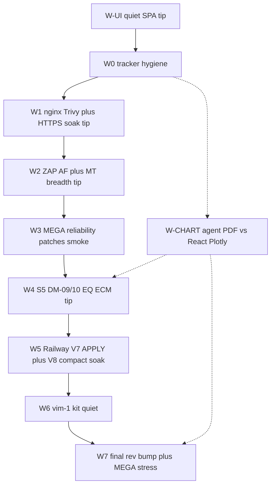

# Wave U post-FQ remainder + patch cycles

**Baseline (do not re-open):** FQ OPS PINNED **sha-7ad6479 / 3.5.43** · stress `reports/nightly-ot-bench_20260921T234148Z/` · `fully_qualified=true` · edge `vim-1`. V7 dual-read + V8 compaction product-landed; #958 Pages cleanup merged.

**Supersedes for scheduling:** [`.cursor/plans/wave_u_remainder_patch_cycles.plan.md`](.cursor/plans/wave_u_remainder_patch_cycles.plan.md) (V1–V8 status table is stale — mark LANDED/CLOSED in MILESTONES as W0).

**Living trackers:** [`docs/operations/BUG_REPORT_WAVE_P.md`](docs/operations/BUG_REPORT_WAVE_P.md) · [`MILESTONES.md`](MILESTONES.md) · [`docs/operations/IMAGE_FINDING_DISPOSITIONS.md`](docs/operations/IMAGE_FINDING_DISPOSITIONS.md)

**Progress snapshot 2026-09-22:** W-UI #980 · W0+ECM #981 · PyPI tag `open-fdd-v4.4.4` (smoke fix #983) · W2 MT tip #982 · ECM plan [ecm_context_hardening.plan.md](ecm_context_hardening.plan.md) · chart parity child [agent_report_chart_parity.plan.md](agent_report_chart_parity.plan.md).

## Inventory — still open

### P1 — patch / security acceptance (actionable)

- **UA-05 / image-digest-trivy** — Dockerfile already `nginx>=1.28.3`; tip Trivy rescan after 3.5.44 GHCR → **W1**.
- **UA-02 / standalone-https-bootstrap** — Product-image soak Soft-OPEN; re-run trusted-CA peer soak on tip → **W1**.
- **UA-04 / zap-af-authenticated** — Disposable AF Soft-OPEN → **W2** (#982 seeds `/api/health`).
- **UA-08/09 readiness** — Live host/runtime evidence incomplete.
- **MEGA reliability** — Gate 00 login 429; `railway_repin_hub.sh` positional TAG **LANDED** (#981).

### P2 — product Soft-OPEN (feature tips)

- **wave-s5-dm-remainder** — DM-09/10 · EQ-VOCAB · ECM-ADAPT → **W4** + ECM context.
- **sec-harness-mt-breadth** — Next batch in **W2** (#982 plant-health routes).
- **wu-pypi-publish-4.4.3** — **CLOSED** (4.4.3 live); **4.4.4** pending publish after #983.
- **agent-report-chart-parity** — PyPI/Typst PDF charts vs React Plotly one-for-one → **W-CHART** (parallel; may PyPI bump).
- **wave-o1 live APPLY** / **historian compact soak** → **W5**.
- **wu-vim1-oa-t-kit** → **W6**.

### Deferred / BLOCKED (document only)

- **U-H** Nessus licensed assessment
- `stage-c-idp-mfa-sku`
- `local-bacnet-ot-bench` (physical FEC)
- Kali learning track (parallel personal — not product FQ)

## Cycle map (execute in order)

W-CHART runs **in parallel** after W0 (does not block W1–W3 security tips). Land chart fixes via PyPI bump; fold agent-spec updates with W4 if timing aligns. Must be closed or honest Soft-OPEN before W7 FQ claim for agent reporting quality.

### W-UI — Quiet product SPA (tip first; before security patch cycles)

Ship a UX tip that makes the React app feel clickable, not documentary:

- Strip froofy grey `oracle-sidebar__caption` under Overview matrices / schedule / weather / anomaly; one title per section.
- Rename schedule block to **Set Building Schedule and Comfort Requirements**.
- Nest Results by Category under Data Model; Sites under Operations radios.
- Left rail: Sites · **CSV Upload** · Units · Lab; Sign in/out by revision; hide `tenant:legacy`.
- No session-restore / AI-agent help panels in the SPA — point humans/agents at GitHub `AGENTS.md`.
- Encode in [`openfdd_agent_spec/AGENTS.md`](openfdd_agent_spec/AGENTS.md) rule 52 + [`openfdd-react-spa`](openfdd_agent_spec/skills/openfdd-react-spa/SKILL.md).
- VERSION patch bump → PR → green Actions → GHCR → smoke; **no mid-cycle MEGA** (still W7).
- Closeout hygiene: zero stale tip PRs/branches; no failed Actions noise.

**Status:** **LANDED** #980 / 3.5.44.

### W0 — Tracker hygiene (docs PR, no VERSION)

- Mark MILESTONES V1–V8 rows LANDED/CLOSED vs residual Soft-OPEN; bump U-G Soft remainders list.
- Banner on old remainder master: SUPERSEDED by this plan.
- Verify `pip index versions open-fdd` / PyPI: close `wu-pypi-publish-4.4.3` or schedule publish in W4.

**Status:** **LANDED** #981 (+ `ecm_context_v1`, railway_repin positional TAG).

### W1 — Image remediations + HTTPS (product tip, patch bump)

- Edit [`frontend/web/Dockerfile`](frontend/web/Dockerfile): delete `nginx-module-*`, install `nginx>=1.28.3` (per dispositions). *(Already in tip Dockerfile — W1 is tip rescan + soak.)*
- VERSION patch bump only if Dockerfile still needs change; else rescan-only.
- Trivy tip rescan under `reports/trivy-wave-u/sha-<7>/`.
- Product HTTPS peer soak on tip; update UA-02/UA-05 rows honestly (Debian/caddy stay TRACKED UNFIXED).
- Railway backup + re-pin + smoke only.

### W2 — ZAP AF execute + MT breadth batch (product tip if harness/routes change)

- Execute disposable authenticated ZAP AF; store report; close or FAIL UA-04.
- Next batch of PLANNED→IMPLEMENTED MT routes in [`scripts/security/inventory/routes.json`](scripts/security/inventory/routes.json) + suite Y (same pattern as V3 buildings/series).
- Smoke; no MEGA unless ACL contract breaks.

**In flight:** #982 (plant-health MT + ZAP seed `/api/health`).

### W3 — MEGA / re-pin reliability patches (product or scripts tip)

- Gate 00: wait/`has_telemetry` or pre-mint admin token before edge assert; avoid login-storm after gate 23.
- [`scripts/railway_repin_hub.sh`](scripts/railway_repin_hub.sh): `TAG="${1:-$OPENFDD_IMAGE_TAG}"` and refuse if unset.
- Optional: raise default gate-00 / post-repin settle time for 300s fieldbus poll.
- Smoke only — **no mid-cycle MEGA**; full stress is reserved for W7.

**Status:** positional TAG **LANDED** (#981); gate-00 backoff residual may still Soft-OPEN until W7 stress recipe.

### W4 — S5 residual tip

- DM-09/10 + EQ-VOCAB + ECM-ADAPT per [`.cursor/plans/wave_u_v5_s5_dm_ecm.plan.md`](.cursor/plans/wave_u_v5_s5_dm_ecm.plan.md) / [ecm_context_hardening.plan.md](ecm_context_hardening.plan.md).
- PyPI publish **4.4.4** (after #983 smoke fix) + any W-CHART bump if chart fixes land same wheel.
- Smoke only.

### W-CHART — Agent report chart parity (PyPI/Typst vs React Plotly)

**Why:** External AI agents build human PDF / Engineering Findings reports via **PyPI** (`open_fdd.reporting` / Typst pipeline). Operators judge chart quality against the **React Plotly** product UI (RCx Plots, Inspect, FDD Plots). Agent charts are close but often weaker — wrong/muted colors, axis mismatches, scatter vs line drift, missing series styling.

**Scope (deep eval, then fix):**

1. Inventory every React Plotly chart (RCx presets, Inspect overlay, FDD series, motors, mixing/econ, mech OAT bins, weather, anomaly if charted) — colors, line styles, axes, units, markers, legends, `downloadFilename`.
2. Inventory every PyPI/Typst/matplotlib/plotly figure used in agent PDFs / Findings — same fields.
3. Build a **one-for-one parity matrix** (chart_id × React path × PyPI path × gap).
4. Permanent tests: color hex / series order / axis titles+units / chart type (scatter vs line vs bar) known-answers on synthetic fixtures — do not mark COMPLETE from screenshots alone.
5. Fix PyPI chart theme to match React tokens (shared palette if possible); regenerate Typst PNG embeds.
6. Update agent-spec: [`openfdd-typst-rcx-report`](openfdd_agent_spec/skills/openfdd-typst-rcx-report/SKILL.md), reporting skill if any, [`AGENTS.md`](openfdd_agent_spec/AGENTS.md) / [`docs/ecm/agent-context.md`](docs/ecm/agent-context.md) — agents must prefer parity-locked chart helpers.
7. PyPI version bump + publish when fixes land (may be 4.4.5+ if 4.4.4 already shipped for ECM envelope).

**Child plan:** [agent_report_chart_parity.plan.md](agent_report_chart_parity.plan.md).

**Anti-cheating:** No “looks fine” close. React is the visual SoT for product-facing charts; PyPI must match or document intentional PDF constraints (DPI/page width) with measured tolerances.

### W5 — Railway live soaks (ops; no VERSION unless bugs)

- V7: backup → `scripts/ops/wave_u_v7_tenant_path_migrate.sh` with `CONFIRM_BACKUP=1` on hub buildings ACME / BUILDING_100 / LAKESIDE_ES; dual-read smoke.
- V8: maintenance-window `POST /api/historian/compaction` (hub-admin) on a non-prod window; cite artifact; fail-closed behavior checked.
- Log FAIL before any code tip.

### W6 — OT kit quiet

- Restore/redeploy `ACME__vim-1` kit if `ingest_reject` still climbs post-redeploy; close `wu-vim1-oa-t-kit` when rejects quiet under steady poll.

### W7 — Final platform rev bump + MEGA hub stress (closeout)

**Status `2026-09-22`:** First W7 MEGA on hub tip **`sha-9da9902` / 3.5.45** → **`fully_qualified=false`**. Artifact `reports/nightly-ot-bench_20260922T213831Z/`. Soft-OPEN logged in BUG_REPORT **before** patch tip (do not greenwash). Root causes: (1) gate 35 `pick_edge` → `lab` when edges omitted `site_id`; (2) gate 25 foreign-analytics 10s timeouts under load; (3) gate 37 analytics 502 under load; (4) gate 26 BLOCKED without `OPENFDD_MQTT_ACL_EXECUTE`. Follow-up product+harness tip **3.5.46**; Soft-OPEN stays OPEN until re-MEGA PASS.

Required end of series after W0–W6 Soft-OPEN work is in (or parked with honest FAIL rows):

1. **VERSION patch bump** on master tip (platform revision only if no pending product tip; otherwise fold into the last product tip that already needs a bump) so sidebar/`GET /api/health` shows a new `semver+shortsha`.
2. PR → green Actions → wait GHCR publish for `openfdd-central` / `openfdd-web` / `openfdd-mqtt` / `openfdd-fieldbus` as needed.
3. Confirm tip via `./scripts/ghcr_newest_by_created.py` (not sticky `.env`).
4. Railway **backup** then `railway_repin_hub.sh sha-<tip>` (positional TAG from W3).
5. Smoke: health, `vim-1` online, MV 200, gate 37 if ACME in scope.
6. **Full MEGA** hub stress (same contract as V6 FQ): `./scripts/nightly-ot-bench/run_all.sh` (or the locked MEGA entry used for `20260921T234148Z`) with gates 00/17/25/25b/26 + OT path; settle for 300s fieldbus poll before gate 00. Ensure `OPENFDD_MQTT_ACL_EXECUTE=1` when `OPENFDD_SECURITY_EXECUTE=1`.
7. On `fully_qualified=true`: update OPS PINNED to new `sha-*` / semver in MILESTONES + BUG_REPORT + Railway docs; cite `reports/nightly-ot-bench_<stamp>/`.
8. On FAIL: log Soft-OPEN / FAIL rows before any follow-up tip — do not greenwash.

W7 is the **only** planned full stress in this remainder series (plus one re-MEGA after FAIL patch). Mid-cycle tips stay smoke-only. W-CHART may ship a PyPI bump without forcing a product VERSION bump.

## Patch-cycle rules (unchanged)

- Tiny VERSION bump when product images change; **plus mandatory W7 platform rev bump** before final MEGA even if W1–W6 already bumped (skip double-bump only when the last product tip is the W7 tip and lands immediately before stress).
- PR → green Actions → GHCR `sha-*` → newest-by-created check → Railway backup then re-pin → smoke (health, `vim-1`, MV 200).
- No mid-cycle MEGA; **one** full MEGA at W7 after rev bump + re-pin.
- Log FAIL in BUG_REPORT before fix; never `docker compose down -v` / delete `workspace/`.
- Do not claim readiness VERIFIED while Critical/High unresolved; do not greenwash Debian/caddy TRACKED UNFIXED.

## Deliverables on execute

1. Master plan MD under [`.cursor/plans/`](.cursor/plans/) (this inventory, committed with W0).
2. Per-cycle subplan stubs or sections (W1–W7 + W-CHART) linked from master.
3. Docs PR: MILESTONES + BUG_REPORT Soft-OPEN refresh after each cycle.
4. Product tips only when code/images change; ops soaks cited by artifact path.
5. W7: new OPS PINNED + stress artifact with `fully_qualified=true` (or honest FAIL).
6. W-CHART: parity matrix + permanent tests + agent-spec update + PyPI publish when fixed.
