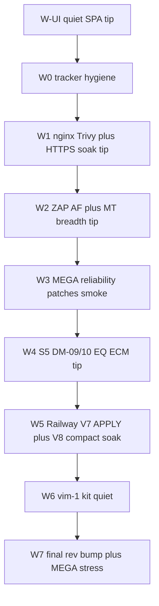

# Wave U post-FQ remainder + patch cycles

**Baseline (do not re-open):** FQ OPS PINNED **sha-7ad6479 / 3.5.43** · stress `reports/nightly-ot-bench_20260921T234148Z/` · `fully_qualified=true` · edge `vim-1`. V7 dual-read + V8 compaction product-landed; #958 Pages cleanup merged.

**Supersedes for scheduling:** [`.cursor/plans/wave_u_remainder_patch_cycles.plan.md`](.cursor/plans/wave_u_remainder_patch_cycles.plan.md) (V1–V8 status table is stale — mark LANDED/CLOSED in MILESTONES as W0).

**Living trackers:** [`docs/operations/BUG_REPORT_WAVE_P.md`](docs/operations/BUG_REPORT_WAVE_P.md) · [`MILESTONES.md`](MILESTONES.md) · [`docs/operations/IMAGE_FINDING_DISPOSITIONS.md`](docs/operations/IMAGE_FINDING_DISPOSITIONS.md)

## Inventory — still open

### P1 — patch / security acceptance (actionable)

- **UA-05 / image-digest-trivy** — Tip Trivy still cites nginx 1.28.2; Debian/caddy TRACKED. Tip: `apk del nginx-module-*` then `nginx>=1.28.3` in [`frontend/web/Dockerfile`](frontend/web/Dockerfile); rescan published tip; update dispositions.
- **UA-02 / standalone-https-bootstrap** — Product-image soak Soft-OPEN on older tip. Re-run trusted-CA peer soak on current tip (or next tip); cite artifact.
- **UA-04 / zap-af-authenticated** — Disposable AF not executed. Run disposable auth AF with `/api/auth/me` + `auth_me_hit`; PASS or FAIL logged.
- **UA-08/09 readiness** — Live host/runtime evidence incomplete. Re-run `host_runtime_probe` + field-only on tip; readiness stays PARTIAL until Critical/High policy met.
- **MEGA reliability** — Gate 00 false-FAIL on login 429; sticky `.env` `OPENFDD_IMAGE_TAG` re-pinned wrong tip. Stress: reuse bearer / backoff before gate 00; [`scripts/railway_repin_hub.sh`](scripts/railway_repin_hub.sh) accept positional `sha-*` or require explicit env (never silent sticky).

### P2 — product Soft-OPEN (feature tips)

- **wave-s5-dm-remainder** — DM-09 PERF · DM-10 versioned projection · EQ-VOCAB · ECM-ADAPT (DM-07/08 done; Pages done via #958).
- **sec-harness-mt-breadth** — Residual PLANNED routes after V3’s +6 IMPLEMENTED.
- **wu-pypi-publish-4.4.3** — Verify PyPI `open-fdd==4.4.3`; close row if live, else publish via existing workflow.
- **wave-o1 live APPLY** — Dual-read landed; Railway `CONFIRM_BACKUP=1` migrate not run.
- **historian-n-building-scale residual** — Railway maintenance-window live compact soak.
- **wu-vim1-oa-t-kit** — Residual `ingest_reject` after redeploy — kit restore / quiet threshold.

### Deferred / BLOCKED (document only)

- **U-H** Nessus licensed assessment
- `stage-c-idp-mfa-sku`
- `local-bacnet-ot-bench` (physical FEC)
- Kali learning track (parallel personal — not product FQ)

## Cycle map (execute in order)

### W-UI — Quiet product SPA (tip first; before security patch cycles)

Ship a UX tip that makes the React app feel clickable, not documentary:

- Strip froofy grey `oracle-sidebar__caption` under Overview matrices / schedule / weather / anomaly; one title per section.
- Rename schedule block to **Set Building Schedule and Comfort Requirements**.
- Nest Results by Category under Data Model; Sites under Operations radios.
- Left rail: Sites · **CSV Upload** · Units · Lab; Sign in/out by revision; hide `tenant:legacy`.
- No session-restore / AI-agent help panels in the SPA — point humans/agents at GitHub `AGENTS.md`.
- Encode in [`openfdd_agent_spec/AGENTS.md`](openfdd_agent_spec/AGENTS.md) rule 52 + [`openfdd-react-spa`](openfdd_agent_spec/skills/openfdd-react-spa/SKILL.md).
- VERSION patch bump → PR → green Actions → GHCR → smoke; **no mid-cycle MEGA** (still W7).
- Closeout hygiene: zero stale tip PRs/branches; no failed Actions noise.

### W0 — Tracker hygiene (docs PR, no VERSION)

- Mark MILESTONES V1–V8 rows LANDED/CLOSED vs residual Soft-OPEN; bump U-G Soft remainders list.
- Banner on old remainder master: SUPERSEDED by this plan.
- Verify `pip index versions open-fdd` / PyPI: close `wu-pypi-publish-4.4.3` or schedule publish in W4.

### W1 — Image remediations + HTTPS (product tip, patch bump)

- Edit [`frontend/web/Dockerfile`](frontend/web/Dockerfile): delete `nginx-module-*`, install `nginx>=1.28.3` (per dispositions).
- VERSION patch bump → PR → GHCR → Trivy tip rescan under `reports/trivy-wave-u/sha-<7>/`.
- Product HTTPS peer soak on new tip; update UA-02/UA-05 rows honestly (Debian/caddy stay TRACKED UNFIXED).
- Railway backup + re-pin + smoke only.

### W2 — ZAP AF execute + MT breadth batch (product tip if harness/routes change)

- Execute disposable authenticated ZAP AF; store report; close or FAIL UA-04.
- Next batch of PLANNED→IMPLEMENTED MT routes in [`scripts/security/inventory/routes.json`](scripts/security/inventory/routes.json) + suite Y (same pattern as V3 buildings/series).
- Smoke; no MEGA unless ACL contract breaks.

### W3 — MEGA / re-pin reliability patches (product or scripts tip)

- Gate 00: wait/`has_telemetry` or pre-mint admin token before edge assert; avoid login-storm after gate 23.
- [`scripts/railway_repin_hub.sh`](scripts/railway_repin_hub.sh): `TAG="${1:-$OPENFDD_IMAGE_TAG}"` and refuse if unset (fixes sticky `.env` clobber seen when targeting 7ad6479).
- Optional: raise default gate-00 / post-repin settle time for 300s fieldbus poll.
- Smoke only — **no mid-cycle MEGA**; full stress is reserved for W7.

### W4 — S5 residual tip

- DM-09/10 + EQ-VOCAB + ECM-ADAPT per [`.cursor/plans/wave_u_v5_s5_dm_ecm.plan.md`](.cursor/plans/wave_u_v5_s5_dm_ecm.plan.md) / child S5 plan.
- PyPI publish if W0 found 4.4.3 missing.
- Smoke only.

### W5 — Railway live soaks (ops; no VERSION unless bugs)

- V7: backup → `scripts/ops/wave_u_v7_tenant_path_migrate.sh` with `CONFIRM_BACKUP=1` on hub buildings ACME / BUILDING_100 / LAKESIDE_ES; dual-read smoke.
- V8: maintenance-window `POST /api/historian/compaction` (hub-admin) on a non-prod window; cite artifact; fail-closed behavior checked.
- Log FAIL before any code tip.

### W6 — OT kit quiet

- Restore/redeploy `ACME__vim-1` kit if `ingest_reject` still climbs post-redeploy; close `wu-vim1-oa-t-kit` when rejects quiet under steady poll.

### W7 — Final platform rev bump + MEGA hub stress (closeout)

Required end of series after W0–W6 Soft-OPEN work is in (or parked with honest FAIL rows):

1. **VERSION patch bump** on master tip (platform revision only if no pending product tip; otherwise fold into the last product tip that already needs a bump) so sidebar/`GET /api/health` shows a new `semver+shortsha`.
2. PR → green Actions → wait GHCR publish for `openfdd-central` / `openfdd-web` / `openfdd-mqtt` / `openfdd-fieldbus` as needed.
3. Confirm tip via `./scripts/ghcr_newest_by_created.py` (not sticky `.env`).
4. Railway **backup** then `railway_repin_hub.sh sha-<tip>` (positional TAG from W3).
5. Smoke: health, `vim-1` online, MV 200, gate 37 if ACME in scope.
6. **Full MEGA** hub stress (same contract as V6 FQ): `./scripts/nightly-ot-bench/run_all.sh` (or the locked MEGA entry used for `20260921T234148Z`) with gates 00/17/25/25b/26 + OT path; settle for 300s fieldbus poll before gate 00.
7. On `fully_qualified=true`: update OPS PINNED to new `sha-*` / semver in MILESTONES + BUG_REPORT + Railway docs; cite `reports/nightly-ot-bench_<stamp>/`.
8. On FAIL: log Soft-OPEN / FAIL rows before any follow-up tip — do not greenwash.

W7 is the **only** planned full stress in this remainder series. Mid-cycle tips stay smoke-only.

## Patch-cycle rules (unchanged)

- Tiny VERSION bump when product images change; **plus mandatory W7 platform rev bump** before final MEGA even if W1–W6 already bumped (skip double-bump only when the last product tip is the W7 tip and lands immediately before stress).
- PR → green Actions → GHCR `sha-*` → newest-by-created check → Railway backup then re-pin → smoke (health, `vim-1`, MV 200).
- No mid-cycle MEGA; **one** full MEGA at W7 after rev bump + re-pin.
- Log FAIL in BUG_REPORT before fix; never `docker compose down -v` / delete `workspace/`.
- Do not claim readiness VERIFIED while Critical/High unresolved; do not greenwash Debian/caddy TRACKED UNFIXED.

## Deliverables on execute

1. Master plan MD under [`.cursor/plans/`](.cursor/plans/) (this inventory, committed with W0).
2. Per-cycle subplan stubs or sections (W1–W7) linked from master.
3. Docs PR: MILESTONES + BUG_REPORT Soft-OPEN refresh after each cycle.
4. Product tips only when code/images change; ops soaks cited by artifact path.
5. W7: new OPS PINNED + stress artifact with `fully_qualified=true` (or honest FAIL).
