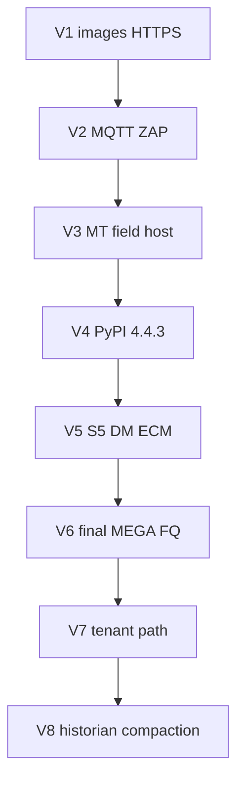

# Wave U remainder — multi-cycle closeout inventory

> **SUPERSEDED 2026-09-22** — Do not schedule from this file. Active master:
> [`.cursor/plans/wave_u_post-fq_remainder.plan.md`](wave_u_post-fq_remainder.plan.md)
> (W-UI → W0–W7). V1–V8 product landings are closed; residual Soft-OPEN continues under W1–W7 /
> [`ecm_context_hardening.plan.md`](ecm_context_hardening.plan.md).

**Living trackers:** [`docs/operations/BUG_REPORT_WAVE_P.md`](../../docs/operations/BUG_REPORT_WAVE_P.md) · [`MILESTONES.md`](../../MILESTONES.md) · audit [`.cursor/plans/wave_u_independent_acceptance_audit.plan.md`](wave_u_independent_acceptance_audit.plan.md)

**SUPERSEDES for Soft-OPEN scheduling:** [`.cursor/plans/wave_u_patch_softopen_closeout.plan.md`](wave_u_patch_softopen_closeout.plan.md) (banner only; historical Soft-OPEN list retained).

## Already done (do not re-open)

- Hub **FQ OPS PINNED:** `sha-1677c33` / **3.5.37** · stress `20260921T021332Z` `fully_qualified=true`
- UA evaluator contract (UA-01/03/04/06/07) + both gate **36** required
- Tip **3.5.38** / `af4086fb` (#966): BACnet CI keys, nginx force-upgrade, trusted-CA stub peer, Trivy absolute paths — **not** OPS-repinned until V6
- Wave S4 SQL twins FQ **CLOSED** on hub tip

## Actionable Soft-OPEN → cycle map

| Soft-OPEN / UA | Cycle | Subplan |
|----------------|-------|---------|
| UA-05 `image-digest-trivy`, UA-02 product HTTPS | **V1** | [`wave_u_v1_images_https.plan.md`](wave_u_v1_images_https.plan.md) |
| UA-03 MQTT product ACL, UA-04 ZAP AF | **V2** | [`wave_u_v2_mqtt_zap.plan.md`](wave_u_v2_mqtt_zap.plan.md) |
| UA-07/08 MT breadth + field/host, `sec-harness-mt-breadth` | **V3** | [`wave_u_v3_mt_field_host.plan.md`](wave_u_v3_mt_field_host.plan.md) |
| `wave-s3-pypi-mv-oracle` / `wu-pypi-publish-4.4.3` | **V4** | [`wave_u_v4_pypi_publish.plan.md`](wave_u_v4_pypi_publish.plan.md) |
| `wave-s5-dm-remainder` | **V5** | [`wave_u_v5_s5_dm_ecm.plan.md`](wave_u_v5_s5_dm_ecm.plan.md) |
| Security/product tip FQ + OPS PINNED | **V6** | [`wave_u_v6_final_mega.plan.md`](wave_u_v6_final_mega.plan.md) |
| `wave-o1-tenant-path-migrate` | **V7** | [`wave_u_v7_tenant_path_migrate.plan.md`](wave_u_v7_tenant_path_migrate.plan.md) |
| `historian-n-building-scale` | **V8** | [`wave_u_v8_historian_compaction.plan.md`](wave_u_v8_historian_compaction.plan.md) |

## Deferred / BLOCKED (not V1–V8)

- **U-H** `nessus-isolated-assessment` — licensed Nessus only
- `stage-c-idp-mfa-sku` — commercial IdP/MFA/SKU
- `local-bacnet-ot-bench` — physical FEC/MS/TP
- **#958 HOLD** — diy-bacnet baud docs

## Patch-cycle rules (V1–V5, V7–V8)

- Tiny VERSION patch bump only when product images change.
- PR → green required Actions → GHCR `sha-*` → `check_ghcr_tip_stack` → Railway **backup then re-pin** → **smoke only** (health, edges=`vim-1`, MV 200).
- **No MEGA mid-cycle.** One optimized MEGA at **V6** only (after V1–V5).
- V7/V8 after V6; no full MEGA unless path/compaction changes ingest/ACL contracts (then targeted gates).
- Log FAIL in BUG_REPORT before fix; preserve #958 HOLD and workspace.

## Order

Execute subplans in order **V1 → V2 → V3 → V4 → V5 → V6 → V7 → V8**. Update BUG_REPORT + MILESTONES after each cycle.

## Pages human cleanup (PR #958)

In flight on `docs/diy-baud-hold-ai-context`:

- Hide `docs/migration/` (+ maintenance/legacy root) from GH Pages; keep in git for agents/MCP
- Merge **API & Security** nav; fix duplicate CSV titles; home field-to-cloud image
- Rewrite Architecture / VAV health / Web App as current-product summaries
- Fix G14 MathJax; expand ECM engineering-calcs formulas; SQL anomaly page under `/rules/`

Do not merge #958 while GHCR publish for tip `f1adfbd` is still running (cancel-in-progress).
