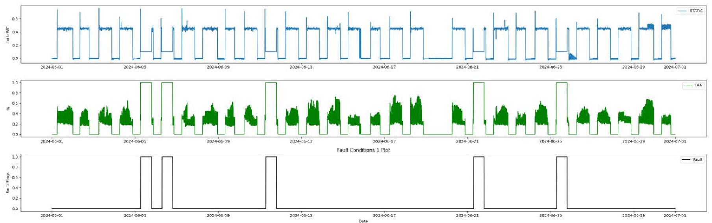

# open-fdd



This is a Python-based Fault Detection and Diagnostics (FDD) tool for running fault equations inspired by ASHRAE and NIST standards for HVAC systems across historical datasets using the Pandas computing library. The tool evaluates various fault conditions and outputs fault flags as boolean columns within typical Pandas DataFrames. These fault flags indicate the presence (True) or absence (False) of specific issues identified by the fault equations. This approach integrates seamlessly into standard data science and computer science workflows, allowing for efficient analysis, visualization, and further processing of fault conditions within familiar data structures like DataFrames.


## Getting Setup
* Some features may be broken or not work as expected while the project is undergoing a significant makeover to become installable from PyPI. The aim is to streamline the reporting processes and make them much easier to use. I appreciate your patience during this transition.

```bash
git clone https://github.com/bbartling/open-fdd
cd open-fdd
```
For now until this project is on PyPI as a Python library install `open-fdd` as a local python library.

```bash
pip install .
```
I am on Windows, using a version of Python 3.12, and run this project on SharePoint drives to make reports. Future examples could be Linux OS on a cloud machine for a more AFDD approach but in Windows OS world.

```bash
py -m pip install .
```

See `README` inside the `air_handling_unit` directory for further instructions. Coming soon more faults and reports for `vav_system` and `central_plants` and examples getting data from SQL databases.

## Contribute
This project is a community-driven initiative, focusing on the development of free and open-source tools. I believe that Fault Detection and Diagnostics (FDD) should be free and accessible to anyone who wants to try it out, embodying the spirit of open-source philosophy. Additionally, this project aims to serve as an educational resource, empowering individuals to learn about and implement FDD in their own systems. As someone wisely said, `"Knowledge should be shared, not hoarded,"` and this project strives to put that wisdom into practice.

Got any ideas or questions? Submit a Git issue or start a Discussion...

## License

【MIT License】

Copyright 2024 Ben Bartling

Permission is hereby granted, free of charge, to any person obtaining a copy of this software and associated documentation files (the "Software"), to deal in the Software without restriction, including without limitation the rights to use, copy, modify, merge, publish, distribute, sublicense, and/or sell copies of the Software, and to permit persons to whom the Software is furnished to do so, subject to the following conditions:

The above copyright notice and this permission notice shall be included in all copies or substantial portions of the Software.

THE SOFTWARE IS PROVIDED "AS IS", WITHOUT WARRANTY OF ANY KIND, EXPRESS OR IMPLIED, INCLUDING BUT NOT LIMITED TO THE WARRANTIES OF MERCHANTABILITY, FITNESS FOR A PARTICULAR PURPOSE AND NONINFRINGEMENT. IN NO EVENT SHALL THE AUTHORS OR COPYRIGHT HOLDERS BE LIABLE FOR ANY CLAIM, DAMAGES OR OTHER LIABILITY, WHETHER IN AN ACTION OF CONTRACT, TORT OR OTHERWISE, ARISING FROM, OUT OF OR IN CONNECTION WITH THE SOFTWARE OR THE USE OR OTHER DEALINGS IN THE SOFTWARE.
