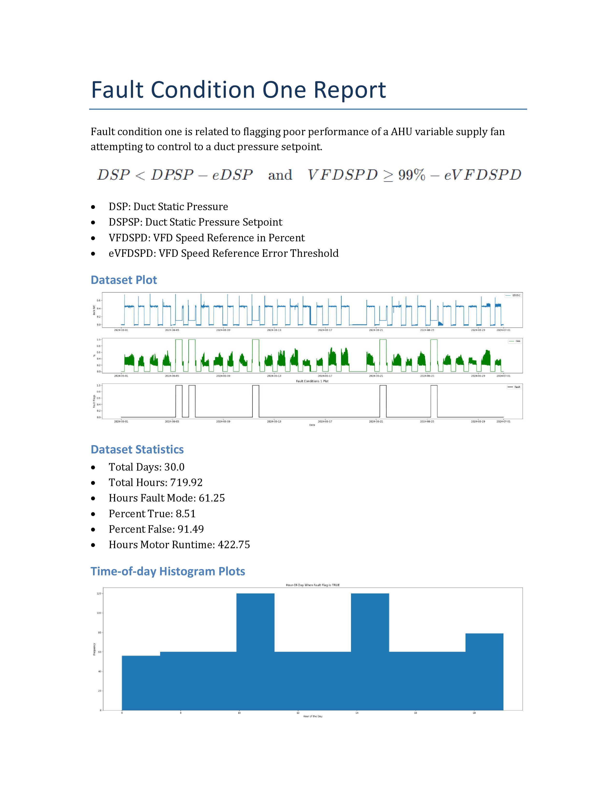

# open-fdd

This is a Python based FDD tool for running fault equations inspired by ASHRAE and NIST for HVAC systems across historical datasets with the Pandas computing library. Word documents are generated programmatically with the Python Docx library.

* See `README` inside the `air_handling_unit` directory for further instructions.

## UNDER ACTIVE DEVELOPMENT - 7/23/24
* Some features may be broken or not work as expected while the project is undergoing a significant makeover to become installable from PyPI. The aim is to streamline the reporting processes and make them much easier to use. We appreciate your patience during this transition.

**GOALS** 
1. Update AHU fault rules to be a Combined condition check, see Git Issue
2. Update unit tests for Combined condition check
3. Publish as a Python library to PyPI
4. Ultimate goal is to be able to make reports like this below with `pip` and `pandas`


## Example Python script for flagging faults and monthly reports
* See sub directory `air_handling_unit` for more specific information.
```python
import pandas as pd
import os
from air_handling_unit.faults.fault_condition_one import FaultConditionOne
from air_handling_unit.faults.fault_condition_two import FaultConditionTwo
from air_handling_unit.faults.fault_condition_three import FaultConditionThree
from air_handling_unit.reports.report_fc1 import FaultCodeOneReport
from air_handling_unit.reports.report_fc2 import FaultCodeTwoReport
from air_handling_unit.reports.report_fc3 import FaultCodeThreeReport
from air_handling_unit.faults.helper_utils import HelperUtils

# Load your data
ahu_data = r"C:\Users\bbartling\Documents\WPCRC_Master_Mod.csv"
df = pd.read_csv(ahu_data)

# Convert the timestamp column to datetime and set it as the index
df['timestamp'] = pd.to_datetime(df['timestamp'])
df.set_index('timestamp', inplace=True)

# Print the DataFrame and its columns to verify
print(df)
print(df.columns)

# Configuration dictionary
config_dict = {
    # used for report name
    'AHU_NAME': "MZVAV_1",

    # timestamp column name
    'INDEX_COL_NAME': "timestamp",

    'DUCT_STATIC_COL': "SaStatic",
    'DUCT_STATIC_SETPOINT_COL': "SaStaticSPt",
    'SUPPLY_VFD_SPEED_COL': "Sa_FanSpeed",
    'MAT_COL': "MA_Temp",
    'OAT_COL': "OaTemp",
    'SAT_COL': "SaTempSP",
    'RAT_COL': "RaTemp",
    'HEATING_SIG_COL': "HW_Valve",  
    'COOLING_SIG_COL': "CW_Valve",  
    'ECONOMIZER_SIG_COL': "OA_Damper",
    'SUPPLY_FAN_AIR_VOLUME_COL': "vav_total_flow",

    'SAT_SETPOINT_COL': "SaTempSPt",
    'CONSTANT_LEAVE_TEMP_SP': False,
    'CONSTANT_LEAVE_TEMP_SP_VAL': 55.0,

    'VFD_SPEED_PERCENT_ERR_THRES': 0.05,
    'VFD_SPEED_PERCENT_MAX': 0.99,
    'DUCT_STATIC_INCHES_ERR_THRES': 0.1,
    'OUTDOOR_DEGF_ERR_THRES': 5.0,
    'MIX_DEGF_ERR_THRES': 2.0,
    'RETURN_DEGF_ERR_THRES': 2.0,
    'SUPPLY_DEGF_ERR_THRES': 2.0,
    'DELTA_T_SUPPLY_FAN': 2.0,

    'DELTA_OS_MAX': 7,
    'AHU_MIN_OA_DPR': 0.20,
    'OAT_RAT_DELTA_MIN': 10,
    'AIRFLOW_ERR_THRES': 0.3,
    'AHU_MIN_OA_CFM_DESIGN': 2500,
    'TROUBLESHOOT_MODE': True,
    'ROLLING_WINDOW_SIZE': 5
}

# Convert percentage columns to floats between 0 and 1
percentage_columns = [
    config_dict['SUPPLY_VFD_SPEED_COL'],
    config_dict['HEATING_SIG_COL'],
    config_dict['COOLING_SIG_COL'],
    config_dict['ECONOMIZER_SIG_COL']
]

for col in percentage_columns:
    df[col] = df[col] / 100.0

# Apply rolling average if needed for high frequency 1-minute or less data set
helper = HelperUtils()
df = helper.apply_rolling_average_if_needed(df)

# Initialize Fault Condition Classes
fc1 = FaultConditionOne(config_dict)
fc2 = FaultConditionTwo(config_dict)
fc3 = FaultConditionThree(config_dict)

# Apply fault conditions to DataFrame
df = fc1.apply(df)
df = fc2.apply(df)
df = fc3.apply(df)

# Make reports in one month batches
df['month'] = df.index.to_period('M')
unique_months = df['month'].unique()

# Generate the report for each month
current_dir = os.path.dirname(os.path.abspath(__file__))

for month in unique_months:
    df_month = df[df['month'] == month].copy()
    
    # Create directories for each fault type
    fc1_dir = os.path.join(current_dir, "reports", "fault_code_1", str(month))
    fc2_dir = os.path.join(current_dir, "reports", "fault_code_2", str(month))
    fc3_dir = os.path.join(current_dir, "reports", "fault_code_3", str(month))
    
    os.makedirs(fc1_dir, exist_ok=True)
    os.makedirs(fc2_dir, exist_ok=True)
    os.makedirs(fc3_dir, exist_ok=True)
    
    # Generate report for Fault Condition One
    report_fc1 = FaultCodeOneReport(config_dict)
    report_name_fc1 = f"ahu1_fc1_{month}.docx"
    report_fc1.create_report(fc1_dir, df_month, report_name=report_name_fc1)
    
    # Generate report for Fault Condition Two
    report_fc2 = FaultCodeTwoReport(config_dict)
    report_name_fc2 = f"ahu1_fc2_{month}.docx"
    report_fc2.create_report(fc2_dir, df_month, report_name=report_name_fc2)
    
    # Generate report for Fault Condition Three
    report_fc3 = FaultCodeThreeReport(config_dict)
    report_name_fc3 = f"ahu1_fc3_{month}.docx"
    report_fc3.create_report(fc3_dir, df_month, report_name=report_name_fc3)
```

## Example Monthly Word doc report output for `FaultCodeOneReport`



## Contribute
This project is a community-driven initiative, focusing on the development of free and open-source tools. I believe that Fault Detection and Diagnostics (FDD) should be free and accessible to anyone who wants to try it out, embodying the spirit of open-source philosophy. Additionally, this project aims to serve as an educational resource, empowering individuals to learn about and implement FDD in their own systems. As someone wisely said, `"Knowledge should be shared, not hoarded,"` and this project strives to put that wisdom into practice.

Got any ideas or questions? Submit a Git issue or start a Discussion...

## License

【MIT License】

Copyright 2024 Ben Bartling

Permission is hereby granted, free of charge, to any person obtaining a copy of this software and associated documentation files (the "Software"), to deal in the Software without restriction, including without limitation the rights to use, copy, modify, merge, publish, distribute, sublicense, and/or sell copies of the Software, and to permit persons to whom the Software is furnished to do so, subject to the following conditions:

The above copyright notice and this permission notice shall be included in all copies or substantial portions of the Software.

THE SOFTWARE IS PROVIDED "AS IS", WITHOUT WARRANTY OF ANY KIND, EXPRESS OR IMPLIED, INCLUDING BUT NOT LIMITED TO THE WARRANTIES OF MERCHANTABILITY, FITNESS FOR A PARTICULAR PURPOSE AND NONINFRINGEMENT. IN NO EVENT SHALL THE AUTHORS OR COPYRIGHT HOLDERS BE LIABLE FOR ANY CLAIM, DAMAGES OR OTHER LIABILITY, WHETHER IN AN ACTION OF CONTRACT, TORT OR OTHERWISE, ARISING FROM, OUT OF OR IN CONNECTION WITH THE SOFTWARE OR THE USE OR OTHER DEALINGS IN THE SOFTWARE.
