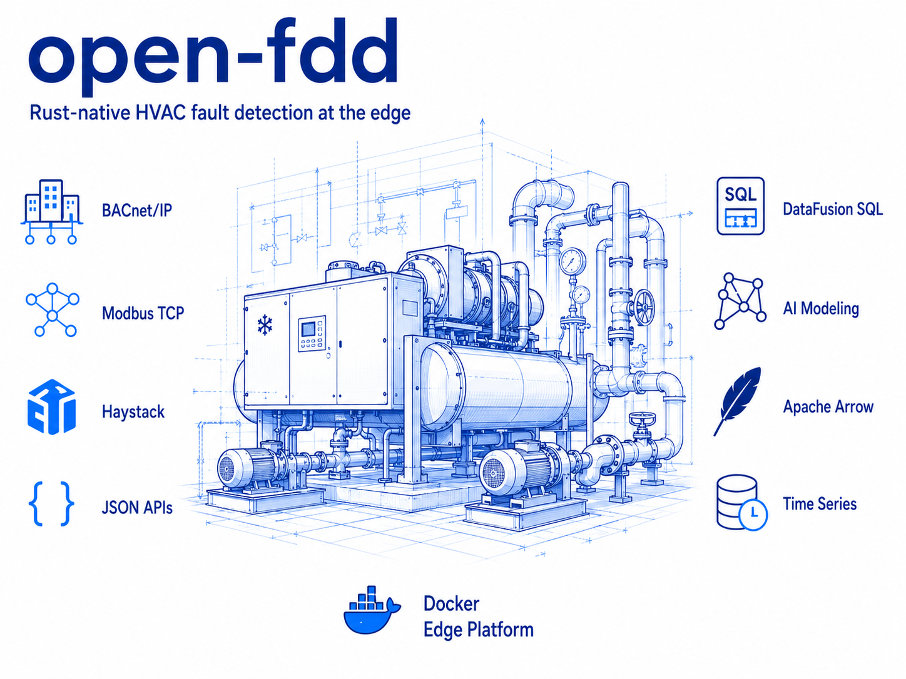

# Open-FDD

<p align="center">
  <a href="https://discord.gg/Ta48yQF8fC"></a>
  <a href="https://github.com/bbartling/open-fdd/actions/workflows/ci.yml"></a>
  
  
  
  
</p>

<p align="center">
  
</p>

<p align="center">
  Open-source HVAC supervisory fault detection for buildings — local-first, on-prem, and vendor-neutral.
  The <strong>3.2 Rust edge</strong> runs as Docker containers: JWT auth, React dashboard, Apache Arrow/Feather historian,
  DataFusion SQL rules, Haystack model layer, and BACnet / Modbus / JSON API / CSV connectors.
</p>

## What Open-FDD is

Open-FDD collects building telemetry at the edge, maps points into a Haystack-oriented model, runs SQL-based fault detection with confirmation delays, and exposes operator dashboards plus CSV/PDF exports. Everything runs on your hardware — no cloud dependency for core FDD.

| Layer | Technology |
| --- | --- |
| Edge runtime | Rust (`edge/`) — API, auth, drivers, historian, FDD |
| Dashboard | React (static assets served by the bridge) |
| Historian | Apache Arrow RecordBatches persisted as Feather |
| FDD engine | DataFusion SQL + time-in-fault confirmation |
| Model | Haystack tags, equipment/point assignments, FDD Wires graph |
| Field buses | BACnet (commission sidecar), Modbus TCP, JSON HTTP sources |
| Bulk data | CSV import/export sidecars |
| TLS (optional) | Caddy reverse proxy in `docker-compose.prod.yml` |
| Container images | `ghcr.io/bbartling/openfdd-edge-rust` (multi-arch amd64/arm64) |

See [architecture overview](docs/architecture/overview.md) and [drivers + FDD](docs/architecture/drivers-and-fdd.md).

<p align="center">
  <a href="docs/README.md"></a>
  <a href="docs/quick-start/rust-edge-bootstrap.md"></a>
</p>

---

## Quick start (Docker / GHCR)

**Canonical image:** [`ghcr.io/bbartling/openfdd-edge-rust`](https://github.com/bbartling/open-fdd/pkgs/container/openfdd-edge-rust)

Images are published through GitHub Actions (`.github/workflows/rust-ghcr.yml`) when changes merge to `master` or when maintainers tag a release. Documentation-only PRs do not require a new image tag.

| Host CPU (`uname -m`) | Docker platform |
| --- | --- |
| `x86_64`, `amd64` | `linux/amd64` |
| `aarch64`, `arm64` | `linux/arm64` |

```bash
curl -fsSL -o /tmp/openfdd_rust_edge_bootstrap.sh \
  https://github.com/bbartling/open-fdd/raw/refs/heads/master/scripts/openfdd_rust_edge_bootstrap.sh
bash /tmp/openfdd_rust_edge_bootstrap.sh --start
```

Open `http://127.0.0.1:8080` and sign in with the **integrator** password from `~/open-fdd/workspace/bootstrap_credentials.once.txt` (one-time plaintext handoff). `workspace/auth.env.local` stores bcrypt hashes only — do not paste those into the login form.

Validate:

```bash
cd ~/open-fdd
./scripts/openfdd_rust_edge_validate.sh
```

### Update an existing site

```bash
cd ~/open-fdd
./scripts/openfdd_rust_site_backup.sh
./scripts/openfdd_rust_site_update.sh
./scripts/openfdd_rust_edge_validate.sh
```

**Never** run `docker compose down -v`. **Never** delete `workspace/`.

Full lifecycle: [Rust site lifecycle](docs/quick-start/rust-site-lifecycle.md).

### Production TLS (Caddy)

```bash
cd edge && cargo run --release --bin openfdd_edge -- auth init --path ../workspace/auth.env.local
chmod 600 ../workspace/auth.env.local
docker compose -f docker-compose.prod.yml up -d --build
./scripts/openfdd_prod_validate.sh
```

HTTPS: `https://127.0.0.1/` (Caddy `tls internal`). Details: [production Caddy](docs/operations/production-caddy.md).

### JSON/CSV-only desktop mode

For laptops without BACnet/Modbus hardware, use the desktop compose profile documented in [local development](docs/deployment/local-dev.md) — drivers can be disabled while historian, model, and SQL FDD remain available.

---

## Local development

```bash
git clone https://github.com/bbartling/open-fdd.git && cd open-fdd
cp .env.example .env

# Option A — Docker (recommended)
./scripts/openfdd_inspection_build.sh --build

# Option B — host Rust + dashboard
cargo test --workspace
cd workspace/dashboard && npm ci && npm run build
docker compose up --build
```

**Auth bootstrap**

```bash
./scripts/openfdd_auth_init.sh --rotate --all --show-secrets --restart
# Plaintext once: workspace/bootstrap_credentials.once.txt
```

**React hot reload (API proxied to bridge :8080)**

```bash
./scripts/openfdd_ui_dev.sh
```

**Local validation profile (generic test bench)**

Use a gitignored profile under `workspace/smoke-profiles/local/*.local.toml` to map your own BACnet, Modbus, JSON API, or Haystack points for testing. Example templates live under `workspace/smoke-profiles/`; local overrides are not committed.

See [live FDD validation (development)](docs/testing/live-fdd-validation.md) and [UI inspection](docs/deployment/local_ui_inspection.md).

### Troubleshooting

| Symptom | Check |
| --- | --- |
| Login fails | Use plaintext from `bootstrap_credentials.once.txt`, not `auth.env.local` hashes |
| Health never ready | `docker compose logs openfdd-bridge` |
| Wrong CPU image | `./scripts/openfdd_rust_check_ghcr_platform.sh` |
| Auth file missing | `./scripts/openfdd_auth_init.sh` or bootstrap `--force-auth` |

Contributor guide: [AGENTS.md](AGENTS.md) · [docs index](docs/README.md)

---

## Dashboard features

| Area | Description |
| --- | --- |
| Dashboard | Building summary, source health, faults, historian status |
| Integrations | BACnet, Haystack, Modbus, JSON API driver trees |
| Model & assignments | Haystack model import, point mapping, FDD Wires |
| SQL FDD rules | Builder + raw DataFusion SQL with confirmation delays |
| Plots | Historian trend export |
| Reports | Report builder with HTML/PDF download |
| Data export | CSV downloads (historian, faults, model points, validation runs) |
| Host / data management | Storage summary, retention, host stats |

---

## AI agent prompts (OpenClaw / Cursor)

| Area | Examples |
| --- | --- |
| **Deploy** | `openfdd_rust_edge_bootstrap.sh`, GHCR platform check, site backup/update |
| **Drivers** | BACnet tree/poll, Modbus scan, JSON API sources |
| **Model & rules** | Haystack model, FDD Wires, DataFusion SQL builder |
| **Operations** | Stack health, override scans, CSV exports |
| **Safety** | No BACnet writes without approval; never `docker compose down -v` |

Guides: [AI agent index](docs/ai-agent/README.md) · [SQL FDD cookbook](docs/rule-cookbook/sql-hvac-fdd.md) · [AGENTS.md](AGENTS.md)

<details>
<summary><strong>Copy-paste: OpenClaw — fresh Raspberry Pi Rust edge bootstrap</strong></summary>

```text
You are OpenClaw on a fresh Raspberry Pi edge host.

Goal: Install Open-FDD Rust edge from GHCR, start Docker, validate health and integrator login.
Do not install from PyPI. Do not use a Python runtime.

Image: ghcr.io/bbartling/openfdd-edge-rust:latest
Bootstrap: https://github.com/bbartling/open-fdd/raw/refs/heads/master/scripts/openfdd_rust_edge_bootstrap.sh
Site root: ~/open-fdd (never delete workspace/)

Steps:
1. Verify Docker and architecture (aarch64 → linux/arm64).
2. curl bootstrap script; bash /tmp/openfdd_rust_edge_bootstrap.sh --start
3. curl -sf http://127.0.0.1:8080/api/health | jq .
4. ./scripts/openfdd_rust_edge_validate.sh
5. Login smoke with integrator password from workspace/bootstrap_credentials.once.txt
   (do not print password or JWT in chat).

When opening PRs for code changes: wait for GitHub Actions green before merge.
This docs-only pass does not publish a new GHCR tag.
```

</details>

<details>
<summary><strong>Copy-paste: OpenClaw — ongoing operator</strong></summary>

```text
You maintain an Open-FDD Rust edge site at ~/open-fdd.

Use integrator JWT on http://127.0.0.1:8080 (or HTTPS via Caddy in prod compose).
Inspect drivers (/api/bacnet/driver/tree, /api/modbus/*, /api/json-api/*),
Haystack model (/api/model/haystack), FDD Wires, and SQL rules (/api/fdd-rules/*).

Safe updates: openfdd_rust_site_backup.sh then openfdd_rust_site_update.sh.

Never: docker compose down -v, delete workspace/, print auth secrets, BACnet writes without approval.
```

</details>

---

## CI and publishing

| Workflow | Purpose |
| --- | --- |
| `ci.yml` | Rust tests, dashboard build, Docker compose smoke |
| `rust-ghcr.yml` | Publish `ghcr.io/bbartling/openfdd-edge-rust` (master + tags) |

PyPI publishing for the retired Python package has been removed. Historical Python-era artifacts remain in git history only — see [docs/archive/python-era.md](docs/archive/python-era.md).

---

## License

MIT — see [LICENSE](LICENSE).

Version: **3.2.0**
