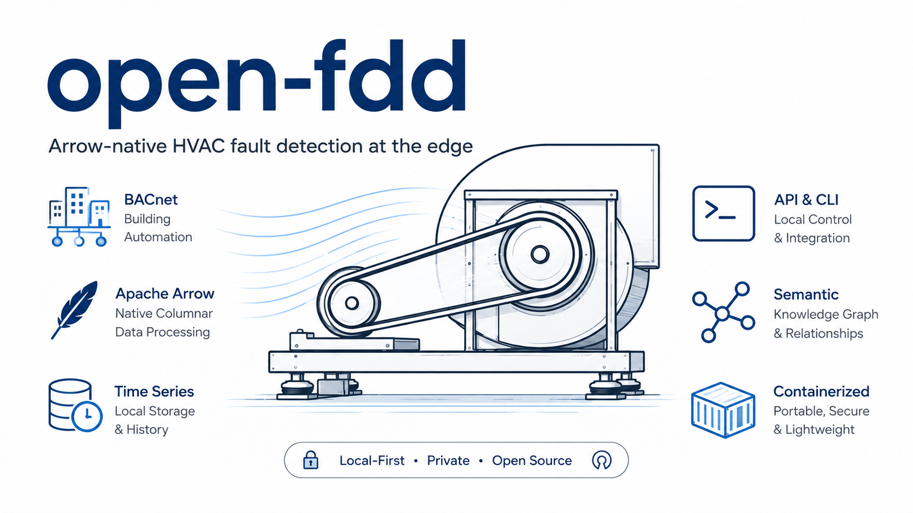

# Open-FDD


[](https://discord.gg/Ta48yQF8fC)

<div align="center">



</div>

Open-FDD is an **open-source knowledge graph for building technology systems**, specializing in **fault detection and diagnostics (FDD) for HVAC**. It helps facilities optimize energy use and cut costs; because it runs **on-premises**, facilities never have to worry about a vendor hiking prices, going dark, or walking away with their data. The platform is an AFDD stack designed to run inside the building, behind the firewall, under the owner’s control. It transforms operational data into actionable, cost-saving insights and provides a secure integration layer that any cloud platform can use without vendor lock-in. U.S. Department of Energy research reports median energy savings of roughly 8–9% from FDD programs—meaningful annual savings depending on facility size and energy spend.

The building is modeled in a **unified graph**: Brick (sites, equipment, points), BACnet discovery RDF, platform config, and—as the project evolves—other ontologies such as ASHRAE 223P, in one semantic model queried via SPARQL and serialized to `config/data_model.ttl`.

---


## Quick Start — Open-FDD AFDD Platform

Open-FDD uses Docker and Docker Compose to orchestrate and manage all platform services within a unified containerized environment. The bootstrap script (`./scripts/bootstrap.sh`) is **Linux only** (tested on Ubuntu Server and Linux Mint, x86; should work on ARM but is untested). Windows is not supported.

### 🚀 Platform Deployment (Docker)

```bash
git clone https://github.com/bbartling/open-fdd.git
cd open-fdd
./scripts/bootstrap.sh
```

This will start the full AFDD edge stack locally. The stack includes Grafana, TimescaleDB, and a Python rules engine built on pandas for time-series analytics; the default protocol is **BACnet** for commercial building automation data. Future releases will add other data sources such as REST/API and Modbus.


### Development: run unit tests

No Docker needed for the test suite. From the repo root:

```bash
python3 -m venv .venv
source .venv/bin/activate
pip install -e ".[dev]"
pytest -v
```

- **`.[dev]`** installs pytest, black, aiohttp, and platform deps so the full suite (open_fdd + HA integration tests) runs.
- Test paths are set in `pyproject.toml` (`open_fdd/tests`, `stack/ha_integration/tests`). Run `pytest` with no path to use them.
- **E2E frontend (Selenium):** `pip install -e ".[e2e]"` then `python scripts/e2e_frontend_selenium.py` with the stack running. All actions via the UI; validates delete-all/reset, create site, import LLM payload, and that Plots/Weather charts are not blank. See [Contributing — E2E](docs/contributing.md#e2e-frontend-tests-selenium).
- Style and workflow: [docs/contributing.md](docs/contributing.md).


---


## AI Assisted Data Modeling

Use the export API and an LLM (e.g. ChatGPT) to tag BACnet discovery points with Brick types, rule inputs, and equipment; then import the tagged JSON so the platform creates equipment by name and links points without pasting UUIDs. For full workflow and **deterministic mapping** (repeatable, rules-style tagging), see [docs/modeling/ai_assisted_tagging.md](docs/modeling/ai_assisted_tagging.md) and [docs/modeling/llm_mapping_template.yaml](docs/modeling/llm_mapping_template.yaml).

**Canonical prompt** (as defined in [docs/modeling/ai_assisted_tagging](docs/modeling/ai_assisted_tagging.md)) — copy-paste this into ChatGPT or your LLM. It is **generic** and works for **any site** (single building, campus, or tenant); the export JSON is the only input that varies.

```text
I use Open-FDD. I will paste the JSON from GET /data-model/export (and optionally my site identifier).

Your job (for any building/site in the export):
1. **Keep every field** from each point (bacnet_device_id, object_identifier, object_name, external_id, point_id if present); add or fill in: brick_type (Brick class, e.g. Supply_Air_Temperature_Sensor — with or without "brick:" prefix), rule_input (short slug for FDD rules, e.g. ahu_sat, zone_temp), polling (true for points that must be logged for FDD, false otherwise), and **unit** when known. Units are important: they appear in the data model (and TTL), and the frontend uses them for axis labels and grouping on the Plots page (e.g. °F for temperatures, % for humidity, 0/1 for binary/status). Use standard abbreviations: degF or °F, percent or %, cfm, mph, W/m², or "0/1" for binary/boolean.
2. Assign points to equipment by name only: use "equipment_name": "AHU-1" or "VAV-1" (do NOT use equipment_id or any UUIDs for equipment).
3. For site_id: use exactly the value from the export. **Important:** Call GET /data-model/export**?site_id=YourSiteName** (or your site name) so the export pre-fills site_id on every row; if you omit that, the export has site_id null and the import will only succeed when there is exactly one site in the database (it will use it automatically). Accepted formats: "site_262dcf0e_b1ec_42ad_b1eb_14881a1516ab" (TTL) or UUID "262dcf0e-b1ec-42ad-b1eb-14881a1516ab".
4. In the "equipment" array (separate from points), use equipment by name and set feeds/fed_by:
   - Each item: "equipment_name": "AHU-1" or "VAV-1", "site_id": "<same site_id as in points>".
   - AHU feeds VAV: use "feeds": ["VAV-1"] or "feeds_equipment_id": "VAV-1".
   - VAV fed by AHU: use "fed_by": ["AHU-1"] or "fed_by_equipment_id": "AHU-1".

Return ONLY valid JSON with exactly two top-level keys: "points" (array) and "equipment" (array). No "sites", "equipments", or "relationships". No placeholder UUIDs — use the site_id from the export and equipment names everywhere. Return the full list of points (recommended) or only those you need for FDD/polling; the import creates or updates only the points you send. If the same external_id appears twice (e.g. two devices with object_name "NetworkPort-1"), the import updates the existing point for that site+external_id; the last row wins.
```


If OpenFDD nails the ontology, the project will be a huge success: an open-source knowledge graph for buildings. Everything else is just a nice add-on.


---

## Online Documentation

[📖 Docs](https://bbartling.github.io/open-fdd/) — For a copy-paste guide to run Open-FDD on Linux hardware.

---


## Dependencies

[pandas](https://github.com/pandas-dev/pandas) · [PyYAML](https://github.com/yaml/pyyaml) · [FastAPI](https://fastapi.tiangolo.com/)  

Optional: [rdflib](https://github.com/RDFLib/rdflib) (Brick TTL), [matplotlib](https://github.com/matplotlib/matplotlib) (viz)

---

## Contributing

Contributions welcome — especially bug reports, rule recipes (see the [expression rule cookbook](https://bbartling.github.io/open-fdd/expression_rule_cookbook)), BACnet integration tests, and documentation. See [docs/contributing.md](docs/contributing.md) for how to get started.

```bash
~/open-fdd$ bash scripts/bootstrap.sh --test
```


---

## License

MIT
