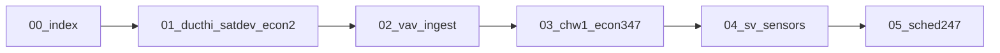

# FDD leftover dump blockers — cycle index

Building 100 dump-vs-dump after `#734`/`#735`/`#736` (`sha-69494c2`): **212 blockers**, all `fdd_findings`. Schema buckets (diurnal/stats/vav_health/rcx) are cleared. These cycles close **pandas vs SQL FDD hours/status**, not dump CSV grain.

Do **not** run this as one mega-PR. Do **not** wait for GHCR / `:nightly` unless a later soak is explicitly requested. Do **not** promise `stop_rule_met=true` or 212→0.

| Order | File | Family | Later PR may change |
| ---: | --- | --- | --- |
| 0 | this file | contract | — |
| 1 | [01_ducthi_satdev_econ2.md](01_ducthi_satdev_econ2.md) | DUCTHI, SATDEV fan-gate, ECON-2 AHU_2 0.25 h | one SQL fan-gate + tiny GHA |
| 2 | [02_vav_ingest.md](02_vav_ingest.md) | VAV-4/6 pandas FAULT / SQL PASS 0 | ingest rank like mad_c |
| 3 | [03_chw1_econ347.md](03_chw1_econ347.md) | CHW-1 hours; ECON-3/4/6/7 | proof pack then one mapping/SQL |
| 4 | [04_sv_sensors.md](04_sv_sensors.md) | SV-* 122 rows | per-sensor vs 5-role SQL |
| 5 | [05_sched247.md](05_sched247.md) | SCHED-247 0 vs ~1500 h | window `%` vs streak, or semantic_gap |

Baseline soak (do not greenwash away): [BUGREPORT_WATTLAB_DUMP_PARITY.md](../../migration/BUGREPORT_WATTLAB_DUMP_PARITY.md).

## Shared test contract (every cycle)

**Synthetic, short, few fault hours** — not Building 100 thousands of hours.

1. Frozen golden: [`scripts/synthetic_59_target_pair_soak.py`](../../../scripts/synthetic_59_target_pair_soak.py) and [`reports/wattlab-parity/fixtures/synthetic_59/openfdd_synthetic_59_rule_fixture_v1/expected_faults.csv`](../../../reports/wattlab-parity/fixtures/synthetic_59/openfdd_synthetic_59_rule_fixture_v1/expected_faults.csv). Package `confirm_min=0`. Target **59/59**. Do **not** edit pandas thresholds so B100 “matches.”
2. GHA: add fixtures in [`crates/fdd_rules/src/oracle_parity_test.rs`](../../../crates/fdd_rules/src/oracle_parity_test.rs) via `write_equipment_fixture`. Pattern: 6 samples × 5 min, `confirm_rows=2`, hours from `pandas_confirm_fault_hours` (see `sched247_fan_cmd_screening_confirm_streak` and ECON competing-column).
3. Classifier: [`tests/test_wattlab_parity_diff.py`](../../../tests/test_wattlab_parity_diff.py). Do not auto-accept FAULT∩FAULT without a one-line rationale in [`scripts/wattlab_parity_diff.py`](../../../scripts/wattlab_parity_diff.py).

**Bensbench low RAM:** no local `docker build`, `openfdd_stack_up.sh --build`, or `cargo test --all`. GHA still runs cargo. **Do not** wait for **Publish Open-FDD stack to GHCR**. Pin `sha-<7>` only on an explicit later soak.

**Do not** mass-edit `ELSE 1` — [FAN_ON_ELSE_1_FOLLOWON.md](../FAN_ON_ELSE_1_FOLLOWON.md). One rule’s fan-gate per cycle.

**Do not** mix [WINDOWS_PLAYGROUND_CLOSEOUT_PROMPT.md](../WINDOWS_PLAYGROUND_CLOSEOUT_PROMPT.md) into these PRs.

## How to execute a cycle

1. Open that cycle `.md` as the spec.
2. Branch from `origin/master`. Implement the smallest SQL/mapping slice + GHA fixture.
3. Wait **Rust CI** (and pytest if Python). Squash-merge.
4. Stop. No GHCR watch, no B100 re-diff unless the user asks for a soak.

## Stop rules

- Blockers drop only when vibe19 and OpenFDD match **or** a row is `accepted` with a written rationale.
- Synthetic-59 must stay 59/59 after every cycle that touches ingest or SQL.
- Catalog `sql_screening` stays until the equation matches pandas on fixtures — do not flip `proven` from B100 hours alone.
