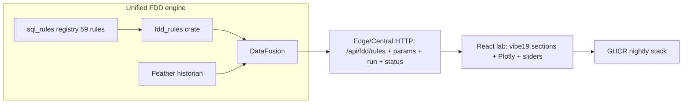

# Vibe19 product parity — monster nightly agent prompt

**Repo:** [bbartling/open-fdd](https://github.com/bbartling/open-fdd)  
**Host:** `/home/ben/open-fdd` (WSL product agent — ships code, not bench validation)

> **Agents:** paste the **compact charter block** below into a new Cursor chat before doing any work. This file is the full turn-key playbook for one monster nightly cycle.

---

## Compact charter block (paste into Cursor)

```
You are the Open-FDD Vibe19 product parity agent on /home/ben/open-fdd.

Charter: ONE monster nightly cycle — drive a PR train (PR-0 → PR-6) until master is green,
GHCR nightlies publish, and issues #502/#481/#482/#483 close. Ship vibe19 look/feel, 59 SQL rules,
registry HTTP APIs, security fixes, and docs. You MAY edit Rust/TS/docs and push PRs.

Sources of truth:
  UX:  /mnt/c/Users/ben/Documents/py-bacnet-stacks-playground/vibe_code_apps_19
  Product: /home/ben/open-fdd

PR train (merge in order; each fully green before next):
  PR-0 bench P0s (#502) → PR-1 registry engine APIs → PR-2 sql_rules 19→59 (#482)
  → PR-3 UI shell → PR-4 Plotly charts (#481) → PR-5 jsonwebtoken 10 + thrift (#483)
  → PR-6 docs + this prompt

Per-PR local gates:
  cargo fmt --all --check && cargo clippy --all-targets -- -D warnings && cargo test
  cargo test -p open_fdd_edge_prototype --lib registry_api
  cargo run -p fdd_cli -- validate/ingest/run-rules (fixture path)
  cd workspace/dashboard && npm run build && npm test
  python3 scripts/cookbook_parity_check.py --all

Loop: push → watch Actions (rust-ci, fdd-engine-ci, ghcr-openfdd-stack test, appsec,
cookbook-parity, docs-pages) → CodeRabbit triage → squash merge → prune → next PR.

NEVER: weaken CI; skip human Workbench gate; auto-merge with failing checks;
claim BACnet PASS without human Workbench of hosted 599999.

After PR-6: verify GHCR nightlies, record SHAs in docker/VERSION_MANIFEST.md,
bench handoff, close #502/#481/#482/#483.

Deferred (out of scope): Energy Model/WattLab, DOCX RCx, live BACnet-fed rule runs.

Acknowledged. Channel: vibe19 parity nightly. Repo bbartling/open-fdd.
```

---

## 1. Title and purpose

**Vibe19 product parity — monster nightly build**

One coordinated nightly cycle that delivers full product parity with the vibe19 Streamlit reference:

| Deliverable | Target |
|-------------|--------|
| **UI look/feel** | React 19 dashboard matching vibe19 sections, sidebar sliders, Plotly charts |
| **SQL rules** | Expand `sql_rules/` from **19 → 59** rules with `CookbookParam` metadata |
| **Unified engine** | `fdd_rules` + DataFusion on historian Feather; registry HTTP APIs on edge/central |
| **Security** | `jsonwebtoken` 10 migration, thrift advisory triage, JWT on `/api/fdd/*` |
| **Docs** | API contract, cutover plan, this turn-key prompt |
| **GHCR nightlies** | Four-image stack (`central`, `ui`, `fieldbus`, `mqtt`) publish green on `master` |

Success = PR train merged in order, all CI green, fresh `:nightly` images verified, bench handoff posted, linked issues closed.

---

## 2. Sources of truth

### UX / UI / rules reference

**Path:** `/mnt/c/Users/ben/Documents/py-bacnet-stacks-playground/vibe_code_apps_19`

| Asset | Location |
|-------|----------|
| Streamlit app + pandas + Plotly | `vibe_code_apps_19/` |
| 59 validated `CookbookRule`s | cookbook modules |
| Dashboard contract | `vibe19_agent_spec/docs/DASHBOARD_CONTRACT.md` |
| Plot catalog | `vibe19_agent_spec/docs/RULE_PLOT_CATALOG.md` |
| `CookbookParam` slider schema | rule definitions |
| `confirm_fault` flow + operational gates | rule runner |

When in doubt about layout, chart types, parameter sliders, or rule semantics — **read vibe19 first**, then port to React/Rust.

### Product repository

**Path:** `/home/ben/open-fdd`  
**Remote:** `https://github.com/bbartling/open-fdd`

| Asset | Location |
|-------|----------|
| React 19 + Plotly dashboard | `workspace/dashboard/` |
| DataFusion crates | `crates/fdd_sql`, `crates/fdd_rules`, `crates/fdd_cli` |
| Edge FDD module | `edge/src/fdd/` |
| SQL rules (current 19, target 59) | `sql_rules/*.sql`, `sql_rules/registry.yaml` |
| Rule tuning | `rule_tuning/` |
| Cookbook docs (59-rule target synced) | `docs/rules/cookbook/` |
| API contract | `docs/frontend/API_CONTRACT.md` |
| SQL tuning contract | `docs/migration/vibe19/SQL_RULE_TUNING_CONTRACT.md` |

---

## 3. Architecture

### Unified FDD engine + registry HTTP + React lab



### Key architectural shifts (this nightly)

1. **Single data plane** — historian Feather → DataFusion. Kill the production/CLI-only `.cache/parquet` split; edge depends on `crates/fdd_rules` + `crates/fdd_sql`.
2. **Registry HTTP surface** — implement planned endpoints from `docs/frontend/API_CONTRACT.md`:
   - `GET /api/fdd/rules`
   - `GET /api/fdd/rules/{id}/params`
   - `POST /api/fdd/run` (typed params only; `{{CONFIRM_SECONDS}}` / `{{POLL_SECONDS}}` substitution per tuning contract)
   - `GET /api/fdd/cache/status`
   - `GET /api/fdd/roles`
3. **Rule run semantics** (vibe19 parity):
   - equipment-kind check → required-roles check → operational gate mask → raw mask → time-aware confirm
   - statuses: `PASS | FAULT | SKIPPED_* | NOT_APPLICABLE | ERROR`
   - outputs: fault_hours, fault_pct, plot series
4. **Docker images ship `sql_rules/` + `rule_tuning/`** (today they are not packaged).
5. **React lab** — operator surface has no raw SQL editing; integrator lab route only.

### Rule run flow (reference)

```
package load → data model tree → family sliders (CookbookParam)
  → POST /api/fdd/run { mode: "registry", rule_ids: [...], params: {...} }
  → results tables + Plotly charts (display downsampling ~5k points; never for rule math)
```

---

## 4. PR train (merge in order)

**Rule:** Each PR must be **fully green** (local gates + all required Actions + CodeRabbit triaged) before opening or merging the next. Squash merge, prune branch, proceed.

### PR-0 — Bench P0s (#502)

**Branch:** `fix/nightly-bench-p0-502` (may already exist locally)

| Fix | Issue |
|-----|-------|
| Central openapi crash (duplicate path+method panic) | #502 |
| MQTT telemetry `value` non-null | #502 |
| MS/TP `add_routed_device` for device 5007 | #502 |
| Remote UI login (JWT + admin password wiring) | #502 |

**Close #502** after nightly republishes and central stays healthy (no restart loop on `/openapi.json`).

---

### PR-1 — Registry engine APIs

**Scope:**

- Edge depends on `crates/fdd_rules` + `crates/fdd_sql`; unified Feather → DataFusion path.
- Implement full registry HTTP surface (see Architecture above).
- Package `sql_rules/` + `rule_tuning/` into Docker images.
- Unit tests: route tests, param substitution, confirm-window, gate mask.
- `cargo test -p open_fdd_edge_prototype --lib registry_api` green.

**No issue close** — foundation for PR-2 through PR-4.

---

### PR-2 — SQL rules 19 → 59 (#482)

**Scope:**

- Port remaining 40 rules from `docs/rules/cookbook/datafusion-sql-cookbook.md` into `sql_rules/*.sql` + `registry.yaml`.
- Full `CookbookParam` metadata per rule: `key`, `label`, `unit`, `min`, `max`, `step`, `default`, `direction`, `confirm_min`.
- `SV-RATE` and `PID-HUNT-1` as documented simplified SQL variants (flagged, same cookbook caveats).
- Per-rule fixture tests in `fdd-engine-ci`; extend fixtures beyond current 6; parity oracle where equation is directly checkable.
- Update issue #482 text to **59-rule target** before close.

**Closes #482.**

---

### PR-3 — UI shell (vibe19 part 1)

**Scope:** Complete restyle of `workspace/dashboard` to vibe19 layout.

| Section | Content |
|---------|---------|
| **Overview** | Metrics, occupancy, BAS-vs-web OAT, data inspection |
| **Data Model** | Equipment → role → tag → column tree; feeds/fedBy |
| **Run Rules** | Family sliders, confirm_min, run batch |
| **Results by Category** | Equipment-type → device tables, status + fault hours |

- Lazy section navigation (no whole-app rerun).
- Sidebar: package/source load, unit system, operational-gate toggles, per-family sliders from registry params.
- Raw SQL editing removed from operator surface (integrator lab route only).

---

### PR-4 — Plotly charts (#481)

**Scope:** Port vibe19 `REQUIRED_CHART_APIS` as typed TS chart library over `plotly.js-dist-min`.

| Chart API | Use |
|-----------|-----|
| `rule_result_chart` | Multi-y traces + confirmed-fault swim lane |
| `multi_equipment_timeseries` / `box` | Equipment comparison |
| `oat_scatter` | Outdoor air analysis |
| Motor weekly runtime bars | Fan/pump runtime |
| Mech-cooling / BAS-vs-web histograms | Reset analysis |
| Equipment inspection stacked lines | Sensor traces |
| Sensor-health matrix | Stale/spike/range |
| VAV comfort donut | Zone comfort |
| Metering bar + scatter | Utility metering |

- **FDD Plots** — auto-run applicable rules, rule cards, focused chart.
- **RCx Plots** — frozen preset ids; weather policy: DB for SAT/HW/CHW resets, wet-bulb for CW.
- Vitest coverage for chart-spec builders; `npm run build` stays green in `rust-ci`.

**Closes #481.**

---

### PR-5 — Security & dependency debt (#483)

**Scope:**

- `jsonwebtoken` 9 → 10 migration in `services/central` + `edge` (fix API breakage from Dependabot PR #501).
- `thrift` advisory: bump via parquet/arrow chain if feasible; else dismiss with documented rationale in `docs/security/thrift-advisory.md`.
- JWT enforced on all new `/api/fdd/*` endpoints; no raw SQL accepted from browser.
- AppSec green: `cargo audit`, `npm audit`, Trivy, Gitleaks.

**Closes #483.**

---

### PR-6 — Docs + this prompt

**Scope:**

- Update `docs/frontend/REACT_TYPESCRIPT_CUTOVER_PLAN.md` + `docs/frontend/API_CONTRACT.md` to shipped state.
- Mark vibe19 migration stages complete in `docs/migration/vibe19/`.
- Refresh `docs/rules/index.md` rule counts if touched.
- Add/update `docs/agent/vibe19-parity-nightly-monster-prompt.md` (this file).
- Link from `docs/agent/index.md` if appropriate.

**No new issue** — completes the train.

---

## 5. Per-PR local test commands

Run from repo root `/home/ben/open-fdd` unless noted.

### Rust (every PR)

```bash
cargo fmt --all --check
cargo clippy --all-targets -- -D warnings
cargo test
```

### Registry API unit tests (PR-1+)

```bash
cargo test -p open_fdd_edge_prototype --lib registry_api
```

### FDD CLI fixture pipeline (PR-1+, PR-2 especially)

```bash
# Adjust paths to your local HVAC data root / building
DATA_ROOT="${DATA_ROOT:-../data/hvac_systems_CLEANED}"
BUILDING="${BUILDING:-BUILDING_100}"
CACHE="${CACHE:-.cache/parquet}"
RESULTS="${RESULTS:-.cache/rule_results}"

cargo run -p fdd_cli -- validate --data-root "$DATA_ROOT" --building "$BUILDING"
cargo run -p fdd_cli -- ingest --data-root "$DATA_ROOT" --building "$BUILDING" --out "$CACHE"
cargo run -p fdd_cli -- run-rules --parquet "$CACHE" --rules-dir sql_rules --out "$RESULTS"
```

Optional parity compare (when oracle JSON exists):

```bash
cargo run -p fdd_cli -- compare \
  --python-results .cache/oracle/pandas_rules.json \
  --sql-results "$RESULTS" \
  --report docs/benchmarks/RUST_DATAFUSION_PARITY_BENCHMARK.md
```

### Dashboard (PR-3+, PR-4 especially)

```bash
cd workspace/dashboard
npm ci
npm run build
npm test    # vitest run
```

### Cookbook parity (PR-2+)

```bash
python3 scripts/cookbook_parity_check.py --all
```

### Quick smoke (optional, post-merge)

```bash
scripts/release/smoke_standalone_mqtts.sh
```

---

## 6. Turn-key iteration loop (every PR)

```
┌──────────┐   push PR    ┌─────────────┐   green    ┌─────────────┐
│  Local   │ ──────────► │ GH Actions  │ ─────────► │ CodeRabbit  │
│  gates   │             │  (6 jobs)   │            │  triage     │
└──────────┘             └─────────────┘            └──────┬──────┘
                                                           │
                     squash merge ◄── fix or resolve ◄──────┘
                           │
                     prune branch → next PR
```

### Step-by-step

| Step | Action |
|------|--------|
| **1. Local** | Run all per-PR commands (§5). Fix failures before push. |
| **2. Push** | Open PR against `master`. Link related issue in description. |
| **3. Watch Actions** | All required workflows must pass (see table below). Poll every 5–10 min; do not merge on yellow. |
| **4. CodeRabbit** | Triage per policy (§6.1). Re-push until review + CI green. |
| **5. Merge** | Squash merge only when **all** checks green. |
| **6. Prune** | Delete branch locally and on remote. Confirm `ghcr-prune` ran if applicable. |
| **7. Next** | Rebase next PR branch on fresh `master`; repeat. |

### Required GitHub Actions workflows

| Workflow | Purpose |
|----------|---------|
| `rust-ci` | fmt, clippy, test, dashboard build |
| `fdd-engine-ci` | SQL rule fixtures, engine integration |
| `ghcr-openfdd-stack` | **test job** must pass (publish runs on master) |
| `appsec` | cargo/npm audit, Trivy, Gitleaks |
| `cookbook-parity` | `cookbook_parity_check.py` |
| `docs-pages` | MkDocs site build |

Watch via:

```bash
gh run list --limit 10
gh run watch <run-id>
gh pr checks <pr-number>
```

### 6.1 CodeRabbit triage policy

| Finding type | Action |
|--------------|--------|
| **Validated rule logic** (cookbook equation matches vibe19; reviewer suggests different threshold) | Close with rationale citing cookbook + fixture evidence. Do not change working parity. |
| **Real bug** (crash, wrong status, missing auth, broken route) | Fix in PR; re-run local gates. |
| **Doc/code inconsistency** | Fix docs or code to match shipped contract. |
| **Style/nit without behavioral impact** | Fix if trivial; otherwise resolve with brief rationale if out of scope for this PR. |
| **Security finding** | Always fix or document explicit acceptance (thrift only with `docs/security/thrift-advisory.md`). |

**Never** dismiss a failing CI check as "known flake" without a tracked issue and owner.

---

## 7. Explicit NEVER list

| Never | Why |
|-------|-----|
| **Weaken CI** to get green | Defeats the nightly contract; breaks bench trust |
| **Skip human Workbench gate** | BACnet OT requires human YABE/Workbench on LAN |
| **Auto-merge with failing checks** | Each PR must be fully green |
| **Claim BACnet PASS without human Workbench of hosted 599999** | curl/BIP poll ≠ OT discoverability |
| **Commit secrets** (`.env`, JWT secrets, passwords) | Security |
| **`docker compose down -v` on bench** | Destroys historian state |
| **Edit product code on bench Linux host** | Bench pulls `:nightly` only; fixes ship from WSL/source |
| **Close issues before nightly verify** | Wait for GHCR republish + smoke |
| **Accept raw SQL from browser** on operator surface | Tuning contract violation |

---

## 8. Human Workbench gate + remote UI login

These gates apply **after PR-0 merges** and on every nightly verification. The **product agent does not substitute for the human** on BACnet OT.

### Human Workbench gate (mandatory)

Before claiming BACnet OT PASS, the **human tester** opens YABE / BACnet Workbench on a **different machine** on the OT LAN and confirms:

| Check | Expect |
|-------|--------|
| Who-Is discovers hosted Open-FDD device **599999** | UDP `:47808` on OT NIC |
| Hosted points readable | Live present-value |
| Device 5007 routed read | Not `UNKNOWN_OBJECT` (post-#502) |

**Agent records:** `Workbench: PASS (human) | FAIL (human) | NOT RUN`  
**Agent must ask the human** before signing off BACnet. Do not infer PASS from curl or BIP poll alone.

Full bench playbook: [linux-edge-tester-stack-nightly-prompt.md](./linux-edge-tester-stack-nightly-prompt.md)

### Remote UI login (LAN)

Configure in bench `.env` (**do not commit**):

```bash
OPENFDD_JWT_SECRET=<long-random-string>
OPENFDD_ADMIN_PASSWORD=<bench-password>
```

| Condition | Behavior |
|-----------|----------|
| `OPENFDD_JWT_SECRET` unset | Auth open (dev); `/api/auth/status` returns `auth_required: false` |
| Secret set, password unset | UI login fails until `OPENFDD_ADMIN_PASSWORD` configured |
| Both set | Login required on all `/api/*` routes |

From another machine on the LAN:

```
http://<bench-lan-ip>:3000/login
```

- Username: `admin`
- Password: value of `OPENFDD_ADMIN_PASSWORD`
- Caddy in UI container proxies `/api/*` → central `:8080`

Example bench IP: `192.168.204.55` (adjust to your OT network).

---

## 9. After PR-6 — nightly verification and closeout

### 9.1 Verify GHCR nightlies

Confirm these workflows succeeded on `master` after PR-6 merge:

| Workflow | Images |
|----------|--------|
| `ghcr-openfdd-stack` | `openfdd-central`, `openfdd-ui`, `openfdd-fieldbus`, `openfdd-mqtt` |
| `rust-ghcr` | `openfdd-edge-rust` (legacy monolith — note separately) |

```bash
gh run list --workflow=ghcr-openfdd-stack.yml --limit 3
gh run view <run-id> --log-failed   # if needed
```

Only advance `:nightly` tag after `scripts/release/smoke_standalone_mqtts.sh` passes on candidate SHA.

### 9.2 Record SHAs in VERSION_MANIFEST

Update [docker/VERSION_MANIFEST.md](../../docker/VERSION_MANIFEST.md) with the new immutable tags:

```markdown
## Current nightly (YYYY-MM-DD)

| Image | Tag |
|-------|-----|
| openfdd-central | sha-abc1234 |
| openfdd-ui | sha-abc1234 |
| openfdd-fieldbus | sha-abc1234 |
| openfdd-mqtt | sha-abc1234 |
```

All four services must pin the **same** `sha-*` (or semver) tag.

### 9.3 Bench handoff

Post a handoff comment on the primary tracking issue (or #429 if still open) with:

- New `sha-*` tags for all four images
- PR train summary (PR-0 … PR-6 merged)
- Scorecard pointer to [linux-edge-tester-stack-nightly-prompt.md](./linux-edge-tester-stack-nightly-prompt.md)
- Explicit ask: human Workbench gate on 599999 + remote UI login

### 9.4 Close issues

| Issue | Close when |
|-------|------------|
| [#502](https://github.com/bbartling/open-fdd/issues/502) | PR-0 merged + nightly healthy (central no crash-loop, MQTT value, 5007 routed) |
| [#482](https://github.com/bbartling/open-fdd/issues/482) | PR-2 merged + 59 rules in registry + `fdd-engine-ci` green |
| [#481](https://github.com/bbartling/open-fdd/issues/481) | PR-4 merged + Plotly chart parity + dashboard build green |
| [#483](https://github.com/bbartling/open-fdd/issues/483) | PR-5 merged + AppSec green |

Update issue bodies with final counts (59 rules, not 50) before closing.

---

## 10. Deferred (explicitly out of scope)

These items are **not** part of this monster nightly. Track for a future cycle:

| Item | Notes |
|------|-------|
| **Energy Model / WattLab** | 3D massing wizard, ECM schedules |
| **DOCX RCx report export** | Vibe19 has Plotly RCx presets; DOCX export is separate |
| **Live BACnet-fed rule runs** | Vibe19 uses CSV/package + historian; fieldbus FDD surface stays as-is |

---

## Quick reference links

| Doc | Path |
|-----|------|
| API contract | `docs/frontend/API_CONTRACT.md` |
| SQL tuning contract | `docs/migration/vibe19/SQL_RULE_TUNING_CONTRACT.md` |
| DataFusion cookbook (59 rules) | `docs/rules/cookbook/datafusion-sql-cookbook.md` |
| Engine integration audit | `docs/architecture/FDD_ENGINE_EDGE_INTEGRATION_AUDIT.md` |
| VERSION manifest | `docker/VERSION_MANIFEST.md` |
| Bench stack prompt | `docs/agent/linux-edge-tester-stack-nightly-prompt.md` |
| Thrift advisory | `docs/security/thrift-advisory.md` |

---

*Last updated: vibe19 parity monster nightly (PR-6 deliverable).*
