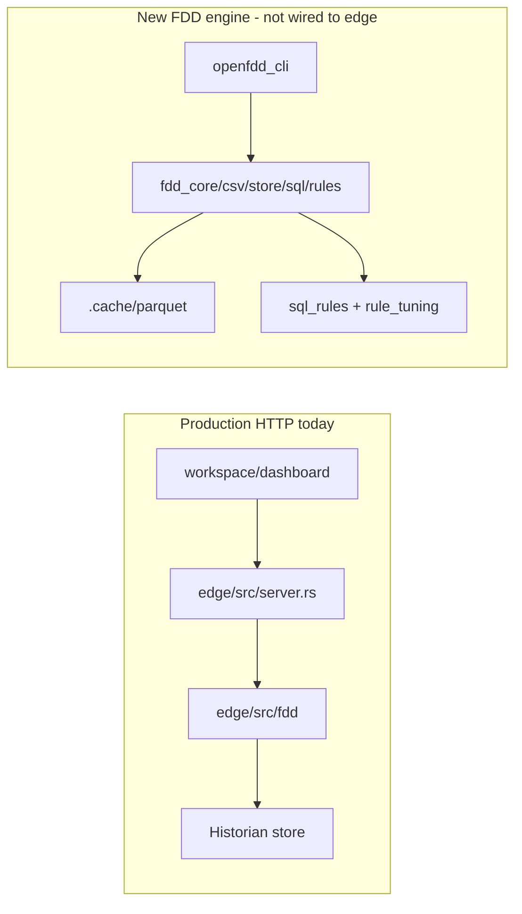

# FDD Engine ↔ Edge Integration Audit

**Date:** 2026-07-10  
**Scope:** `open-fdd` workspace after PR #477 / #489 era (`master` lineage through `52a7d2c`, audit branch may include recovery docs)  
**Mode:** evidence-led

## Executive verdict

Two parallel FDD stacks exist. **Production HTTP uses the in-tree edge FDD module** (`edge/src/fdd`), which runs DataFusion SQL against the **historian**, with JSON rules under workspace FDD wires. The newer **`crates/fdd_*` engine** (Parquet + `sql_rules/registry.yaml`) is a **workspace member used by `fdd_cli` / CI**, but **`edge/Cargo.toml` does not depend on it**, and the **runtime Docker image does not ship `sql_rules/` or `rule_tuning/`**. Planned registry/Parquet HTTP endpoints from `docs/frontend/API_CONTRACT.md` are **not implemented**.

This confirms the expected Phase 6 gap and is the prerequisite map for Phase 7 (`feat/edge-fdd-engine-api`).

## Answers (1–14)

### 1. Are `fdd_*` crates workspace members?

**Yes.** Root `Cargo.toml` members include `crates/fdd_core`, `fdd_csv`, `fdd_store`, `fdd_sql`, `fdd_rules`, `fdd_bench`, `fdd_cli` plus `edge` and `mcp`.

### 2. Does the edge crate depend on them?

**No.** `edge/Cargo.toml` has no path dependencies on any `fdd_*` crate. `mcp/Cargo.toml` likewise does not.

### 3. Is old `edge/src/fdd` duplicated with the new crates?

**Yes — parallel implementations, not a thin wrapper.**

| Concern | Edge (`edge/src/fdd`) | New engine (`crates/fdd_*`) |
| --- | --- | --- |
| Rule source | JSON under workspace FDD wires | `sql_rules/registry.yaml` + `*.sql` |
| Data plane | Historian → Arrow | CSV → Parquet → DataFusion `history` |
| Tuning | Rule JSON params | `rule_tuning/*.yaml` |
| Role map | Hardcoded inputs in `execution.rs` | `fdd_core` column role map |

### 4. Which implementation is canonical for production HTTP today?

**`edge/src/fdd` via `edge/src/server.rs`.**  
`POST /api/fdd/run` → historian DataFusion path. Docs for the new engine (`docs/RUST_DATAFUSION_ENGINE.md`) state HTTP/UI are planned, not shipped.

### 5. Does the Docker build copy all required crate manifests and source?

**For compiling edge + mcp: yes** (`COPY crates ./crates` with workspace members).  
**Engine assets: no** — `sql_rules/`, `rule_tuning/`, and `examples/` are not copied. Build does not produce `openfdd_cli`.

### 6. Does the runtime image contain `sql_rules/registry.yaml`?

**No.**

### 7. Does the runtime image contain SQL files?

**No.**

### 8. Does the runtime image contain rule tuning profiles?

**No.** Repo has `rule_tuning/defaults.yaml`; Dockerfile never copies it.

### 9. Can the edge binary invoke the new FDD engine without spawning a subprocess?

**No.** No Cargo link and no subprocess to `fdd_cli`. In-process integration is Phase 7 work.

### 10. Are the planned FDD HTTP endpoints actually implemented?

| Planned (`docs/frontend/API_CONTRACT.md`) | Status |
| --- | --- |
| `GET /api/fdd/rules` | Not implemented |
| `GET /api/fdd/rules/{id}/params` | Not implemented |
| `POST /api/fdd/run` | Exists with **different** semantics (ad-hoc historian SQL) |
| `GET /api/fdd/cache/status` | Not implemented |
| `GET /api/fdd/roles` | Not implemented |

Legacy surfaces that **are** implemented: `/api/fdd-rules*`, `/api/fdd-schema*`, `/api/fdd-wires*`, `/api/rules*`.

### 11. Is the dashboard calling real endpoints or mock?

**Real edge HTTP** via `apiFetch`. No FDD mock layer under `workspace/dashboard/src`. Pages call wires/historian APIs (`/api/fdd-rules`, `/api/fdd-wires/...`), **not** the planned registry/Parquet `/api/fdd/rules` family.

### 12. Is the Parquet cache location consistent between CLI and edge?

**No.** CLI defaults to `.cache/parquet`. Edge has no Parquet cache path; it uses the historian.

### 13. Are role mappings stored in one canonical location?

**No.** New engine: `fdd_core` role map. Edge HTTP: separate hardcoded catalog in `edge/src/fdd/execution.rs`.

### 14. Is BUILDING_100 used only for local validation?

**Primarily yes.** Local parity/docs/benchmarks; CI uses synthetic `BUILDING_FIXTURE`. Not packaged in the runtime image. Must not be committed as client data.

## Inventories

### Crates

`fdd_core`, `fdd_csv`, `fdd_store`, `fdd_sql`, `fdd_rules`, `fdd_bench`, `fdd_cli` (`openfdd_cli`).

### `edge/src/fdd`

`mod.rs`, `confirmation.rs`, `datafusion_sql.rs`, `execution.rs`, `rules.rs`, `sql_safety.rs`, `wires/*`.

### SQL registry

**19** `rule_id` entries; **19** `*.sql` files. Target: 50 (#482).

### Dashboard FDD clients (representative)

`workspace/dashboard/src/lib/api.ts`, `ruleBindings.ts`, `pages/SqlFddRulesPage.tsx`, wiresheet APIs, `OperationalContextPanel.tsx`, `LiveFddValidationPage.tsx`.

## Gap summary (Phase 7 blockers)

1. No Cargo link from edge → `fdd_*`.
2. No packaging of `sql_rules/` / `rule_tuning/` in the runtime image.
3. No Parquet cache in edge; CLI and edge data planes diverge.
4. Planned `/api/fdd/*` registry/cache/roles API missing.
5. Dashboard talks to real **wires/historian** APIs, not the new registry engine (Phase 8 after Phase 7).

## Architecture (current)

