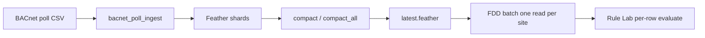

# Apache Arrow on the edge (what is / is not)

Open-FDD’s **edge historian** uses **Feather files** (Apache Arrow IPC on disk) inside the **`openfdd-bridge`** Docker image. The thin host OS ([`os/`](../../os/README.md)) does not ship Arrow; neither does the **PyPI** `open-fdd` wheel (pandas + YAML only).

This page is the honest map for operators and integrators: what is columnar/Arrow-native today (Phases **1** and **1½**), and what is intentionally **not**.

---

## Pipeline



---

## Built on Apache Arrow (yes)

| Component | How Arrow is used |
|-----------|-------------------|
| **On-disk format** | `latest.feather` / `shard-*.feather` = Arrow IPC via **pyarrow** (`pyarrow>=17` in bridge image) |
| **Shard merge** | `read_site_table()` → `pyarrow.concat_tables` (threaded read optional) |
| **Compaction** | Merge shards → single Feather; `compact_all()` can run **per site in parallel** |
| **Retention prune** | Prefer `pyarrow.compute` timestamp filter before rewrite (pandas fallback) |
| **Wide-frame reads** | `read_site(..., columns=[...])` column-prunes at Feather read |
| **FDD batch I/O** | One Feather read per site per batch; column union from rule bindings |

Implementation: [`workspace/api/openfdd_bridge/feather_store.py`](../../workspace/api/openfdd_bridge/feather_store.py).

---

## Uses pandas at the boundary (hybrid — not “all Arrow”)

| Step | Why pandas |
|------|------------|
| **Rule Lab / plots** | `pd.DataFrame` for operator APIs and `evaluate(row, …)` |
| **Dedupe / sort** | Timestamp dedupe after concat (single materialization) |
| **Demo CSV fallback** | `load_frame_for_run` when no feather yet |
| **PyPI engine** | Offline YAML rules — separate from bridge storage |

Arrow reduces **I/O and merge** cost; pandas remains the **operator and rule** surface.

---

## Not on Arrow (by design — do not overclaim)

| Area | Reality |
|------|---------|
| **Rule Lab default** | Row-by-row Python `evaluate()` — **not** multi-core vectorized unless the rule author vectorizes inside the script |
| **“All CPU cores”** | True mainly for **parallel site compact/prune** and optional `OFDD_ARROW_IO_THREADS` on concat/read — **not** for arbitrary commissioning Python |
| **Vectorized Rule Lab mode** | **Not shipped** — future optional mode beside row-Python |
| **Polars historian** | **Not shipped** — would replace dataframe APIs across bridge |
| **Parquet-only store** | **Not shipped** — Feather shards + `latest.feather` stay the edge layout |
| **GPU Arrow** | **Not used** |
| **Host OS image** | No Arrow dependency on bare-metal OS; only in containers |

**Defensible marketing:** *Arrow-backed Feather historian with parallel site maintenance and efficient batch loads; Rule Lab stays row-Python for commissioning clarity.*

**Overclaim to avoid:** *“FDD uses all cores”* or *“everything runs in Arrow compute.”*

---

## Phase 1 vs 1½ (what landed when)

| Phase | Scope |
|-------|--------|
| **1** | Feather = Arrow IPC; pyarrow in bridge image; pickle fallback only if pyarrow missing (ARM edge note in `requirements-edge-armv7.txt`) |
| **1½** | Arrow concat + compute prune; deferred ingest compact; `compact_all` + workers; column-pruned `read_site`; FDD **one load per site**; docs + `scripts/bench_feather_compact.sh` |

---

## Operations

### Environment

| Variable | Default | Purpose |
|----------|---------|---------|
| `OFDD_ARROW_IO_THREADS` | `0` | `pyarrow.set_cpu_count` for Feather read/concat |
| `OFDD_FEATHER_COMPACT_WORKERS` | `1` | Parallel site `compact` / `prune` |
| `OFDD_FEATHER_COMPACT_ON_INGEST` | `0` | `1` = compact every poll (legacy hot-path) |
| `OFDD_FEATHER_COMPACT_SHARD_THRESHOLD` | `8` | Auto-compact when loose shards ≥ N |
| `OFDD_FEATHER_MAX_GIB` | `0` | Disk cap (`enforce_max_bytes`) |
| `OFDD_FEATHER_RETENTION_DAYS` | `90` | Row retention (`prune`) |

### CLI (host or `docker compose exec bridge`)

```bash
python -m openfdd_bridge.feather_store --compact
python -m openfdd_bridge.feather_store --maintain
```

**Important:** Ingest usually **defers** compaction. Schedule `--compact` or `--maintain` in cron or [`scripts/docker_maintenance.sh`](../../scripts/docker_maintenance.sh) so shards do not sprawl.

### Validation

```bash
./scripts/openfdd_edge_validate.sh --quick   # health, SPARQL, Ollama hello, pytest, logs
./scripts/bench_feather_compact.sh           # local timing smoke
```

---

## Related

- [BACnet capabilities](../bacnet/capabilities.md) — poll → ingest → feather
- [System overview](../overview.md) — container data flow
- [Local Ollama](../local_ollama.md) — check-engine AI (separate from Arrow)
