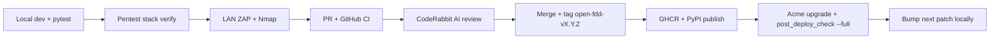

# Security testing cycle

How Open-FDD validates each **patch revision** before it ships to the live Acme HVAC bench — local automation, AI-assisted PR review, LAN passive scans, and edge post-deploy checks.

Related security docs: [ZAP baseline](../security/zap-baseline), [TLS and certificates](../security/tls-and-certs), [LAN hardening](../security/lan-hardening), [Authenticated scanning (roadmap)](../security/authenticated-scanning).

## Who owns what

| Concern | Owner | Where |
|---------|-------|-------|
| HTTP security headers (CSP, X-Frame, COOP, …) | **Bridge** middleware | `workspace/api/openfdd_bridge/security_headers.py` |
| TLS termination + HSTS | **Caddy** | `workspace/deploy/caddy/`, Ansible `Caddyfile.j2` |
| OT LAN TLS certificates | **Site integrator / maintainer** | `./scripts/setup_caddy_certs.sh` → `workspace/deploy/caddy/certs/`; Ansible `/etc/openfdd/caddy/` on edge |
| Pentest credentials | Generated per stack | `workspace/auth.pentest.local` (never commit) |
| LAN ZAP + Nmap scans | **Developer workstation** on test LAN | `scripts/security/` |

See [TLS and certificate ownership](../security/tls-and-certs) for cert lifecycle.

## Per-revision workflow

Typical cycle on a **control machine** (local dev) through a **lab edge host** (live bench):



### 1. Local functional tests

```bash
./scripts/build_and_test.sh
PYTHONPATH=workspace/api pytest tests/workspace_bridge/test_security.py -q
infra/ansible/scripts/bench_5007_arrow_battery.sh   # when FDD/Arrow paths change
```

### 2. Pentest production stack (on Open-FDD host)

```bash
./scripts/pentest_production_stack.sh start
./scripts/pentest_production_stack.sh verify
```

Confirms Caddy `:80` fronts the bridge, auth is enabled, BACnet writes disabled, and security headers are singular (no Caddy duplicates). Details: [Health checks — pentest](health-check#pentest-production-stack-lan-zap).

### 3. LAN security scan (from laptop)

Use the packaged scripts — do not hand-roll one-off docker/nmap commands unless debugging:

| Platform | Command |
|----------|---------|
| Windows | `.\scripts\security\Run-OpenFddSecurityScan.ps1` |
| macOS / Linux | `./scripts/security/run_openfdd_security_scan.sh` |

Setup (Docker Desktop, Nmap): [scripts/security/README.md](../../scripts/security/README.md).

Target URL is usually **`http://<lan-ip>/`** (Caddy), not `:8765`.

Review `openfdd-security-report/90-quick-findings-summary.txt` and compare against [ZAP baseline expectations](../security/zap-baseline).

### 4. Pull request + automated review

- Open PR against `master`
- **GitHub Actions** (`ci.yml`): pytest, bridge security audit, dashboard build, Jekyll docs
- **CodeRabbit** (or similar AI PR review): style, security footguns, missing tests/docs

Do not merge with failing CI or unresolved duplicate-header regressions.

### 5. Release

```bash
git tag open-fdd-v3.0.4   # example
git push origin open-fdd-v3.0.4
```

Tag triggers GHCR `:latest` and PyPI publish workflows.

### 6. Lab edge validation

After pulling new images on a live bench VM:

```bash
OPENFDD_IMAGE_TAG=latest ./scripts/upgrade_edge_full.sh --limit <inventory_host>
infra/ansible/scripts/post_deploy_check.sh --limit <inventory_host> --full
```

Re-run LAN ZAP + Nmap against the edge LAN IP if Caddy or auth behavior changed. Site-specific example: [GL36 lab note](../examples/acme-gl36-lab).

### 7. Next cycle

Bump patch version locally (`pyproject.toml`, `open_fdd/__init__.py`) on `master` for the next development round — do not tag until the next release is ready.

## What each scan layer covers

| Layer | Tool | Depth |
|-------|------|-------|
| Unit / integration | pytest, `test_security.py` | Header middleware, auth gates |
| Stack smoke | `pentest_production_stack.sh verify` | Live headers, health, auth file |
| Passive web | ZAP baseline | Public routes, CSP, cookies, CORS |
| Port exposure | Nmap scoped | One host, known service ports |
| Authenticated API/dashboard | ZAP full + login | **Roadmap** — [Authenticated scanning](../security/authenticated-scanning) |

Baseline ZAP does **not** exercise integrator login or protected `/api/*` routes deeply.

## Open-source contributors

The `scripts/security/` folder is part of the public repo so any fork can run the same LAN smoke against their bench. PRs that change Caddy, auth, or `security_headers.py` should update [ZAP baseline](../security/zap-baseline) and re-run the scan scripts.
