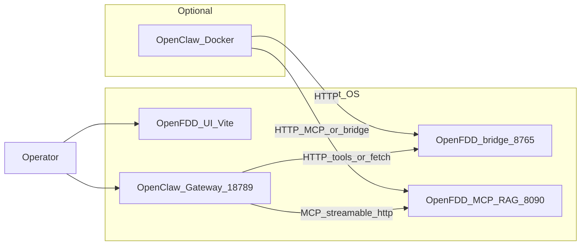
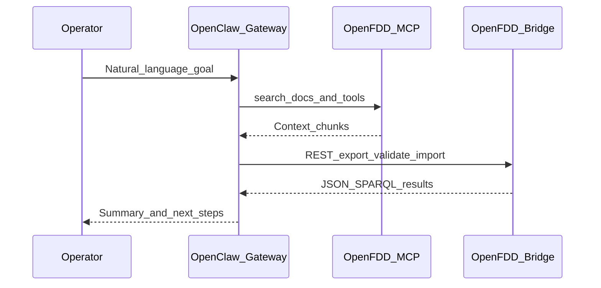

# Open FDD Claw architecture

**Open FDD Claw** is the integration pattern where **OpenClaw** is the AI control plane (gateway, tools, skills, optional channels) and **Open-FDD** stays the data and FDD plane (FastAPI bridge, MCP RAG, rules engine, Feather storage). This page matches the shipped runbook and skills; see also [`scripts/OPENCLAW_RUNBOOK.md`](https://github.com/bbartling/open-fdd/blob/master/scripts/OPENCLAW_RUNBOOK.md).

Full **Brick / SPARQL / Compose** platform docs: **[open-fdd-afdd-stack](https://github.com/bbartling/open-fdd-afdd-stack/tree/main/docs)**.

---

## Integration topology



---

## OpenClaw capabilities mapped to Open-FDD

| OpenClaw capability | Open-FDD / energy / AFDD use |
|---------------------|------------------------------|
| **Gateway + agent loop** | Single place for “operator asks → plan → call bridge/MCP → summarize”. |
| **`mcp.servers` + MCP adapter** | Stock **8090** service is **REST** `/tools/*`; add a thin MCP shim to use `mcp.servers` (`openfdd__*` tool names), or call REST via fetch/prompts. |
| **`openclaw mcp serve`** | Optional: IDE MCP clients talk to OpenClaw, which still reaches the host bridge. |
| **Workspace skills** (`SKILL.md`) | Repo ships skills under [`contrib/openclaw-skills/`](../contrib/openclaw-skills/README.md); copy into `~/.openclaw/workspace/skills/`. |
| **Bootstrap Markdown** (`AGENTS.md`, `SOUL.md`, `MEMORY.md`, …) | Repo ships starter copies under [`contrib/openclaw-workspace/`](../contrib/openclaw-workspace/README.md); merge into your OpenClaw workspace root so the agent loads Open-FDD API context automatically. |
| **Live Canvas / A2UI** | Dashboards: fault timelines, equipment trees, structured summaries instead of raw tables in chat. |
| **Thinking / subagents / `sessions_spawn`** | Heavy jobs: multi-site backfill, large SPARQL, BACnet discovery in isolated sessions. |
| **Cron + webhooks** | Scheduled ingest, nightly FDD, alerts to Slack/Telegram/WebChat. |
| **Sandbox** | Non-main agents with tighter tool allowlists while keeping MCP/HTTP to Open-FDD. |
| **OpenAI-compatible HTTP** (`/v1/chat/completions`) | Any client (including Python in Open-FDD) sends **Gateway** bearer auth; backend model uses **Codex OAuth** via `x-openclaw-model` (see below). |
| **Multi-agent routing** | Separate “modeling” vs “field ops” agents with different skills and MCP exposure. |
| **Diagnostics** | `/diagnostics` and export flows for support when Claw + FDD stack misbehaves. |

---

## AI-assisted modeling and FDD (sequence)



Human-in-the-loop export → review → validate → import is described in [Data modeling](modeling/index).

---

## Codex-aligned auth (do not duplicate OAuth in Python)

| Secret / credential | Where it lives |
|---------------------|----------------|
| **ChatGPT / Codex subscription (OAuth)** | OpenClaw: `openclaw models auth login --provider openai-codex`; tokens in `~/.openclaw/agents/.../auth-profiles.json`. |
| **Gateway operator HTTP auth** | `OPENCLAW_GATEWAY_TOKEN` (or `gateway.auth.token` in `openclaw.json`). |
| **Onboard, BACnet DIY, etc.** | Open-FDD bridge env (e.g. `OFDD_ONBOARD_API_KEY`) — **data plane**, not LLM auth. |

**Policy:** LLM calls from Python should go to the **OpenClaw Gateway** `POST /v1/chat/completions` with `Authorization: Bearer <gateway token>` and `x-openclaw-model: openai-codex/<model>` so **Codex OAuth stays in OpenClaw**. Do not read `auth-profiles.json` from Open-FDD.

Enable the HTTP surface in OpenClaw (see [OpenClaw OpenAI chat completions](https://docs.openclaw.ai/gateway/openai-http-api)):

```json5
{
  gateway: {
    http: {
      endpoints: {
        chatCompletions: { enabled: true },
      },
    },
  },
}
```

---

## Reference `openclaw.json` fragment

Adjust hostnames for Docker (`host.docker.internal`) vs native loopback.

**Model auth (Codex subscription)** — after `openclaw models auth login --provider openai-codex`, pin profiles so the default agent prefers the OAuth route:

```json5
{
  auth: {
    profiles: {
      "openai-codex:default": { provider: "openai-codex", mode: "oauth" },
    },
    order: {
      "openai-codex": ["openai-codex:default"],
    },
  },
}
```

**Open-FDD MCP RAG service today** — `open-fdd-mcp-rag` exposes **HTTP REST** under `POST /tools/...` and `GET /manifest` on port **8090** (not Streamable HTTP MCP). OpenClaw’s built-in `mcp.servers` entries expect a **protocol MCP** server. Practical options:

1. **Prompts + fetch** — Teach the agent the base URL (`http://127.0.0.1:8090`) and use OpenClaw’s web/fetch tooling to call `/tools/search_docs` etc. (see runbook smoke steps).
2. **Thin MCP adapter** — Run (or write) a small stdio or `streamable-http` MCP process that translates MCP `call_tool` into Open-FDD’s REST; then register it under `mcp.servers` like any other server.
3. **Bridge only** — Skip MCP in Claw and use **`GET/POST` on the bridge** (`8765`, `/docs`) for modeling and FDD.

When you do have a **real MCP** endpoint for Open-FDD, a typical OpenClaw registration looks like:

```json5
{
  mcp: {
    servers: {
      openfdd: {
        url: "http://127.0.0.1:8090/mcp",
        transport: "streamable-http",
        headers: {
          Authorization: "Bearer ${OFDD_MCP_HTTP_BEARER}",
        },
      },
    },
  },
}
```

Replace `url` / `headers` with whatever your adapter exposes; action tools on the stock RAG service may require `OFDD_MCP_ENABLE_ACTION_TOOLS` and matching bridge auth (runbook §4).

---

## Python helper

[`open_fdd.gateway.openclaw_chat`](../open_fdd/gateway/openclaw_chat.py) implements a small **`OpenClawGatewayChatClient`** that posts to `/v1/chat/completions` using **`requests`** and env vars **`OFDD_OPENCLAW_GATEWAY_URL`**, **`OFDD_OPENCLAW_GATEWAY_TOKEN`**, optional **`OFDD_OPENCLAW_BACKEND_MODEL`** (default `openai-codex/gpt-5.5`).

Install: `pip install "open-fdd[desktop]"` (bridge already pulls desktop deps).

---

## Host startup order (summary)

1. Open-FDD on host: `scripts/start-local.ps1` or `scripts/start-local.sh` from the repo root (see [`scripts/OPENCLAW_RUNBOOK.md`](https://github.com/bbartling/open-fdd/blob/master/scripts/OPENCLAW_RUNBOOK.md) §1).  
2. OpenClaw: `openclaw onboard` (or your install path); enable chat completions if you need the HTTP client.  
3. Codex OAuth: `openclaw models auth login --provider openai-codex`.  
4. Register MCP: merge `mcp.servers.openfdd` into `openclaw.json` (this doc + runbook Phase 0).  
5. Skills: copy [`contrib/openclaw-skills/`](../contrib/openclaw-skills/) skill folders into `~/.openclaw/workspace/skills/`.
