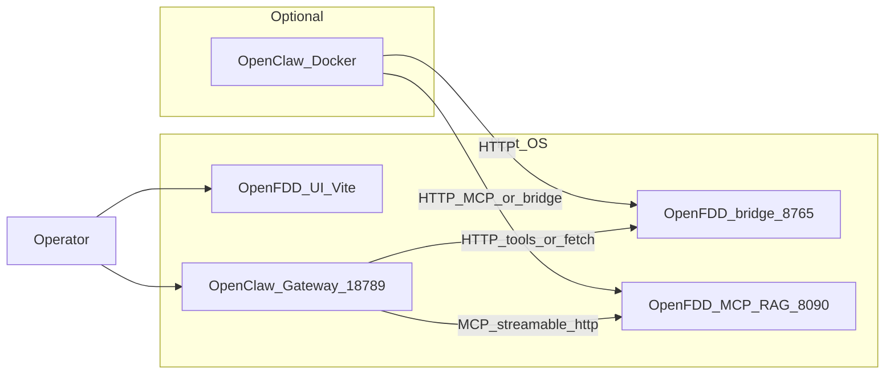
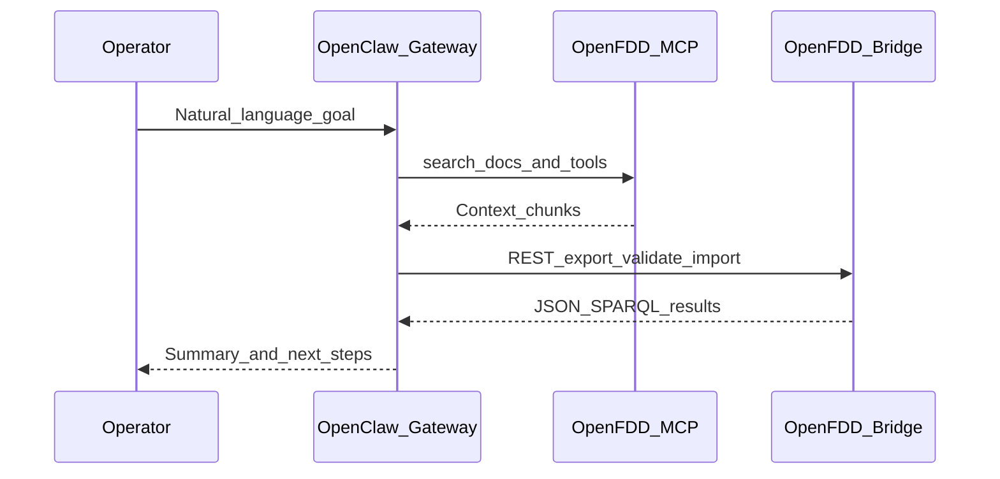

# Open FDD Claw architecture

**Goal for Open-FDD operators:** a **fixed, first-party AI surface** inside the desktop app for **FDD**, **AI-assisted data modeling**, and **AI data cleaning**—**inspired by** OpenClaw (skills, memory/SOUL-style workspace docs, model routing ideas, readiness handoff)—**without** requiring everyone to install or run the full OpenClaw stack.

**Open FDD Claw** still names the **optional** pattern where a separate **OpenClaw** process is the AI control plane (gateway, channels, full agent loop) while **Open-FDD** remains the data plane (bridge **8765**, MCP RAG **8090**, rules, Feather). That remains supported for power users.

This page describes **both** tracks, maps shipped code and `contrib/` clones, and points at a **local OpenClaw checkout** when you want to compare upstream behavior (example path: `C:\Users\ben\Documents\openclaw`). See also [`scripts/OPENCLAW_RUNBOOK.md`](https://github.com/bbartling/open-fdd/blob/master/scripts/OPENCLAW_RUNBOOK.md).

Full **Brick / SPARQL / Compose** platform docs: **[open-fdd-afdd-stack](https://github.com/bbartling/open-fdd-afdd-stack/tree/main/docs)**.

---

## Product split: built-in Open-FDD AI vs optional OpenClaw

| Track | Who it is for | Auth / model | Where it lives in this repo |
|-------|----------------|----------------|-----------------------------|
| **Built-in AI (Open-FDD only)** | Default Open-FDD desktop users | Official **`codex` CLI** on the bridge host: `codex login` / `codex login --device-auth`, then `codex login status`; optional `OFDD_CODEX_CMD` | UI: **`/ai-agent`** (legacy **`/openfdd-claw-chat`** redirects) — stack context + **SIMPLE/COMPLEX** agent chat; bridge: **`GET /openfdd-agent/context`**, **`POST /openfdd-agent/chat`** (`open_fdd/gateway/openfdd_agent.py`, `openfdd_agent_routing.py`, `openfdd_agent_context.py`); raw CLI: **`GET /local-codex/diagnostics`**, **`POST /local-codex/chat`** |
| **Optional OpenClaw gateway** | Teams that already run OpenClaw | OpenClaw-managed **OAuth** (`openclaw models auth login --provider openai-codex`) + gateway token | Bridge: **`OpenClawGatewayChatClient`** (`open_fdd/gateway/openclaw_chat.py`), **`/assistant/data-model-openclaw`**; UI: embedded Claw URL (**`VITE_OPENFDDCLAW_UI_URL`**) |

**Execution model (built-in path):** the **Vite/React desktop UI** only calls the bridge over HTTP. The **Python gateway** spawns a **`codex exec`** child process on the **same machine** as the bridge (`local_codex_cli.py`). **Codex** (the CLI) performs the actual model/tool/sandbox steps; Open-FDD passes workdir, stdin, and **`OFDD_CODEX_*`**-derived flags. See **[Desktop app — Where Codex runs](howto/desktop_app#where-codex-runs)** for the full table.

**Agentic / “OpenClaw-style” building blocks already in Open-FDD (fixed, repo-local):**

- **Model routing (inspired by OpenClaw):** `open_fdd/gateway/openclaw_routing.py` — task classification and simple vs complex lanes used when calling the gateway client (`complete_for_task`).
- **Workspace + skills (cloned patterns, not a running OpenClaw dependency):** [`contrib/openclaw-workspace/`](https://github.com/bbartling/open-fdd/blob/master/contrib/openclaw-workspace/README.md) (`AGENTS.md`, `SOUL.md`, `MEMORY.md`, …) and [`contrib/openclaw-skills/`](https://github.com/bbartling/open-fdd/blob/master/contrib/openclaw-skills/README.md) (`SKILL.md` bundles: bootstrap, clean-metrics, modeling, drivers, BACnet). These mirror OpenClaw’s **bootstrap Markdown + AgentSkills** layout; operators can still **copy** them into `~/.openclaw/workspace/` if they *also* run OpenClaw.
- **Operator tools in the UI:** Advanced panel (cron/API/policy presets) on the same route as **AI Agent** chat — see `OpenFddClawAdvancedPanel.tsx`.

**Gaps / roadmap (honest):** a single long-running “Open-FDD agent” process with OpenClaw-parity **memory files**, **multi-step tool loop**, and **subagents** is **not** fully merged into the bridge yet; today the **built-in** path is **CLI Codex + REST bridge + readiness/MCP/docs**. Gateway routing and workspace clones are the **spine** to grow toward that without forking OpenClaw wholesale.

---

## Upstream OpenClaw (local checkout) — what to compare

If you have OpenClaw cloned (e.g. `C:\Users\ben\Documents\openclaw`), useful references when evolving Open-FDD’s built-in AI:

| Topic | OpenClaw (upstream) | Open-FDD (this repo) |
|-------|---------------------|------------------------|
| Codex device OAuth (HTTP) | `extensions/openai/openai-codex-device-code.ts` | **Built-in:** delegate to **`codex` CLI** (`local_codex_cli.py`) so auth matches `codex login` / OpenAI’s supported installer path |
| TUI / chat UX | `src/tui/` (e.g. `gateway-chat.ts`, `components/chat-log.ts`) | Desktop **React** chat + handoff cards (`AiAgentChatPage.tsx`) — same *ideas* (transcript, status), not a terminal port |
| Skills format | `skills/**/SKILL.md`, `.agents/skills/**` | `contrib/openclaw-skills/**/SKILL.md` |
| Workspace bootstrap | Workspace `AGENTS.md`, `SOUL.md`, `MEMORY.md` | `contrib/openclaw-workspace/*.md` |
| Gateway HTTP completions | Gateway `POST /v1/chat/completions` | `openclaw_chat.py` + env `OFDD_OPENCLAW_GATEWAY_*` |

---

## Integration topology



---

## OpenClaw capabilities mapped to Open-FDD

| OpenClaw capability | Open-FDD / energy / AFDD use |
|---------------------|------------------------------|
| **Gateway + agent loop** | Single place for “operator asks → plan → call bridge/MCP → summarize”. |
| **`mcp.servers` + MCP adapter** | Stock **8090** service is **REST** `/tools/*`; add a thin MCP shim to use `mcp.servers` (`openfdd__*` tool names), or call REST via fetch/prompts. |
| **`openclaw mcp serve`** | Optional: IDE MCP clients talk to OpenClaw, which still reaches the host bridge. |
| **Workspace skills** (`SKILL.md`) | Repo ships skills under [`contrib/openclaw-skills/`](https://github.com/bbartling/open-fdd/blob/master/contrib/openclaw-skills/README.md) — include **`open-fdd-bootstrap`**, **`open-fdd-clean-metrics`** (preview/commit clean-metrics until plot-readiness is green), modeling/drivers/BACnet packs; copy into `~/.openclaw/workspace/skills/`. |
| **Bootstrap Markdown** (`AGENTS.md`, `SOUL.md`, `MEMORY.md`, …) | Repo ships starter copies under [`contrib/openclaw-workspace/`](https://github.com/bbartling/open-fdd/blob/master/contrib/openclaw-workspace/README.md); merge into your OpenClaw workspace root so the agent loads Open-FDD API context automatically. |
| **Live Canvas / A2UI** | Dashboards: fault timelines, equipment trees, structured summaries instead of raw tables in chat. |
| **Thinking / subagents / `sessions_spawn`** | Heavy jobs: multi-site backfill, large SPARQL, BACnet discovery in isolated sessions. |
| **Cron + webhooks** | Scheduled ingest, nightly FDD, alerts to Slack/Telegram/WebChat. |
| **Sandbox** | Non-main agents with tighter tool allowlists while keeping MCP/HTTP to Open-FDD. |
| **OpenAI-compatible HTTP** (`/v1/chat/completions`) | Any client (including Python in Open-FDD) sends **Gateway** bearer auth; backend model uses **Codex OAuth** via `x-openclaw-model` (see below). |
| **Multi-agent routing** | Separate “modeling” vs “field ops” agents with different skills and MCP exposure. |
| **Diagnostics** | `/diagnostics` and export flows for support when Claw + FDD stack misbehaves. |

---

## AI-assisted modeling and FDD (sequence)



Human-in-the-loop export → review → validate → import is described in [Data modeling](modeling/index).

---

## Codex / OpenAI auth (two supported paths)

### A) Built-in Open-FDD (Codex CLI — default product story)

| Concern | Where it lives |
|--------|----------------|
| **Operator subscription / CLI session** | Same as a normal Codex install: **`codex login`**, **`codex login --device-auth`**, **`codex login status`** on the machine running **`open-fdd-desktop-bridge`**. |
| **Bridge integration** | **`OFDD_CODEX_CMD`** if `codex` is not on `PATH` for the bridge process (Windows: often `…\npm\codex.cmd`). **`GET /local-codex/diagnostics`**, **`POST /local-codex/chat`**. |
| **External data credentials (BACnet / CSV workflow)** | Open-FDD env + local tools config (for example the standalone Onboard CSV tool inputs) — **data plane**, not LLM auth. |

**Device / org policy:** If `codex login` fails, use the same guidance as upstream Codex: ChatGPT **security / device** settings or admin policy; official: [Codex authentication](https://developers.openai.com/codex/auth/).

**Policy:** Do **not** invent a second OAuth store in Open-FDD for this path—the **`codex` binary** owns tokens for built-in chat.

### B) Optional OpenClaw gateway (OAuth in OpenClaw)

| Secret / credential | Where it lives |
|---------------------|----------------|
| **ChatGPT / Codex subscription (OAuth)** | OpenClaw: `openclaw models auth login --provider openai-codex`; tokens in `~/.openclaw/agents/.../auth-profiles.json`. |
| **Gateway operator HTTP auth** | `OPENCLAW_GATEWAY_TOKEN` (or `gateway.auth.token` in `openclaw.json`). |

**Policy for bridge → gateway calls:** Use **`OpenClawGatewayChatClient`** (`POST /v1/chat/completions` with `Authorization: Bearer <gateway token>` and `x-openclaw-model: openai-codex/<model>`). Do **not** read `auth-profiles.json` from Open-FDD Python for gateway-backed flows.

Enable the HTTP surface in OpenClaw (see [OpenClaw OpenAI chat completions](https://docs.openclaw.ai/gateway/openai-http-api)):

```json5
{
  gateway: {
    http: {
      endpoints: {
        chatCompletions: { enabled: true },
      },
    },
  },
}
```

---

## Reference `openclaw.json` fragment

Adjust hostnames for Docker (`host.docker.internal`) vs native loopback.

**Model auth (Codex subscription)** — after `openclaw models auth login --provider openai-codex`, pin profiles so the default agent prefers the OAuth route:

```json5
{
  auth: {
    profiles: {
      "openai-codex:default": { provider: "openai-codex", mode: "oauth" },
    },
    order: {
      "openai-codex": ["openai-codex:default"],
    },
  },
}
```

### Grounding OpenClaw on Open-FDD (MCP + docs + “same screen” as the human)

- **Best default:** give the agent **MCP RAG** (`8090`) plus **`GET /manifest`** so it discovers tool names, then **`search_docs`** / **`search_api_capabilities`** for Jekyll `docs/` and OpenAPI-shaped capability text. That is how it “knows the API” without you pasting Swagger each time — **after** `python scripts/build_mcp_rag_index.py` has been run so the index exists.
- **Parity with the React UI:** the agent does **not** see the live Vite DOM. Use **`GET /assistant/readiness`** (same payload as **Open-FDD Claw → Fetch readiness**) so links and copy match what the operator sees; combine with repo skills **`open-fdd-bootstrap`** and **`open-fdd-clean-metrics`** (`contrib/openclaw-skills/`) plus workspace **`AGENTS.md`** / **`TOOLS.md`** for first-run health, doc-offline warnings, and **preview → commit → re-check** Feather cleaning.
- **OpenClaw `mcp.servers`:** still expects a **protocol** MCP server in strict mode; many setups use **fetch** to `8090` tools instead — see runbook.

**Open-FDD MCP RAG service today** — `open-fdd-mcp-rag` exposes **HTTP REST** under `POST /tools/...` and `GET /manifest` on port **8090** (not Streamable HTTP MCP). OpenClaw’s built-in `mcp.servers` entries expect a **protocol MCP** server. Practical options:

1. **Prompts + fetch** — Teach the agent the base URL (`http://127.0.0.1:8090`) and use OpenClaw’s web/fetch tooling to call `/tools/search_docs` etc. (see runbook smoke steps).
2. **Thin MCP adapter** — Run (or write) a small stdio or `streamable-http` MCP process that translates MCP `call_tool` into Open-FDD’s REST; then register it under `mcp.servers` like any other server.
3. **Bridge only** — Skip MCP in Claw and use **`GET/POST` on the bridge** (`8765`, `/docs`) for modeling and FDD.

When you do have a **real MCP** endpoint for Open-FDD, a typical OpenClaw registration looks like:

```json5
{
  mcp: {
    servers: {
      openfdd: {
        url: "http://127.0.0.1:8090/mcp",
        transport: "streamable-http",
        headers: {
          Authorization: "Bearer ${OFDD_MCP_HTTP_BEARER}",
        },
      },
    },
  },
}
```

Replace `url` / `headers` with whatever your adapter exposes; action tools on the stock RAG service may require `OFDD_MCP_ENABLE_ACTION_TOOLS` and matching bridge auth (runbook §4).

---

## Python helper

[`open_fdd.gateway.openclaw_chat`](../open_fdd/gateway/openclaw_chat.py) implements a small **`OpenClawGatewayChatClient`** that posts to `/v1/chat/completions` using **`requests`** and env vars **`OFDD_OPENCLAW_GATEWAY_URL`**, **`OFDD_OPENCLAW_GATEWAY_TOKEN`**, optional **`OFDD_OPENCLAW_BACKEND_MODEL`** (default `openai-codex/gpt-5.5`).

Install: `pip install "open-fdd[desktop]"` (bridge already pulls desktop deps).

---

## Host startup order (summary)

1. Open-FDD on host: `scripts/start-local.ps1` or `scripts/start-local.sh` from the repo root (see [`scripts/OPENCLAW_RUNBOOK.md`](https://github.com/bbartling/open-fdd/blob/master/scripts/OPENCLAW_RUNBOOK.md) §1).  
2. OpenClaw: `openclaw onboard` (or your install path); enable chat completions if you need the HTTP client.  
3. Codex OAuth: `openclaw models auth login --provider openai-codex`.  
4. Register MCP: merge `mcp.servers.openfdd` into `openclaw.json` (this doc + runbook Phase 0).  
5. Skills: copy [`contrib/openclaw-skills/`](https://github.com/bbartling/open-fdd/tree/master/contrib/openclaw-skills) skill folders into `~/.openclaw/workspace/skills/`.  
6. Workspace bootstrap: copy Markdown from [`contrib/openclaw-workspace/`](https://github.com/bbartling/open-fdd/blob/master/contrib/openclaw-workspace/README.md) (`AGENTS.md`, `SOUL.md`, `MEMORY.md`, etc.) into your OpenClaw workspace root so the agent loads Open-FDD API context on boot.
