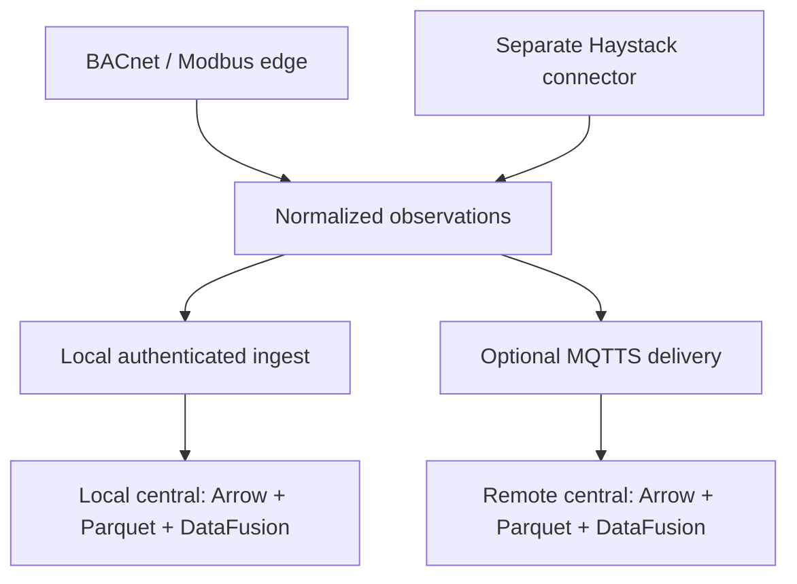

# PR proposal: restore BACnet commissioning in Operations with Rust delivery recipes

Status: researched implementation proposal, not an implemented or tested software PR.
Prepared: 2026-09-29 (America/Chicago).
Repository: https://github.com/bbartling/open-fdd
Related: https://github.com/bbartling/open-fdd/issues/781

## Final UI placement and deployment capability checker

**Place all protocol commissioning trees, point properties and context actions inside the existing Operations → MQTT section.** Within that section provide nested panels/tabs for MQTT payloads, BACnet, Haystack and Modbus, plus a deployment-status strip. Do not add BACnet/Haystack/Modbus as separate top-level Operations views. Earlier references to a BACnet tab “near MQTT” mean a nested tab here; this placement requirement takes precedence. The MQTT section must remain useful for a local-only OT recipe with no broker configured: protocol commissioning and local ingest continue to work there.

Give the human user a clear answer to “which recipe is bootstrapped, what is running, and where does data go?” Central performs bounded authenticated checks against explicitly configured internal service endpoints and returns a sanitized capability snapshot to React. Use existing health/metadata endpoints where their contracts suffice; otherwise add a small versioned connector hello/capabilities endpoint. A proposed central aggregation route, such as `/api/operations/capabilities`, is design intent, not a verified existing endpoint. The browser calls central, not internal container addresses, and never receives connector credentials.

Each Rust service's hello response should identify its service type, build/version, protocol capabilities actually compiled in, enabled/configured state, readiness and startup instance. Recipe configuration declares expected services, recipe id and local/MQTT/dual delivery mode. Compare that declaration to observed hello responses. The UI reports the configured recipe with verified runtime service states; it must not guess “cloud” versus “OT” merely because a TCP port answers. A reachable fieldbus HTTP server does not prove live BACnet communications, a successful Haystack connection, or Modbus device reachability. Report service readiness and source/device health separately, using cached diagnostics or explicitly requested bounded checks.

| Check | Evidence and UI behavior |
| --- | --- |
| Central / app | Show application readiness and declared recipe; verify shared schema/capability contract compatibility. |
| MQTT broker | Mosquitto normally has no HTTP hello endpoint. Use the Rust application's configured MQTT client status or a bounded authenticated MQTT CONNECT/CONNACK check; distinguish DNS/TCP, TLS/auth, connected and last-message states. Support local broker and optional remote cloud destination as separate connections. Broker connection is not historian persistence. |
| BACnet/Modbus connector | Probe configured connector health/hello, identify supported/enabled protocols, and show local availability independently for each. Device health stays separate. A combined OT connector may legitimately advertise both BACnet and Modbus. |
| Dedicated Haystack connector | Probe its separate configured service; report history/live-read/point-write capabilities only when implemented and enabled. Source authentication failures do not mean the container is absent. |
| Local and cloud delivery | Show enabled sinks independently, last durable local receipt and remote delivery/ingest evidence when available. Outbound cloud publishing is optional; no broker configured is an intentional state for local-only recipes. |

For every service distinguish **not configured**, **disabled**, **checking**, **ready**, **degraded**, **unreachable**, **authentication failed**, **incompatible**, and **unknown/stale**. Show plain-language reasons, last-checked time and a Refresh status action. “Not bootstrapped” may describe a required service missing from the recipe's observed runtime, but a timeout alone must display unreachable rather than asserting no container exists. Do not render an unexplained blank panel.

Probe only allowlisted configured upstreams; impose per-service timeout, concurrency limits, a bounded cache and backoff. Check on central startup and periodically at a modest configurable cadence; opening the MQTT section reads the cached snapshot and may request a bounded status refresh. Health checks must never emit Who-Is, scan points, write registers, fetch a large hisRead range, or start the hourly priority-array rotation. Do not enumerate Docker through the browser or expose a Docker socket merely to identify containers. Do not reboot/start containers automatically from the checker. Existing scoped authorization still governs every tree action even when a service advertises write support.

### Checker implementation prompt and acceptance gates

Implement a central capability aggregator and versioned connector hello contracts, then render the status strip and nested protocol trees in Operations → MQTT. Reconcile expected recipe configuration against observed service identity/readiness. Reuse MQTT connection monitoring for broker evidence rather than assuming an HTTP endpoint exists on Mosquitto. Keep cloud and local destination statuses independent. This extends work packages B, C and E and is mandatory for UI completion.

- Cloud hub: central/web/broker ready; local BACnet/Haystack/Modbus explicitly not configured; MQTT payloads and authorized remote telemetry remain visible.
- BACnet/Modbus local-only: connector and local ingest ready; broker intentionally not configured; BACnet/Modbus tree actions work without MQTT.
- OT dual: local connector and local ingest ready; optional remote cloud publishing reports its own status. Cloud outage does not disable local commissioning or ingestion.
- Haystack direct-history: dedicated connector ready and hisRead available; BACnet/Modbus absent; broker optional. Haystack tree is inside MQTT even when MQTT delivery is disabled.
- Failure fixtures: stopped container, wrong credentials, TLS failure, stale cache, incompatible hello version and disabled protocol each produce the correct state and recovery behavior, without a false ready badge.
- Browser/UI tests: all trees/context menus remain within MQTT; status refresh preserves selected point/expansion; internal credentials/addresses are not exposed; viewers cannot mutate; checker traffic causes no OT discovery/read/write side effects.

## Follow-up PR review comment: Rust BACnet capability audit

Audited September 29, 2026 (America/Chicago), against pinned commit **02ad4c3f559a2b6486d47dc1a4ba922142db0a63**, product 3.5.57. This follow-up supersedes any implication that the complete commissioning feature set already works. **The current Rust stack contains the necessary core BACnet operations, but does not yet satisfy the full restoration requirements.** Verification here means implementation inspection; no compilation, protocol execution, hardware writes, or Railway qualification was performed.

| Required feature | Verified current implementation | Remaining work / verdict |
| --- | --- | --- |
| Device discovery | `who_is` sends Who-Is and returns device summaries; route `/bacnet/whois` | Existing primitive. Results also merge configured/hosted synthetic entries; label those separately from live I-Am evidence. Add scoped async inventory jobs and persistence. |
| Selected-device point discovery | `point_discovery_impl` reads object-list length, chunks indexed object-list reads, and reads names. `/api/bacnet/point-discovery` exists in compatibility routes. | Existing primitive. Object-list fallbacks can omit failed indexes silently. Preserve partial/error status instead of presenting an incomplete tree as complete. |
| Detect commandable points | Discovery probes priority-array index 0 on candidate object types using RPM | Incomplete fallback: failed RPM does not trigger per-object RP capability probing. An RPM-incompatible device can appear non-commandable despite supporting priority arrays. Add RP fallback and unknown/unsupported distinction. |
| Refresh PV | `read_property`, default `present-value`, and `/bacnet/read` | Implemented backend primitive. Add scoped UI action and honest read timestamp/quality; do not confuse interactive response with historian persistence. |
| Read P1–P16 | `read_priority_slots` requests all 16 indexes with RPM and falls back to individual RP after whole-request failure; NULL is distinct from typed values/errors | Implemented but needs hardening: successful RPM directly indexes the first access result, does not enforce 16 unique valid slots, and does not repair missing/per-slot-error results. Validate empty/malformed/partial responses without panic or false all-clear. Respect small-APDU device limits. |
| Write typed value | `write_property_impl` encodes typed value and optional priority; route validates supplied priority 1–16 | Implemented primitive, not a complete operator transaction. Add explicit approval, scoped authorization, audit and slot/PV readback. See retry defect below. |
| Release selected priority | NULL/missing value or string `null` encodes `PropertyValue::Null`; requires explicit priority 1–16 | Implemented backend release through write, without a separate release endpoint. UI must make selected-slot release explicit, verify readback, and preserve all other slots. |
| Winner / relinquish default | Current priority response provides slot data | No computed winner or relinquish-default field in this response. Add validated winner calculation and explicit relinquish-default read; unknown slots must prevent an unjustified winner verdict. |
| Selected-device supervisory scan | `supervisory_logic_check(device_instance)` discovers points, reads priority slots and returns active-slot summaries | Implemented synchronous primitive. Needs async jobs, bounded traffic, accurate error accounting and persisted scan results. An all-error slot list currently still increments `with_priority_array` because it is nonempty. |
| Exactly one device per hour | Inspected fieldbus startup, poll engine, configuration, routes and bridge show PV polling and request-driven supervisory checks | No persisted hourly supervisory rotation was found in this active path. Add a dedicated singleton scheduler, durable cursor/next due, serialized manual scans and no restart/catch-up bursts. Do not use the 300-second PV poll loop as the scan scheduler. |
| Right-click commissioning UI | Current `OperationsView` is `afdd`, `mqtt`, or `sites` | BACnet Operations tab/tree/priority panel/context actions are absent in this page. Build them in `frontend/web` with accessible Actions equivalents. |
| Local / MQTT / dual telemetry | `IngestMode` and bridge implement separate local/MQTT selection | Reuse existing delivery. Exact configuration is `OPENFDD_INGEST_MODE=mqtts|local_fieldbus|dual`; default is `mqtts`. Complete recipe, dedupe and outage qualification before claiming end-to-end success. |
| Cloud BACnet unavailable state | Operations currently has no BACnet pane | Add capability-driven not-configured/disabled/unreachable/ready states. Receiving remote MQTT telemetry must not enable local commissioning automatically. |

### Required backend corrections before UI write/scan acceptance

1. **Ambiguous-write retry:** after any error from `write_property_to_device`, configured devices fall back to another `write_property` using the configured IP MAC. A timeout can mean the first write executed but its acknowledgement was lost. Classify errors and remove blind resend after possible transmission; return unknown outcome and use safe readback. Preserve routed addressing rather than treating the configured router IP as the device itself. Add a fault-injection test where a write succeeds but its ack is dropped, proving no second write is sent.
2. **Approval is not fail-closed today:** `BacnetWriteRequest.approved` defaults to `true`; `approved=false` produces dry-run. A request boolean is not an authorization boundary. For the new commissioning contract require explicit user intent and server-enforced role/scope permissions, with a separate dry-run path. Fieldbus API-key middleware already exists, but does not by itself prove tenant/user/operator authorization through central.
3. **Whole-device bus lock:** supervisory and point-discovery calls acquire `bus_lock` across discovery and all device reads. Interactive refresh/write can wait behind a long scan. Introduce bounded scheduling with safe socket ownership and yield between background requests; test interactive latency under a slow/offline device without concurrent socket conflicts.
4. **Discovery and slot integrity:** guard empty RPM access results, reject duplicate/out-of-range indexes, retain missing/error slots explicitly, and add per-index/per-object fallback where appropriate. Do not overwrite a last-known override with an incomplete scan. Test no-RPM commandable devices, partial object lists, mixed NULL/zero/false/error slots and small-APDU routed controllers.
5. **Router discovery limitation:** `who_is_router_to_network` currently synthesizes routers/networks from configured field devices; it does not issue live router discovery. Label it configuration-derived. If the UI requires live Who-Is-Router-To-Network, implement and qualify that separately instead of claiming the endpoint already provides it.

### Coding-agent amendment and release gate

Treat the findings above as mandatory inputs to work packages A, C, E and F. Reuse and strengthen Rust implementations; no Python replacement is required by these findings. Before marking BACnet parity complete, demonstrate hourly rotation, discovery fallback, full slot integrity, non-replayed writes, selected-slot release/readback, interactive responsiveness, scoped API controls and current React UX. Bench and Railway tests remain NOT RUN until real evidence is attached. Source inspection establishes feasibility, not full product readiness.

Pinned evidence: [BACnet client](https://github.com/bbartling/open-fdd/blob/02ad4c3f559a2b6486d47dc1a4ba922142db0a63/services/fieldbus/src/services/bacnet_client.rs), [BACnet routes](https://github.com/bbartling/open-fdd/blob/02ad4c3f559a2b6486d47dc1a4ba922142db0a63/services/fieldbus/src/routes/bacnet.rs), [discovery compatibility route](https://github.com/bbartling/open-fdd/blob/02ad4c3f559a2b6486d47dc1a4ba922142db0a63/services/fieldbus/src/routes/compat.rs), [request models](https://github.com/bbartling/open-fdd/blob/02ad4c3f559a2b6486d47dc1a4ba922142db0a63/services/fieldbus/src/models.rs), [startup/auth wiring](https://github.com/bbartling/open-fdd/blob/02ad4c3f559a2b6486d47dc1a4ba922142db0a63/services/fieldbus/src/main.rs), [PV poll engine](https://github.com/bbartling/open-fdd/blob/02ad4c3f559a2b6486d47dc1a4ba922142db0a63/services/fieldbus/src/services/poll.rs), [ingest configuration](https://github.com/bbartling/open-fdd/blob/02ad4c3f559a2b6486d47dc1a4ba922142db0a63/services/fieldbus/src/config.rs), [delivery bridge](https://github.com/bbartling/open-fdd/blob/02ad4c3f559a2b6486d47dc1a4ba922142db0a63/services/fieldbus/src/mqtt_bridge.rs), [Operations UI](https://github.com/bbartling/open-fdd/blob/02ad4c3f559a2b6486d47dc1a4ba922142db0a63/frontend/web/src/pages/OperationsPage.tsx).

This audit is included in the documentation PR. It records source findings and implementation gates; it is not a live-test result.

## Proposed PR description

### Explicit UI requirement: mimic the legacy commissioning tree

Restore the legacy tree interaction and layout within the current React Operations UI. The tree is a required product feature, not an optional replacement with a flat telemetry table. Use the historical Python-era UI as the interaction reference while retaining the current React design system. A left pane contains the expandable navigation tree; a right pane contains selected-point properties, current value, quality, timestamps, history and protocol-specific actions. Preserve expansion and selection across refresh; show loading, partial discovery and errors at the affected node. Provide search/filter and keyboard/touch navigation.

| Protocol / separate recipe | Required tree hierarchy | Selected-point properties and context actions |
| --- | --- | --- |
| BACnet / BACnet-Modbus OT recipe | Building/site → device → BACnet object type → point/object | Object identifier, name, units, PV, quality, read time, commandability; P1–P16 and relinquish default where supported. Right-click: refresh PV, read priority array, dry-run write, write at selected priority, release selected priority with NULL. Device context: explicit bounded point discovery and scan status/action. |
| Haystack / dedicated Haystack recipe | Building/site → equipment → point; represent points without equipment in an explicit unassigned group | Source Ref, display name, tags, equipment mapping, units, current value/quality and history range. Right-click: refresh current value where supported, inspect tags, preview history, request bounded hisRead import. Write/release only after the chosen Haystack source/client proves its point-write capability and priority semantics; otherwise show a reason it is unavailable. |
| Modbus / BACnet-Modbus OT recipe | Building/site → configured device → register group → mapped point | Unit id, register/address, function, data type, scaling, units, value, quality and read time. Right-click: refresh mapped point and inspect mapping; write only where an explicit writable binding and verified Rust driver support exist. No invented BACnet-style priority array or NULL-release semantics. |

An accessible Actions button exposes the same actions as right-click. Point actions target only the selected point; refreshing a point must not trigger broad discovery or an entire-device priority scan. MQTT payload inspection remains a sibling nested panel within Operations → MQTT. Remote telemetry can populate a read-only source tree when scoped metadata is available, but remote data alone must not enable OT read/write/discovery controls. A cloud deployment without a local connector displays the explicit local-connector unavailable state.

### Separate protocol recipes, shared delivery choice

Building/site is the data scope; BACnet, Haystack and Modbus are source protocols. Treat protocol selection and telemetry delivery as independent choices. BACnet/Modbus remains the OT driver recipe, and Haystack has its own genuinely separate build target/image as required by #781. Reuse the same central/web application, tree/detail components and canonical observation contracts through protocol-specific adapters. Do not duplicate whole frontends or combine Haystack dependencies back into the BACnet/Modbus image.

For each supported connector recipe, describe **local ingestion**, **MQTTS to a cloud instance**, and **local plus cloud** as delivery options. BACnet already has the local/MQTT/dual machinery inspected above. Haystack and Modbus must gain or prove their adapter wiring into that shared sink contract; do not claim BACnet delivery code automatically establishes complete support for another protocol. Configure MQTT publishing only when desired, with scoped identity, TLS, topic permissions, independent retries and deduplication. A local recipe must remain usable without a cloud broker.

Haystack direct hisRead stays a first-class broker-free recipe. Optional publication of live observations and optional forwarding of imported historical samples must be explicit, separate settings; do not automatically stream a large backfill to cloud. Preserve original sample timestamps and stable observation identity when historical forwarding is enabled. For Modbus, use configured register mappings and bounded reads; do not invent automatic register discovery.

### Additional coding prompt and UI acceptance criteria

The implementation agent must mimic the legacy expandable BACnet device/object-type/point tree and its right-click point workflow in current `frontend/web`. Build reusable tree/detail/context-action components with separate BACnet, Haystack and Modbus adapters, capability-aware actions and distinct build recipes. Include fixture-based UI tests and screenshots proving expansion, selected-point properties, refresh persistence, right-click/Actions equivalence, disabled unsupported actions and cloud read-only/unavailable behavior. Test Haystack site/equipment/point grouping including unassigned points, and Modbus configured device/register grouping. Qualify each implemented protocol against local-only and optional cloud publishing; mark any unsupported adapter or write capability explicitly incomplete. The detailed write and hourly-scan gates in the follow-up audit still apply.

Restore the BACnet device/point tree, priority-array inspection, refresh-PV actions, and explicit write/release workflow inside the current React Operations area. Use the existing Rust fieldbus service for BACnet traffic and central for authenticated UI access and canonical ingestion. The same central/web application runs on an OT host or in the cloud; its local BACnet controls reflect actual deployment capabilities.

An OT deployment can poll once and deliver that observation locally, over MQTTS, or to both destinations. A cloud hub receives remote edge telemetry over MQTTS and shows an intentional “BACnet container not configured on this deployment” state for local commissioning. Separate Haystack history ingestion from the BACnet/Modbus image in accordance with #781, including direct `hisRead` backfill and optional Haystack-edge publishing.

No Python backend, second product UI, duplicate BACnet socket owner, alternate historian, or automatic remote control path is introduced.

## 1. Research findings and historical reference

### Last Python snapshot before the rewrite

The initial rewrite commit [94115afb4ac4a03a5be12a8e1ac3b915ae45a36b](https://github.com/bbartling/open-fdd/commit/94115afb4ac4a03a5be12a8e1ac3b915ae45a36b), dated June 21, has parent **0f8062fe62608f1a2df8bdeeccf982ce639ec901**. That parent is the precise pre-rewrite snapshot for this lineage, and its Python override loop and TypeScript menu were successfully read during this research.

Browse the [pre-rewrite tree](https://github.com/bbartling/open-fdd/tree/0f8062fe62608f1a2df8bdeeccf982ce639ec901). The earlier [v3.1.6 release](https://github.com/bbartling/open-fdd/tree/v3.1.6) is another useful reference. Do not call either snapshot a verified runnable release: this research inspected source, not historical containers or hardware behavior.

| Evidence | What it establishes |
| --- | --- |
| [June 5 menu commit 7b289ba](https://github.com/bbartling/open-fdd/commit/7b289ba736db976522e84d611c9aae0af914f735) | Right-click Actions/Polling submenus, refresh PV, priority-array reads and expandable slots |
| [June 5 scanner commit 2cc745a](https://github.com/bbartling/open-fdd/commit/2cc745a6a4f2085efb360b997a8337b3fea47661) | Rotating scans, persisted override registry, CSV export and interactive/background I/O scheduling |
| [June 10 async scan fix](https://github.com/bbartling/open-fdd/commit/b4d21fb8a729c75a99e13599abf84d02ec3c37a8) | Long scans return an accepted response rather than blocking the HTTP connection |
| [Legacy scan source](https://github.com/bbartling/open-fdd/blob/0f8062fe62608f1a2df8bdeeccf982ce639ec901/bacnet_toolshed/bacnet_override_scan_loop.py) | Exactly one selected device per cycle; persisted cursor; default one-hour interval |
| [Legacy scan documentation](https://github.com/bbartling/open-fdd/blob/0f8062fe62608f1a2df8bdeeccf982ce639ec901/docs/bacnet/override-scans.md) | 33 devices take approximately 33 hours for one rotation; interactive operations preempt background scans |
| [Legacy menu source](https://github.com/bbartling/open-fdd/blob/0f8062fe62608f1a2df8bdeeccf982ce639ec901/workspace/dashboard/src/lib/bacnetTreeMenu.ts) | Verified menu contains refresh PV and read priority array; it does not expose write/release entries |

The old Python backend supports WriteProperty and null release, but the inspected menu does not prove those actions were wired into right-click UI. Treat write/release as explicit requirements for the new implementation, not as historically verified menu parity. Old object-type heuristics also are not sufficient proof that every AV/BV is writable; capability detection must govern new controls.

### Current source inspected

Research read current `master` files during the session. Master was observed at `f4660a5a34638a696fa52eae3ce28c9db32c6383` at the final metadata check; it advanced while research was in progress, so the reads are not a single immutable checkout. The implementation agent must pin its starting HEAD and repeat the targeted source audit before editing.

| Current path | Finding / integration point |
| --- | --- |
| `frontend/web/src/pages/OperationsPage.tsx` | Current product UI; Operations views include `afdd`, `mqtt`, `sites`; MQTT monitor and edge controls already live here |
| `services/fieldbus/src/routes/bacnet.rs` | Existing read, write, write-dry-run, RPM, Who-Is, priority-array, supervisory and poll routes |
| `services/fieldbus/src/services/bacnet_client.rs` | Rust BACnet client; reuse routed-device, APDU and RPM-chunk support |
| `services/fieldbus/src/mqtt_bridge.rs` | Existing `IngestMode`, local HTTP delivery, MQTT delivery, independent spool handling and durable-local-ack checks |
| `services/central/src/ingest.rs` | Current MQTT ingestion, scope checks and acknowledgements |
| `services/central/src/live_historian.rs` | Arrow RecordBatch normalization, buffered writes, durable Parquet publication and receipt provenance |
| `services/fieldbus/src/services/haystack.rs` | Existing Rust `his_read`, including Niagara-oriented implementation; extraction candidate |
| `services/fieldbus/Cargo.toml` | BACnet, Modbus and Haystack dependencies presently coexist; actual protocol isolation remains work |
| `services/central/Cargo.toml` | Central depends on the legacy edge crate; audit transitive protocol dependencies before claiming cloud isolation |

Current fieldbus routes include `POST /bacnet/read`, `/bacnet/write`, `/bacnet/write-dry-run`, `/bacnet/rpm`, `/bacnet/whois`, `/bacnet/whois-router`, `/bacnet/priority-array`, `/bacnet/supervisory`, and `/bacnet/poll/once`, plus `GET /bacnet/poll/status`. These are fieldbus paths, not promises that the product central proxy currently exposes the same paths.

The current bridge delivers to `/api/ingest/local` using `OPENFDD_LOCAL_CENTRAL_URL` and optional local ingest credentials. Reuse this seam rather than inventing an alternate ingest endpoint. The pinned configuration defines `OPENFDD_INGEST_MODE=mqtts|local_fieldbus|dual` (default `mqtts`); re-audit this contract if the implementation starts from a later revision.

## 2. Architecture decisions

1. Keep **one React product UI and one Rust central application** for local and cloud. Protocol containers are optional deployment components, not separate product forks.
2. BACnet sockets and device I/O belong to the local Rust BACnet/Modbus service. The browser never receives fieldbus API keys or opens BACnet connections.
3. Place all protocol panels inside `Operations → MQTT`, using nested MQTT payloads/BACnet/Haystack/Modbus navigation while retaining the existing AFDD and Sites Operations views. Reuse query-string routing and preserve active site/equipment selection.
4. Central proxies permitted local commissioning requests to an explicitly configured local service. It authenticates, authorizes and scopes each request. Do not infer local BACnet availability from a broker connection or a remote edge heartbeat.
5. A cloud-only hub displays local BACnet unavailable even while remote BACnet-origin telemetry is arriving. Remote telemetry metadata may show source/edge identity, but does not enable remote BACnet write controls.
6. Poll **once**, normalize **once**, generate **one stable observation/envelope identity**, then fan out to configured delivery sinks. Local and remote delivery failures must not block each other.
7. “Direct into Arrow/DataFusion” means local fieldbus hands observations to Rust central, which normalizes Arrow batches and uses its existing historian. Separate containers cannot share ordinary process RAM. Reuse authenticated local HTTP initially; do not assume raw shared-memory access or introduce Arrow IPC without a measured reason.
8. Canonical long-term storage remains Parquet. An in-memory batch is not a durable acknowledgement. Exposing unflushed batches to live SQL requires a deliberate bounded overlay and consistent query semantics; initial delivery must preserve existing persisted-data semantics.
9. Separate hourly priority-array scans from the existing fixed **300-second** production PV poll/publish cycle. No sub-300-second scheduled polling knobs return with the old menu.
10. Haystack history backfill is independent of BACnet/Modbus and does not require MQTT. Optional live Haystack edge publishing is a separate recipe; it does not put Haystack back inside the BACnet image.

### Delivery topology



Direct Haystack history fetch can run next to central on an authorized LAN/VPN host, or in a separate cloud connector where the source is deliberately reachable. Never start a BACnet service in Railway to implement direct Haystack access.

## 3. Deployment and capability matrix

Recipe names below are proposed targets, not existing CLI arguments or published images. Preserve current `csv`, `central`, `edge`, `standalone`, `react` and `react-ot` compatibility until replacements are documented and tested.

| Target recipe | Services | Local delivery | Remote MQTTS | BACnet pane |
| --- | --- | --- | --- | --- |
| CSV/dashboard | central + web | CSV/packages | Off | Not configured |
| Cloud hub | central + web + broker | MQTT receive into historian | Receives edge messages | Not configured; remote sources may be listed read-only |
| BACnet OT local | central + web + BACnet/Modbus | Required | Off; no broker required | Ready |
| BACnet OT dual | central + web + BACnet/Modbus | Required | Optional outbound to remote hub | Ready |
| BACnet remote edge | BACnet/Modbus | No local central | Required outbound | No web required; commissioning through separate authorized local UI deployment |
| Haystack VM direct history | central + web + separate Haystack connector | `hisRead` backfill | Off by default | Not configured |
| Haystack edge publish | separate Haystack connector, optional central/web | Optional | Configured outbound | Not configured |
| Cloud direct Haystack | central + web + separate Haystack connector | Authorized HTTPS history | Optional; not a prerequisite | Not configured |
| Cloud generic REST | central + web + separate REST connector | HTTPS ingestion | Optional | Not configured |

Every #781 scenario must support configured Open-Meteo weather without duplicate writers. Pick one weather owner per deployment/building and retain source identity. Weather failure must not stop protocol ingestion.

Distinguish `not_configured`, `starting`, `ready`, `unreachable`, `degraded`, `unauthorized`, and `disabled_by_policy`. These proposed states are public contracts, not a boolean synthesized from failed network calls. A status fetch performs no Who-Is or hidden scan. Cloud recipes omit local driver credentials, containers and OT socket exposure.

## 4. BACnet UI behavior

### Commissioning flow

1. Capability banner explains whether local BACnet is present. No fabricated device or sample values.
2. Operator requests bounded Who-Is with an instance range and configured interface/router information. Discovery is explicit and asynchronous.
3. Show discovered devices before reading every object. Operator selects devices to add or refresh; no network-wide automatic point crawl.
4. Persist the chosen inventory and configured poll subset. Tree hierarchy: device → object type → point → priority slots. Show instance, name, routing, units, PV, quality, timestamp and polling state.
5. Point selection opens a details pane; right-click and an accessible Actions button expose the same operations.
6. Priority panel always shows slots **P1–P16**, typed values/nulls, last-read time, active winning slot and relinquish default when supported. P8 operator marker is configurable and descriptive, not proof that the value was manually entered.
7. Distinguish scanned/cached values from an explicitly refreshed live read. Show PV and priority-array timestamps separately; expose stale/error/unsupported states.

| Context action | Behavior |
| --- | --- |
| Refresh present value | One explicit read, works even when background telemetry is disabled for this point |
| Read priority array | Read all 16 slots; unsupported property shown clearly |
| Write value… | Dialog with device/object identity, typed value, priority, dry-run validation, confirmation and result |
| Release priority… | Send BACnet NULL at the selected slot only; not zero/empty string; confirm exact target |
| Select for telemetry / stop telemetry | Update approved poll subset; retains 300-second scheduled cadence |
| Refresh device inventory | Async selected-device discovery; preserve mapping and operator choices |
| Copy identifier / export | Redacted identifiers and inventory/override exports as applicable |

Write completion requires WriteProperty acknowledgement followed by PV and priority-array readback. A successfully written lower-priority slot may not change effective PV if a higher-priority slot is active; the UI must explain that outcome. Timeout after dispatch is `unknown`, not success or a blind automatic retry. Release verification confirms the selected slot became NULL; effective PV may come from a different slot or relinquish default.

Viewer has no mutations. Use current central roles and OT-write gates rather than inventing permissive “operator” access. Backend authorization remains authoritative even if UI buttons are hidden. Log actor, scope, exact target, priority, before/after status and correlation id; redact credentials.

Cloud commissioning is local-only in this proposal. Existing MQTT command infrastructure is not authorization to add cloud BACnet controls. A future remote-control feature requires separately scoped capabilities, expiry, non-retained requests, deduplication, device allowlists and explicit product authorization.

## 5. Hourly supervisory scanner: non-negotiable requirements

**One device per hour across the configured rotation.** Do not scan all devices every hour, or give each device its own hourly timer. For N devices a complete rotation takes approximately N hours, plus bounded scan delays.

- Maintain one scheduler per local driver instance and a persisted cursor keyed by tenant/building/edge. Prevent overlapping scheduler owners during restart/deployment.
- Use a 3600-second minimum interval between automatically dispatched device scans; start-to-start scheduling with no catch-up burst after downtime. Persist last dispatch and next due across restarts.
- A fresh installation may make one first scan after a startup stagger; restart cannot repeatedly trigger immediate scans.
- Select only commissioned devices; honor routed-device configuration and per-device APDU/chunk limits. Remove stale inventory safely without skipping or duplicating the rotation indefinitely.
- Scan commandable points with bounded work, timeouts and per-device/per-point errors. Do not trust an object-type label alone. Prefer verified priority-array reads; use RPM only when slot indexing/decoding is proven correct for that target.
- Interactive reads/writes receive priority between safe background request boundaries. Do not cancel or automatically replay a WriteProperty once sent. Polling and scans must both make progress.
- Advance after a completed device attempt, including a recorded device failure; interruption may resume the same bounded attempt, without overlapping or dispatching a second device in that hourly allowance.
- Manual “Scan next device now” is an explicit audited action, serialized with the scheduler, and resets the next automatic due time. Do not let repeated UI refreshes trigger scans.
- Store complete successful snapshots separately from failed attempts. Failed reads do not clear known overrides or convert errors to relinquished values.
- Expose last/next device, next due, full rotation estimate, last successful scan, last attempt, stale age, queue state, counts and errors. Optional inventory metadata to cloud is not a reason to poll remotely.
- Persist latest override state and bounded scan history in existing managed storage conventions. Store typed priorities in a separate diagnostic dataset/registry, not as anonymous HVAC role columns. Publish metadata only through an explicitly versioned schema if cloud visibility is enabled.

## 6. Telemetry, durability and duplication

Use existing `TelemetryEnvelope`, topic identity, tenant/building/edge authorization, normalization, receipt tracking and canonical Parquet writer. Do not derive equipment mapping by substring matching on transport point IDs. Use configured equipment type and exact identity plus canonical role mappings.

Local-only mode must operate with MQTT disabled, no broker hostname and no TLS kit. MQTT-only mode must operate without local central. Dual mode reuses the same captured timestamp/value/quality/message identity for both sinks and has independent durable bounded spools. Disconnection of either destination never forces a second BACnet read.

Preserve durable-local-ack checks already present in `mqtt_bridge.rs`. A 202/pending or empty acknowledgement cannot delete a local spool record. Likewise MQTT publish queue acceptance is not proof of central persistence: document publisher PUBACK and application durable-ingest receipt as different milestones and retain the existing replay/receipt contract. Test process loss in the gap between them.

If both paths feed the same central, receipts must deduplicate observations across transport, not only within one topic. Cover retries, partial equipment flushes and restart. If local and cloud are independent central stores, one copy per destination is expected. Do not introduce topic echo loops or recursive publish-on-ingest.

For “immediate live SQL,” decide whether the existing query engine can query bounded pending batches without duplicating flushed rows. If it cannot, deliver durable local ingestion first and label persisted-data freshness honestly; implement a pending-batch overlay only after a separate query/receipt design and memory-budget test. FDD scheduling continues to use its established persisted watermark.

## 7. Haystack and #781 reconciliation

The [September 24 owner comment](https://github.com/bbartling/open-fdd/issues/781#issuecomment-5819882548) narrows the earlier image proposal: remove Haystack completely from BACnet/Modbus, and add direct `hisRead` backfill to DataFusion. Preserve this requirement while allowing optional Haystack-edge MQTTS publishing requested here.

Extract the existing Rust Haystack client/service to a dedicated crate/target/container or genuinely optional feature build. Audit central's dependency on `edge` so a nominal cloud-only image does not drag all protocol dependencies back into its binary. Cargo metadata/tree, build configurations and SBOMs must prove separation; disabling routes at runtime is insufficient.

`hisRead` jobs accept scoped source id, mapped point ids and a bounded time range. Preserve source timestamps/timezone offsets, units, quality and equipment roles. Chunk large ranges, limit concurrent jobs, retry transient transport errors, persist per-source/per-point checkpoints and deduplicate overlapping windows. Empty history, authentication failure and partial import are distinct states. Resume only from safely committed progress; never invent samples or silently interpolate.

The school-district recipe is Niagara → dedicated Haystack connector → local central's Arrow/Parquet historian → DataFusion FDD → same React UI, accessed by engineering/MSI through district-approved VPN. MQTT is unnecessary for this direct-history recipe. Publish a companion architectural schematic and deployment documentation with generic placeholders.

Cloud direct history is viable only when the authorized source is reachable over its intended HTTPS/VPN/private path. A cloud runtime cannot automatically reach an OT LAN. Do not solve that by exposing Niagara or installing BACnet in Railway.

## 8. Implementation work packages

### A — source audit and contract inventory

- Pin HEAD; read repository/nested AGENTS, architecture locks and capability ledger.
- Trace existing local/MQTT/dual sinks end to end and identify exact current configuration keys.
- Inventory central proxies, fieldbus discovery/persistence, write gates, socket ownership and command APIs. Identify what is real versus retired edge compatibility code.
- Record old-to-new parity gaps and current capabilities before changing code.

### B — recipe and protocol isolation

- Extract Haystack and weather-sharing interfaces; ensure BACnet/Modbus target excludes Haystack paths and dependencies.
- Keep current image names/CLI compatibility until replacement images are published and qualified.
- Add proposed recipe profiles, required-input validation, volumes, network bindings, health checks and capability reports. No broker dependency in OT local-only mode.
- Audit transitive dependency isolation in central, including the legacy edge crate. Avoid unrelated large rewrites.

### C — authenticated local commissioning API

- Add/reuse central proxy routes with scoped inventory, async discovery jobs, point PV, typed priority arrays, dry-run/write/release and scanner status.
- Proposed API contracts belong under a scoped Operations/driver API; final names must follow existing conventions. Do not report proposed URLs as already implemented.
- Explicitly configured upstreams only; prevent arbitrary target URL/address proxying, tenant crossover and browser secret exposure.
- Add persistent inventory and scanner state, concurrency limits and audit events.

### D — delivery and history convergence

- Reuse current sink machinery; close identified missing recipe wiring and cross-path dedupe.
- Separate scan diagnostics from PV samples, preserve durable acknowledgement behavior and bounded recovery.
- Implement Haystack history adapter against the same canonical ingest model, with checkpoints and independent optional MQTT sink.

### E — current React UI

- Extend `frontend/web`, not retired `workspace/dashboard` or Streamlit.
- Extract Operations panels if needed; add BACnet/Haystack/Modbus nested panels inside MQTT and preserve URL navigation.
- Implement tree/details/16-slot panel, context actions and accessible keyboard/touch alternative.
- Add explicit capability-empty states, async progress, cancellation where safe and honest result freshness.

### F — qualification and release evidence

- Run deterministic unit/API/UI tests, isolated container tests, then authorized bench validation.
- Publish immutable candidate GHCR images, pin every recipe, qualify local/file and Railway storage as configured.
- Log FAIL before fixing per current repository workflow; rerun affected gates after each correction.
- Attach recipe evidence matrix; keep implementation complete, candidate-tested and production-released statuses separate.

These can be a sequence of focused implementation PRs under one umbrella; this file is the umbrella PR specification. Do not claim a monolithic PR is complete while recipe/hardware evidence remains outstanding.

## 9. Acceptance and test criteria

### Deterministic tests

| Test | Required assertion |
| --- | --- |
| Scanner virtual clock, three devices | Over three dispatch windows exactly A, B, C, one device per ≥3600 s; no hourly fleet fan-out |
| Scheduler restart | Cursor/next due retained; restart/downtime does not create immediate repeated or catch-up scans |
| Manual scan race | One serialized selected-device attempt; next scheduled due updated; no concurrent scans |
| Slot parsing | Exactly P1–P16, NULL vs zero vs false distinct; malformed/incomplete response is not all-null |
| Unsupported property | AV/BV without priority array stays non-commandable; UI disables write/PA appropriately |
| Write/release | Typed WriteProperty and selected-slot NULL release; dry-run sends no write; verified readback and unknown-outcome handling |
| Priority arbitration | Higher-priority active slot explains unchanged PV after lower-priority write/release |
| Roles/scope | Viewer mutation denied; cross-tenant/building/edge target denied; secret absent from API/UI/logs |
| I/O scheduling | Interactive operation serviced between background requests; background makes progress; no write replay after cancellation |
| Local/MQTT/dual | Same observation identity; each sink independent; no extra BACnet poll caused by fan-out |
| Durability fault injection | Pending ack retains spool; process loss/replay preserves rows; partial equipment flush does not falsely retire message |
| Same-store dual arrival | Local then MQTT and MQTT then local produce one logical observation |
| Haystack overlap/restart | Backfill counts, timestamps, quality and checkpoints exact; overlapping jobs/retries do not duplicate rows |
| UI state | Cloud empty state correct; no hidden Who-Is on page load; accessible Actions mirrors right-click |
| Build isolation | Cargo graph + image SBOM prove excluded protocol paths absent; test harness dependencies excluded from product images |

### Container recipe matrix

Run every row in section 3 from a clean persisted test workspace, using pinned images. Check resolved Compose config, startup health, expected ports/services, capabilities, authentication, source identity, one ingest cycle, canonical row count, SQL query and AFDD result. Stop/restart and repeat without losing inventory, cursor, source mapping or history.

Local-only BACnet must pass while the broker is absent. Dual must pass with local central down, then with remote MQTT down, and recover both spools without duplicate logical rows. Remote-edge recipe must pass without central/web on that host. Cloud hub must stay healthy with no fieldbus and no BACnet NIC. Direct Haystack and REST recipes must pass with MQTT disabled. Weather ownership and error behavior are checked in all four original #781 scenarios.

### Live bench: BACnet and Haystack

Use the user's existing BACnet and Haystack bench, with local source/address/credentials supplied through private configuration, never hard-coded into product paths or public artifacts.

1. Capture baseline device inventory, mapped roles, known PV/priority slots and history row counts; identify a safe writable **test** point and selected priority.
2. Verify bounded Who-Is, selected-device object discovery and routed-device support, including the small-APDU/MS/TP controller profile.
3. Compare tree PV to independently observed bench value. Read all 16 slots; refresh an unpolled point. Verify timestamp/source labels.
4. With explicit authorization for the named test point/priority, dry-run, write, read back slot/PV, release NULL at that priority and confirm the original slot state. Do not clear unrelated priorities. Preserve before/after evidence and cleanup outcome.
5. Commission at least three available test devices, or explicitly record that hardware lacks three devices and use deterministic multi-device coverage. Collect ≥three hourly dispatch windows for real scheduling evidence. Do not reduce the production interval to make the soak appear passed.
6. Confirm the PV poll cadence remains 300 seconds and interactive refresh does not silently enroll the whole device/network for polling. Use packet capture to quantify Who-Is/RP/RPM traffic, scan spacing and errors.
7. Fetch a known Niagara/Haystack `hisRead` window; compare source and historian row counts/timestamps/units/roles. Repeat overlapping import and connector restart; count must remain exact.
8. Validate local-only and dual delivery using identical capture ids; verify local SQL/AFDD and remote receipt provenance. Simulate only isolated transport outages; never disrupt the operating BAS.

Python BACpypes3 may remain a disposable CI emulator/diagnostic tool outside product images. It must not become the restored backend. Bench WriteProperty execution remains separately authorized; this planning task has not authorized hardware writes.

### Railway/cloud qualification

- Use a candidate/staging deployment with explicit tenant/building isolation and pinned candidate images; do not assume repository master equals Railway's deployed image.
- Record image SHA/digest, storage backend, schema/contract version and test scope.
- Deploy central/web/broker only for hub tests. Confirm local BACnet pane says not configured, MQTT payload viewer receives the bench edge and source identity is correct.
- Confirm cloud deployment has no BACnet socket/driver credentials, no direct OT discovery and no newly enabled remote WriteProperty action.
- Verify TLS identities, allowed topics, unauthorized topic denial, replay dedupe, reconnect, spool drain and durable canonical rows.
- Compare the same controlled sample set between local and cloud DataFusion results after both are persisted. Document expected timing/retention differences.
- Test configured file/S3-compatible historian behavior, restart, storage-limit failure and restore. Broker connection alone is not a successful ingestion test.
- Exercise Haystack/REST cloud recipes only against deliberately reachable authorized test endpoints. Otherwise record BLOCKED/NOT RUN with the missing network prerequisite; emulator success is not live Niagara proof.

### Required evidence bundle

Each recipe gets PASS/FAIL/BLOCKED/NOT RUN, exact SHA/digests, configuration names with secrets redacted, test commands, timestamps, API examples, row counts, before/after screenshots and log/PCAP references. Include scanner dispatch ledger, write/release cleanup result, SQL parity and dependency-isolation proof. No guessed live values, invented credentials, fake green verdicts or claiming tests were run from this research document.

## 10. Copy/paste prompt for an AI coding agent

```text
Implement the Open-FDD BACnet Operations restoration proposal in this document.
Repository: https://github.com/bbartling/open-fdd
Related issue: #781; honor its September 24 owner comment about separate
Haystack hisRead ingestion. Use the current Rust central/fieldbus stack and
frontend/web React product UI. No Python application backend or old UI revival.

All protocol views live INSIDE Operations → MQTT, alongside the payload panel.
Implement authenticated central aggregation of configured service hello/health
checks, expected recipe identity versus observed runtime capabilities, cached
status timestamps and plain-language unavailable/degraded states. Reuse MQTT
connection evidence for Mosquitto; do not assume it has HTTP hello. Separate
connector readiness, device/source health, local ingest and optional cloud
publishing. Health checks cause no OT discovery/read/write or hisRead backfill.
Mimic legacy expandable BACnet device/object-type/point tree and right-click
actions. Reuse tree/details components for separate Haystack site/equipment/
point and Modbus configured-device/register-group/point adapters. Enable only
proven protocol-specific actions; local-only must work with no MQTT broker.

Start by pinning HEAD and reading root/nested AGENTS.md, architecture locks,
the active capability ledger, and release/test requirements. Inspect current
OperationsPage.tsx, Rust BACnet routes/client, mqtt_bridge IngestMode/local
delivery, central ingest/live_historian, contracts, Compose/build scripts and
Haystack his_read. Report concrete existing-versus-missing behavior first.

Legacy reference is 0f8062fe62608f1a2df8bdeeccf982ce639ec901, parent of initial
Rust rewrite 94115afb. Recover UX intent from BacnetPage, BacnetPointsTree,
bacnetTreeMenu, bacnet_override_scan_loop and override_registry. Verified old
right-click actions are refresh PV and read PA. Implement write/release as
explicit new parity requirements; do not pretend old menu proved them.

Inside Operations → MQTT add nested BACnet/Haystack/Modbus panels, with device/type/point tree, PV/quality
and timestamps, all 16 typed priority slots, winning slot, relinquish default,
context menu plus accessible Actions button, explicit async discovery, refresh
PV, dry-run/write and selected-slot NULL release. Reuse current roles/write
gates and Rust BACnet ownership. No browser fieldbus credentials.

Exactly ONE DEVICE PER HOUR in a persisted rotation, not all devices per hour
and not one timer per device. Preserve 300-second production PV poll/publish.
No scan on page load, no overlapping schedulers, no restart catch-up burst.
Bound reads/timeouts; serialize manual scans; distinguish unknown/error from
NULL and stale scan state from fresh PV. Never blindly replay sent writes.

Same central/web application for cloud and edge. Capability-driven local
BACnet pane: not configured when no local service exists, even when remote
BACnet telemetry arrives over MQTT. Cloud hub does not deploy BACnet. Do not
add cloud remote-control behavior merely because MQTT commands exist.

Reuse existing local/MQTT/dual delivery. Poll once, normalize once, stable
observation identity, independent bounded durable spools. Local-only works
without broker; dual local and remote sinks survive independent outages.
Local ingest uses existing authenticated central seam and canonical Arrow-to-
Parquet writer. Arrow RAM is not shared across containers and is not durable.
Retain durable ack and cross-transport dedupe, tenant isolation and mappings.

Extract Haystack completely from BACnet/Modbus target. Audit central's legacy
edge dependency and prove actual dependency isolation with Cargo graph/SBOM.
Separate connector supports bounded restart-safe hisRead backfill directly to
canonical ingest, optionally live MQTT publishing. Preserve timestamps, quality,
units, roles and checkpoints; no duplicate rows on overlapping ranges.
Provide recipes for OT local-only, OT dual, remote edge, cloud MQTT hub,
Haystack VM direct history, Haystack edge publish, cloud direct Haystack,
cloud REST and existing CSV dashboard. Open-Meteo has one owner per building.

Work in reviewable milestones with focused tests. Use virtual-clock scheduling,
protocol fixtures, API authorization, UI actions, durability fault injection,
all recipe container smoke, and dependency isolation checks. Then qualify
existing BACnet/Haystack bench and staging Railway using pinned images.
Do not touch live test-point writes without explicit target-specific human
authorization. Never expose private source addresses, credentials or kits.
Log real failures before fixes; mark unavailable live tests BLOCKED/NOT RUN.

Return focused code PRs, old/new parity matrix, recipe evidence matrix,
redacted screenshots/log references, updated documentation and architecture
schematic, and exact remaining limitations. Do not call proposed routes,
images, recipe names or unrun tests implemented/released/passed.
```

## 11. Completion checklist and reviewer risks

- [ ] Legacy reference and parity gaps documented honestly.
- [ ] Current React Operations UI restores discovery/tree/slots/PV/write/release.
- [ ] Local capability status and cloud empty state validated.
- [ ] One-device-per-hour scan proven with deterministic and live evidence.
- [ ] Existing 300-second telemetry cadence preserved.
- [ ] One capture feeds independent local/remote sinks; retries are durable/deduplicated.
- [ ] Canonical Parquet persistence and existing AFDD watermark behavior preserved.
- [ ] Haystack hisRead separate from BACnet/Modbus, with compile/image isolation proof.
- [ ] All recipes qualify; weather fetch present without duplicate ownership.
- [ ] Live bench and Railway results distinguished from emulator/CI results.
- [ ] Docs, generic school-district architecture, rollback and immutable image pins included.

Primary review risks: transitive legacy-edge coupling; duplicated telemetry from dual paths; scanner burst/load regression on MS/TP; mistaken slot decoding; false success after write timeout; tenant-scoped proxy authorization; partial-backfill checkpoint loss; changing query freshness without durable semantics. Resolve each with its associated acceptance test, not a reassuring narrative.

Rollback: keep pre-change image digests and storage backups; new state/contracts require backward compatibility or explicit migration. Preserve historian volumes/buckets and avoid destructive Compose commands. Disable local commissioning independently from ongoing telemetry/AFDD if necessary. An application rollback does not automatically release an OT override: test-point cleanup must be verified separately.

## Source links

- [Issue #781](https://github.com/bbartling/open-fdd/issues/781), especially [protocol isolation comment](https://github.com/bbartling/open-fdd/issues/781#issuecomment-5593112240) and [direct hisRead owner direction](https://github.com/bbartling/open-fdd/issues/781#issuecomment-5819882548).
- [Current Operations UI](https://github.com/bbartling/open-fdd/blob/master/frontend/web/src/pages/OperationsPage.tsx).
- [Current Rust BACnet routes](https://github.com/bbartling/open-fdd/blob/master/services/fieldbus/src/routes/bacnet.rs).
- [Current delivery bridge](https://github.com/bbartling/open-fdd/blob/master/services/fieldbus/src/mqtt_bridge.rs).
- [Current canonical live historian](https://github.com/bbartling/open-fdd/blob/master/services/central/src/live_historian.rs).
- [Current Haystack implementation](https://github.com/bbartling/open-fdd/blob/master/services/fieldbus/src/services/haystack.rs).
- [Current fieldbus dependencies](https://github.com/bbartling/open-fdd/blob/master/services/fieldbus/Cargo.toml).
- [Build recipes](https://github.com/bbartling/open-fdd/blob/master/docs/operations/build-recipes.md), [OT policy](https://github.com/bbartling/open-fdd/blob/master/docs/operations/BACNET_OT_POLICY.md), [edge/hub pattern](https://github.com/bbartling/open-fdd/blob/master/docs/operations/FIELDBUS_EDGE_MQTTS_HUB.md), [historian architecture](https://github.com/bbartling/open-fdd/blob/master/docs/architecture/historian.md).

Current-source links use master for navigation. Pin and refresh them to the implementation starting commit in the eventual code PR. This documentation PR proposes future implementation; it does not change product code, deploy a candidate, or execute bench/Railway tests.
