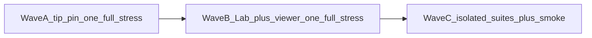

# Open-FDD nightly bug train master (3.3.27+) — optimized

**Not a VERSION bump itself.** Child plans stay the concern backlog. **Stop** full backup → re-pin → `run_railway_hub_stress.sh` after every tiny rev.

**Honesty:** every concern still gets evidence. Drop only **duplicate full Railway matrices** when images/topology did not change.

**Gate:** Wave A tip pin before Wave B. Do not merge docs mid-Publish.

## Waves

| Wave | Children | Stress |
|------|----------|--------|
| **A — tip pin** | 3.3.26 closeout + [`3.3.27`](3.3.27_mqtt_fieldbus_tip_pin_sync.plan.md) | **One full** Railway + Overview `zone_t` |
| **B — product** | [`3.3.28`](3.3.28_lab_tuners_econ_ahu_residual.plan.md) + [`3.3.29`](3.3.29_viewer_login_and_ui_scope.plan.md) | Ship 1–2 PRs → **one** tip → **one full** stress |
| **C — isolated** | [`3.3.30`](3.3.30_isolated_zap_af_auth.plan.md) + [`3.3.31`](3.3.31_mqtts_transport_isolation.plan.md) + [`3.3.32`](3.3.32_durability_restore_perf.plan.md) | Isolated suites primary; end with **Railway smoke** (full only if images changed) |

## Stress tiers

| Tier | When | What |
|------|------|------|
| **Full Railway** | Wave A; Wave B tip; image/topology change | Full `run_railway_hub_stress.sh` → `fully_qualified` + Overview |
| **Railway smoke** | Wave C end; docs-only | Hub health + edges + Overview Zone Other/`zone_t` (+ light ZAP); skip full CSV/synth59/B100/Creekside/MCP re-run unless images moved |
| **Isolated** | 330/331/332 primary | Disposable ZAP AF, MQTTS ACL/QoS, restore-to-empty — never claim PASS from live Railway alone |

### Overview charts (full + smoke)

Hosted-weather AV **9101** → role **`zone_t`** → **Zone Other** charts populated (not empty + rising `ingest_ok`). Evidence in BUG_REPORT or DEFERRED with operator-browser reason.

## Dropped as silly

- Full matrix after every child when tip unchanged
- Isolated proof via live Railway
- Docs merges that cancel fieldbus Publish
- Extra VERSION for pin-only if Wave A already closed that tip under 3.3.26

Ops: [`../PATCH_CYCLE.md`](../PATCH_CYCLE.md) · [`../STRESS_CLOSEOUT.md`](../STRESS_CLOSEOUT.md) · [`../BUG_REPORT_OT_MODBUS_HAYSTACK.md`](../BUG_REPORT_OT_MODBUS_HAYSTACK.md).
