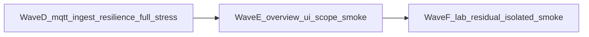

# Open-FDD post-3.3.33 soft-OPEN master — optimized

**Not a VERSION bump itself.** Child plans are the concern backlog. Parent program [`openfdd_nightly_bug_train_3.3.27_plus_program.plan.md`](openfdd_nightly_bug_train_3.3.27_plus_program.plan.md) is **CLOSED** through 3.3.33.

**Honesty rule:** every concern still gets evidence. Drop only **duplicate full Railway matrices** when hub/field images and MQTT topology did not change.

**Gate:** Fix live ingest stall (Wave D) before UI polish (Wave E). Do not merge docs mid-Publish.

**Mirrors:** write children under [``]() then copy to `~/.cursor/plans/`. Living evidence: [`BUG_REPORT_OT_MODBUS_HAYSTACK.md`](../BUG_REPORT_OT_MODBUS_HAYSTACK.md).

**Baseline tip (start):** `25826cf6` · **`sha-25826cf`** · health **`3.3.33+25826cf67999`** · field `bldg2` / `pi-1` · hosted AV `9101` → `bldg2-zone-loopback` / `zone_t`.

## Waves (do this)



| Wave | Children | Ship how | Stress (required) |
|------|----------|----------|-------------------|
| **D — ingest** | [`3.3.34`](3.3.34_mqtt_ingest_reconnect.plan.md) | Product/ops fix so central MQTT ingest **reconnects** after mqtt re-pin; VERSION bump if GHCR ships | **One full** `run_railway_hub_stress.sh` after tip lands + prove `ingest_ok` advances over ≥2 publish intervals |
| **E — UI** | [`3.3.35`](3.3.35_overview_ui_fdd_scope.plan.md) | Close `railway-ui-fdd-stale` + operator Overview tables-visible default for MQTT=`CSV` | **Railway smoke** + Overview probe (`equipment`, Zone Other, picker). **Full** only if web/central images changed |
| **F — Lab residual** | [`3.3.36`](3.3.36_lab_gate_residual.plan.md) | Honest Lab leftovers only; keep Path B refusal for fake SQL-bound gates | **Isolated/unit** primary; end with **Railway smoke**. Full only if tip images moved |

### Child index (one concern each)

| Rev | Plan | One concern |
|-----|------|-------------|
| 3.3.34 | `3.3.34_mqtt_ingest_reconnect.plan.md` | Central MQTT ingest stays live after mqtt/central redeploy (`ingest_ok` rising; not sticky `has_telemetry` alone) |
| 3.3.35 | `3.3.35_overview_ui_fdd_scope.plan.md` | Building-scoped FDD chrome + Overview tables visible by default for live MQTT sites (close `railway-ui-fdd-stale` / browser sign-off) |
| 3.3.36 | `3.3.36_lab_gate_residual.plan.md` | Lab residual that has honest bindings; **DEFER** vibe19 operational-gate trio if still no SQL/session truth |

## Soft-OPEN → wave map (from BUG_REPORT)

| ID | Disposition entering this program | Wave |
|----|-----------------------------------|------|
| **mqtt-ingest-stall** (new) | **OPEN** — hub `edges:1` + fieldbus healthy but `ingest_ok` flat after re-pin | **D** |
| **mqtt-fieldbus-tip-pin-sync** | **CLOSED** on 3.3.33 tip (`sha-25826cf` all services) — remove hybrid deferral | — |
| **railway-ui-fdd-stale** | **DEFERRED** → UX | **E** |
| **bldg2-overview-signoff** | **DEFERRED** → operator browser | **E** (evidence, may close without product PR) |
| **vibe19-operational-gate-lab** | **DEFERRED** → future (no honest SQL) | **F** or stay DEFERRED |
| **qualification-viewer-login** optional matrix path | soft | **F** optional |
| **weather-legitimacy-chicago** | tier-C optional | out of wave (operator soak) |
| **railway-f1-stress** B50/AFDD | operator-skip | out of wave |
| **local-parquet-root-split** | lab-only | out of wave |

## Stress tiers (not cheat — right tier)

| Tier | When | What |
|------|------|------|
| **Full Railway** | Wave D tip; any rev that changes hub/field images or MQTT topology | Full `run_railway_hub_stress.sh` → `fully_qualified` + Overview MQTT=`CSV` gate |
| **Railway smoke** | Wave E/F end; docs-only mid-wave | Hub health + fieldbus `:8081` + edges `has_telemetry` + **`ingest_ok` advancing** + Overview equipment/Zone Other + public ZAP if cheap |
| **Isolated / unit** | Wave F Lab honesty; Wave D reconnect unit if feasible | Prove reconnect without claiming live PASS from docs alone |

### Full / smoke MUST still validate MQTTS → Overview

| Check | Expected |
|-------|----------|
| Field | x86 fieldbus → MQTTS; hosted-weather AV **9101** |
| Edge | `pi-1` / `bldg2` `has_telemetry:true` |
| Ingest | `ingest_ok` **increases** across ≥2× `OPENFDD_MQTT_PUBLISH_INTERVAL_SECS` (do not trust sticky edges alone) |
| Role | **`zone_t`** / `bldg2-zone-loopback` |
| Overview | Equipment non-empty; Zone Other **tables visible** (not hidden empty); AFDD `fdd/run` scoped to `bldg2` |
| Evidence | BUG_REPORT verdict + report dir — or **DEFERRED** with operator-browser reason |

## Dropped as silly (keep evidence elsewhere)

- Full backup + re-pin + full matrix after every UI-only or docs child when tip images unchanged
- Claiming ingest healthy from `edges:1` alone while `ingest_ok` is flat
- Merging docs while Publish is still building fieldbus
- Shipping fake Lab sliders for operational-gate trio without SQL/session binding

## Wave loops

**Wave D (image-shipping / ingest):**

```text
hygiene → VERSION + reconnect fix → PR merge → wait GHCR tip (mqtt+fieldbus too)
  → one backup → re-pin central→mqtt→web → fieldbus sha-<7>
  → prove ingest_ok advances → ONE full run_railway_hub_stress.sh
  → BUG_REPORT wave verdict → hygiene
```

**Wave E (UI / smoke-first):**

```text
hygiene → SPA/FDD scope fix (bump VERSION only if web/central ship)
  → if images changed: backup/re-pin + smoke or full per tier table
  → Overview probe + operator browser sign-off artifact
  → BUG_REPORT → hygiene
```

**Wave F (Lab residual / isolated):**

```text
hygiene → honest Lab PR(s) or explicit DEFER in BUG_REPORT
  → unit/isolated proof → Railway smoke unless tip moved
  → BUG_REPORT → hygiene
```

Locked: Railway hub + bensbench x86 fieldbus; low-RAM; no Pi / no live OT DoS. Ops: [`PATCH_CYCLE.md`](../PATCH_CYCLE.md) · [`STRESS_CLOSEOUT.md`](../STRESS_CLOSEOUT.md).
