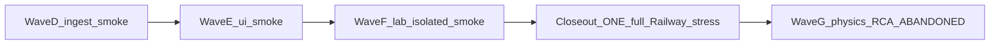

# Open-FDD post-3.3.33 soft-OPEN master — optimized

**Status:** soft-OPEN D→E→F + closeout **CLOSED**. Wave G = Lab tuner Vibe19 parity — [`openfdd_lab_tuner_parity_program.plan.md`](openfdd_lab_tuner_parity_program.plan.md) · Cursor `post_softopen_wave_g_sql_anomaly_master_f7a8b9c0`.

**Not a VERSION bump itself.** Child plans are the concern backlog. Parent program [`openfdd_nightly_bug_train_3.3.27_plus_program.plan.md`](openfdd_nightly_bug_train_3.3.27_plus_program.plan.md) is **CLOSED** through 3.3.33.

**Honesty rule:** every concern still gets evidence. Drop only **duplicate full Railway matrices** between OT children.

**Preferred OT stress shape:** mid-wave **smoke / isolated**; **ONE full** `run_railway_hub_stress.sh` **LAST** (soft-OPEN closeout) before the BUG_REPORT D–F verdict.

**Gate:** Fix live ingest stall (Wave D) before UI polish (Wave E). Do not merge docs mid-Publish.

**Mirrors:** this `patch_trains/` dir + `~/.cursor/plans/post_3.3.33_soft_open_master_a1b2c3d4.plan.md`. Living evidence: [`BUG_REPORT_OT_MODBUS_HAYSTACK.md`](../BUG_REPORT_OT_MODBUS_HAYSTACK.md).

**Baseline tip (start):** `25826cf6` · **`sha-25826cf`** · health **`3.3.33+25826cf67999`** · field `bldg2` / `pi-1` · hosted AV `9101` → `bldg2-zone-loopback` / `zone_t`.

## Would Wave G (physics + RCA) be nuts?

**Abandoned 2026-09-07.** Replacement: [`openfdd_sql_anomaly_screening_program.plan.md`](openfdd_sql_anomaly_screening_program.plan.md) (SQL self/peer anomaly + full Railway/ZAP closeout).

## Waves (do this)



| Wave | Children | Ship how | Stress (required) |
|------|----------|----------|-------------------|
| **D — ingest** | [`3.3.34`](3.3.34_mqtt_ingest_reconnect.plan.md) | MQTT ingest reconnect; VERSION if GHCR ships | **Railway smoke** + `ingest_ok` advance ≥2 intervals |
| **E — UI** | [`3.3.35`](3.3.35_overview_ui_fdd_scope.plan.md) | `railway-ui-fdd-stale` + Overview tables-visible | **Railway smoke** + Overview probe + browser sign-off |
| **F — Lab residual** | [`3.3.36`](3.3.36_lab_gate_residual.plan.md) | Honest Lab only; Path B refuse fake gates | **Isolated/unit** + **Railway smoke** |
| **Closeout** | — (same final tip) | No new product unless tip moved | **ONE full** Railway → `fully_qualified` → **BUG_REPORT D–F CLOSED** |
| **G — physics + RCA** | ~~hybrid~~ | **ABANDONED** — see SQL anomaly program | — |

### Soft-OPEN child index

| Rev | Plan | One concern |
|-----|------|-------------|
| 3.3.34 | `3.3.34_mqtt_ingest_reconnect.plan.md` | Central MQTT ingest stays live after mqtt/central redeploy |
| 3.3.35 | `3.3.35_overview_ui_fdd_scope.plan.md` | Building-scoped FDD chrome + Overview tables visible by default |
| 3.3.36 | `3.3.36_lab_gate_residual.plan.md` | Honest Lab residual; **DEFER** vibe19 operational-gate if no SQL truth |

### Wave G child index — **ABANDONED**

Active: [`openfdd_sql_anomaly_screening_program.plan.md`](openfdd_sql_anomaly_screening_program.plan.md) · Cursor `post_softopen_wave_g_sql_anomaly_master_f7a8b9c0`.

## Soft-OPEN → wave map (from BUG_REPORT)

| ID | Disposition entering this program | Wave |
|----|-----------------------------------|------|
| **mqtt-ingest-stall** | **OPEN** | **D** |
| **mqtt-fieldbus-tip-pin-sync** | **CLOSED** on 3.3.33 tip | — |
| **railway-ui-fdd-stale** | **DEFERRED** → UX | **E** |
| **bldg2-overview-signoff** | **DEFERRED** → operator browser | **E** |
| **vibe19-operational-gate-lab** | **DEFERRED** (no honest SQL) | **F** or stay DEFERRED |
| **qualification-viewer-login** optional matrix path | soft | **F** optional |
| **hybrid-ml-physics-ahu-vav** | **ABANDONED** | — |
| **sql-anomaly-screening** | **OPEN** → product | **G** (new master) |
| **weather-legitimacy-chicago** | tier-C optional | out of wave |
| **railway-f1-stress** B50/AFDD | operator-skip | out of wave |
| **local-parquet-root-split** | lab-only | out of wave |

## Stress tiers (not cheat — right tier)

| Tier | When | What |
|------|------|------|
| **Full Railway** | Soft-OPEN **closeout only** (preferred) | Full `run_railway_hub_stress.sh` → `fully_qualified` + Overview MQTT=`CSV` → BUG_REPORT D–F |
| **Railway smoke** | End of D / E / F; after Wave G image tips | Hub + fieldbus + edges + **`ingest_ok` advancing** + Overview; G adds physics/applicability endpoint smoke only |
| **Isolated / unit / synthetic** | F Lab; **all of Wave G** | Reconnect units; role/residual/RCA/Overview state tests; synthetic-59 regression |
| **Wave G honesty** | Always | Screening diagnostics only; OT stress **≠** twin/Guideline-14; no zero-fill; E+/ML out of product |

### Full / smoke MUST still validate MQTTS → Overview (OT waves)

| Check | Expected |
|-------|----------|
| Field | x86 fieldbus → MQTTS; hosted-weather AV **9101** |
| Edge | `pi-1` / `bldg2` `has_telemetry:true` |
| Ingest | `ingest_ok` **increases** across ≥2× publish interval |
| Role | **`zone_t`** / `bldg2-zone-loopback` |
| Overview | Equipment non-empty; Zone Other **tables visible**; AFDD `fdd/run` on `bldg2` |
| Evidence | BUG_REPORT verdict + report dir — or **DEFERRED** with operator-browser reason |

## Dropped as silly

- Full matrix after every OT child when tip images unchanged
- Claiming ingest healthy from `edges:1` alone while `ingest_ok` is flat
- Merging docs mid-Publish (cancels fieldbus)
- Fake Lab operational-gate sliders without SQL/session binding
- Wave G mockups backed by constants; green N/A families; Python in central/web paths; ONNX/GPU/graph DB without measured need
- Calling Wave G “production-qualified” or Guideline 14; shipping ML or EnergyPlus export inside Open-FDD

## Wave loops

**Waves D / E / F (OT mid-wave):**

```text
hygiene → one-concern PR (VERSION only if images ship)
  → if images: backup → re-pin central→mqtt→web → fieldbus sha-<7>
  → Railway smoke → wave note in BUG_REPORT → hygiene
```

**Soft-OPEN closeout (required before Wave G):**

```text
final tip pinned + fieldbus up
  → ONE full run_railway_hub_stress.sh
  → cite fully_qualified + Overview MQTT gate
  → BUG_REPORT Waves D–F CLOSED → hygiene
```

**Wave G (experimental — after closeout):**

```text
inventory vs tip → short plan in BUG_REPORT
  → one child rev at a time (37→40), Rust+React gates green
  → synthetic/unit proof each child; smoke only if images ship
  → no Railway deploy / merge-to-prod unless separately authorized
  → handoff: screening-only limitations; E+ stays outside via dump
```

Locked OT path: Railway hub + bensbench x86 fieldbus; low-RAM; no Pi / no live OT DoS. Ops: [`PATCH_CYCLE.md`](../PATCH_CYCLE.md) · [`STRESS_CLOSEOUT.md`](../STRESS_CLOSEOUT.md).  
Wave G runtime boundary: Rust central, React web, Parquet historian, DataFusion SQL — see [`AGENTS.md`](../../AGENTS.md) / [`openfdd_agent_spec/AGENTS.md`](../../openfdd_agent_spec/AGENTS.md).
