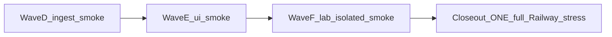

# Open-FDD post-3.3.33 soft-OPEN master — optimized

**Not a VERSION bump itself.** Child plans are the concern backlog. Parent program [`openfdd_nightly_bug_train_3.3.27_plus_program.plan.md`](openfdd_nightly_bug_train_3.3.27_plus_program.plan.md) is **CLOSED** through 3.3.33.

**Honesty rule:** every concern still gets evidence. Drop only **duplicate full Railway matrices** between children.

**Preferred stress shape:** mid-wave **smoke / isolated**; **ONE full** `run_railway_hub_stress.sh` **LAST** (program closeout) before the BUG_REPORT round update. If a child ships hub/field images, re-pin + smoke mid-wave — do **not** run the full matrix until closeout unless topology broke and you need an early abort.

**Gate:** Fix live ingest stall (Wave D) before UI polish (Wave E). Do not merge docs mid-Publish.

**Mirrors:** this `patch_trains/` dir + `~/.cursor/plans/post_3.3.33_soft_open_master_a1b2c3d4.plan.md`. Living evidence: [`BUG_REPORT_OT_MODBUS_HAYSTACK.md`](../BUG_REPORT_OT_MODBUS_HAYSTACK.md).

**Baseline tip (start):** `25826cf6` · **`sha-25826cf`** · health **`3.3.33+25826cf67999`** · field `bldg2` / `pi-1` · hosted AV `9101` → `bldg2-zone-loopback` / `zone_t`.

## Waves (do this)



| Wave | Children | Ship how | Stress (required) |
|------|----------|----------|-------------------|
| **D — ingest** | [`3.3.34`](3.3.34_mqtt_ingest_reconnect.plan.md) | Product fix so central MQTT ingest **reconnects** after mqtt re-pin; VERSION if GHCR ships | **Railway smoke** + prove `ingest_ok` advances ≥2 publish intervals after deliberate mqtt/central bounce |
| **E — UI** | [`3.3.35`](3.3.35_overview_ui_fdd_scope.plan.md) | Close `railway-ui-fdd-stale` + Overview tables-visible for MQTT=`CSV` | **Railway smoke** + Overview probe + browser sign-off artifact |
| **F — Lab residual** | [`3.3.36`](3.3.36_lab_gate_residual.plan.md) | Honest Lab leftovers only; Path B refuse fake gates | **Isolated/unit** + **Railway smoke** |
| **Closeout** | — (same final tip) | No new product unless tip moved | **ONE full** `run_railway_hub_stress.sh` → `fully_qualified` → **BUG_REPORT program verdict** |

### Child index (one concern each)

| Rev | Plan | One concern |
|-----|------|-------------|
| 3.3.34 | `3.3.34_mqtt_ingest_reconnect.plan.md` | Central MQTT ingest stays live after mqtt/central redeploy (`ingest_ok` rising; not sticky `has_telemetry` alone) |
| 3.3.35 | `3.3.35_overview_ui_fdd_scope.plan.md` | Building-scoped FDD chrome + Overview tables visible by default (close `railway-ui-fdd-stale` / browser sign-off) |
| 3.3.36 | `3.3.36_lab_gate_residual.plan.md` | Lab residual with honest bindings; **DEFER** vibe19 operational-gate if still no SQL/session truth |

## Soft-OPEN → wave map (from BUG_REPORT)

| ID | Disposition entering this program | Wave |
|----|-----------------------------------|------|
| **mqtt-ingest-stall** | **OPEN** — `edges:1` + healthy fieldbus but `ingest_ok` flat after re-pin | **D** |
| **mqtt-fieldbus-tip-pin-sync** | **CLOSED** on 3.3.33 tip | — |
| **railway-ui-fdd-stale** | **DEFERRED** → UX | **E** |
| **bldg2-overview-signoff** | **DEFERRED** → operator browser | **E** |
| **vibe19-operational-gate-lab** | **DEFERRED** (no honest SQL) | **F** or stay DEFERRED |
| **qualification-viewer-login** optional matrix path | soft | **F** optional |
| **weather-legitimacy-chicago** | tier-C optional | out of wave |
| **railway-f1-stress** B50/AFDD | operator-skip | out of wave |
| **local-parquet-root-split** | lab-only | out of wave |

## Stress tiers (not cheat — right tier)

| Tier | When | What |
|------|------|------|
| **Full Railway** | **Program closeout only** (preferred); early abort only if tip/topology looks broken | Full `run_railway_hub_stress.sh` → `fully_qualified` + Overview MQTT=`CSV` gate → BUG_REPORT |
| **Railway smoke** | End of Waves D / E / F | Hub health + fieldbus `:8081` + edges + **`ingest_ok` advancing** + Overview equipment/Zone Other + public ZAP if cheap |
| **Isolated / unit** | Wave F Lab; Wave D reconnect unit if feasible | Prove reconnect / Lab honesty without claiming live PASS from docs alone |

### Full / smoke MUST still validate MQTTS → Overview

| Check | Expected |
|-------|----------|
| Field | x86 fieldbus → MQTTS; hosted-weather AV **9101** |
| Edge | `pi-1` / `bldg2` `has_telemetry:true` |
| Ingest | `ingest_ok` **increases** across ≥2× publish interval |
| Role | **`zone_t`** / `bldg2-zone-loopback` |
| Overview | Equipment non-empty; Zone Other **tables visible**; AFDD `fdd/run` on `bldg2` |
| Evidence | BUG_REPORT verdict + report dir — or **DEFERRED** with operator-browser reason |

## Dropped as silly

- Full matrix after every child when tip images unchanged
- Claiming ingest healthy from `edges:1` alone while `ingest_ok` is flat
- Merging docs mid-Publish (cancels fieldbus)
- Fake Lab operational-gate sliders without SQL/session binding

## Wave loops

**Waves D / E / F (mid-wave):**

```text
hygiene → one-concern PR (VERSION only if images ship)
  → if images: backup → re-pin central→mqtt→web → fieldbus sha-<7>
  → Railway smoke (D also: ingest_ok advance proof) → wave note in BUG_REPORT → hygiene
```

**Program closeout (LAST — required for this round):**

```text
final tip pinned + fieldbus up
  → ONE full run_railway_hub_stress.sh
  → cite fully_qualified + Overview MQTT gate
  → BUG_REPORT Waves D–F / program CLOSED verdict → hygiene
```

Locked: Railway hub + bensbench x86 fieldbus; low-RAM; no Pi / no live OT DoS. Ops: [`PATCH_CYCLE.md`](../PATCH_CYCLE.md) · [`STRESS_CLOSEOUT.md`](../STRESS_CLOSEOUT.md).
