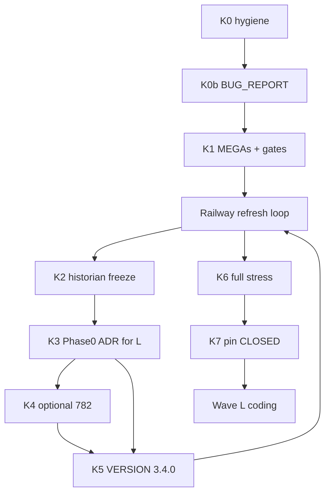

# Wave K — 3.4.0 filesystem-historian pin (master)

**Active.** Ops Railway hub **`sha-5aed663`** / 3.3.41. K2/K3 docs **#885 MERGED**. Next tip: **[#886](https://github.com/bbartling/open-fdd/pull/886)** plot-span. Cursor live board: `~/.cursor/plans/wave_k_340_filesystem_pin_master.plan.md`.

**Why 3.4.0:** Last fully qualified **single-tenant Parquet + DataFusion** product line before Wave L **multi-client shared hosting**. Freeze the historian contract so Wave L partitions storage — it does **not** replace Parquet with Postgres time-series.

## Architecture handoff (locks Wave L)

Inspired by the Sep 2026 multi-client hosting assignment. **Wave K freezes; Wave L implements.**

| Lock | Meaning |
|------|---------|
| Historian | **Parquet + DataFusion stay.** No Postgres (or other RDBMS) as time-series store. |
| “Shared database / shared hosting” | **One shared Railway stack** serving many engineering-firm tenants via **tenant-partitioned storage + control plane** — not a `customer_id` UI filter. |
| Control plane | Optional small **transactional** store (tenants/users/memberships/buildings) — **metadata only**; justify in K3 ADR. |
| Mode | Multi-tenant **OFF by default** until qualified; single-tenant/local preserved. |
| Live ops | Agent uses **Railway CLI** for lab backup/re-pin/smoke/stress on this hub under this wave’s authorization. No DNS purchase, no OT writes, no live customer migration without explicit operator go. |

## Law — low-RAM + Railway CLI (non-negotiable)

| Rule | Do |
|------|----|
| Agents | **One** agent. No competing agents / heavy local stack `docker build`. |
| Images | Wait **GHCR tip Publish** (central/web/mqtt/fieldbus). |
| Railway | Agent drives **`railway` CLI**: vars, backups, service image pins, health probes. Re-pin hub **and** fieldbus when tip moves. |
| Between builds | tip Publish → tip gate → backup → re-pin → soak → **smoke** → BUG_REPORT |
| Full stress | **ONE** `run_railway_hub_stress.sh` at **K6** (no `SKIP_ZAP`). Mid-wave = smoke only. |
| Logging | Every pin/smoke/stress → [`BUG_REPORT_OT_MODBUS_HAYSTACK.md`](../BUG_REPORT_OT_MODBUS_HAYSTACK.md). |

```text
merge PR → GHCR tip Publish → ./scripts/check_ghcr_tip_stack.sh sha-<7>
  → Railway CLI backup → ~/openfdd-backups/railway/<UTC>/
  → re-pin hub + bensbench fieldbus → soak → mid-wave smoke → BUG_REPORT
```

## Required MEGAs (fix + stress before 3.4.0 CLOSED)

| ID | Fix intent | Stress gate |
|----|------------|-------------|
| **sensor-faults-matrix** | Historian equipment discovery; matrix rows pending until SV run | Lakeside `sensor-faults` `matched_equipment_count > 0` |
| **mqtt-bacnet-quad-points** | Delta-filter id includes `point_name`; AV 9101/9102 + web OAT | Recent non-null `zone_t`,`oa_t`, humidity, `web_oa_t` |
| **data-model-all-sites** | Historian Parquet roles; fail closed on cross-site eq; honest copy | `bldg2` mapping roles non-empty; wrong-site eq errors |

Add/require gate in `run_railway_hub_stress.sh` (keep Wave I gate 09). **#782** = optional K4 only.

## Non-goals

- Wave L product runtime (except K3 design ADR)
- Postgres historian / Feather↔DB time-series dual-write
- Enabling public multi-tenant hosting or live customer migration
- Multivendor MFA Stage C product (scaffolded in ADR only)
- PARKED anomaly / ABANDONED hybrid / mass Dependabot

## Parallel agent lab (does **not** block 3.4.0)

**Typst RCx lab report (VAV AHU)** — engineer screening PDF from live DataFusion
Overview / RCx / FDD series (UI Plotly palette, Overview tables, per-AHU **FC1** +
**ECON-*** / **AHU-SATDEV** with `confirmed_fault` overlay). Skill:
[`openfdd_agent_spec/skills/openfdd-typst-rcx-report/SKILL.md`](../../../openfdd_agent_spec/skills/openfdd-typst-rcx-report/SKILL.md).
Not `rust-text-pdf`; never blocks K7.

**OPEN plot-span debt (K1b tip):** BUG_REPORT `fdd-series-recent-only`,
`econ-points-prefix-limit`, `rcx-oat-scatter-cap` — [#886](https://github.com/bbartling/open-fdd/pull/886)
(`edge/src/fdd/registry_api.rs` + `services/central/src/analytics/historian.rs`).

## Order



| Step | Concern | Containers | Stress | BUG_REPORT |
|------|---------|------------|--------|------------|
| **K0** | Hygiene / tip green | Publish if needed | tip gate | Active=Wave K |
| **K0b** | Open MEGA rows | no | no | rows OPEN |
| **K1** | MEGA product + gate | **yes** each product merge | smoke | evidence |
| **K2** | Historian freeze docs | no if docs-only | no | note |
| **K3** | Multi-client Phase-0 ADR | no | no | ADR path |
| **K4** | #782 | if product | smoke | CLOSED/PARK |
| **K5** | **3.4.0** | **yes** | smoke | VERSION line |
| **K6** | Full stress | on tip | **full** | stress path |
| **K7** | Handoff L | — | — | **PINNED 3.4.0** |

## Acceptance

- Health `3.4.0+<sha>`; hub+fieldbus same tip; Python-absence PASS
- `fully_qualified=true` + Wave K MEGA gates PASS
- Historian freeze docs + Phase-0 multi-client ADR merged (design)
- BUG_REPORT **3.4.0 PINNED**; Next = Wave L multi-client hosting

## Child plans

| Order | Plan |
|-------|------|
| K0–K7 | this master |
| L | [`wave_l_shared_db_mega_master.plan.md`](openfdd_wave_l_shared_db_mega_program.plan.md) |
| Optional | [`mqtt_monitor_sse_782.plan.md`](../../../.cursor/plans/mqtt_monitor_sse_782.plan.md) |
