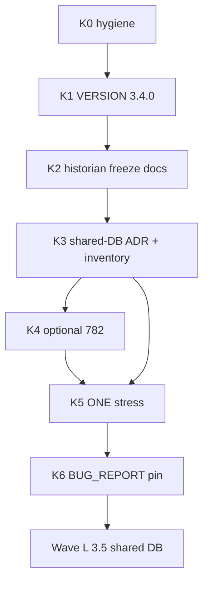

# Wave K — 3.4.0 filesystem-historian pin (master)

**Active program** after Wave J **CLOSED** (`sha-c1b1aa5` / 3.3.41 · stress `20260909T010712Z` · `fully_qualified=true`).

**Retired:** [`wave_j_df_boundary_master.plan.md`](wave_j_df_boundary_master.plan.md) — historical only.

**Why 3.4.0 (not another 3.3.x):** Operator wants a **pinned baseline** before the shared-database mega. 3.4.0 = last fully qualified **volume-local Feather/Parquet** product line. 3.5.x = shared DB cutover.

**Law:** Low-RAM one agent. No local stack `docker build`. 0 open PRs / stale branches / failed tip Actions at child start/end. Mid-wave = smoke only. **ONE** full `run_railway_hub_stress.sh` at **K5**.

## Non-goals (this wave)

- Implementing Postgres/shared DB runtime (→ Wave L)
- Multivendor identity/MFA/tenant isolation Stage C (after shared DB exists)
- Reopening PARKED `sql-anomaly-screening` or ABANDONED hybrid ML
- Mass Dependabot merges (hygiene close only)

## Order

| Step | Concern | VERSION? | Images? |
|------|---------|----------|---------|
| **K0** | 0 PRs; tip GHCR green | no | tip Publish if docs tip incomplete |
| **K1** | Bump **3.4.0** | yes | after merge |
| **K2** | Document freeze: `/workspace` Feather+Parquet, backup script, restore rules | docs ok in same or follow PR | no if docs-only |
| **K3** | ADR + YAML inventory (engine, schema sketch, dual-write plan, rollback) | no | no |
| **K4** | [#782](https://github.com/bbartling/open-fdd/issues/782) SSE — ship **or** PARK | if product | if product |
| **K5** | Backup → re-pin → fieldbus → full stress | — | tip sha |
| **K6** | BUG_REPORT **3.4.0 PINNED** + Wave L OPEN | docs | — |

## Acceptance (Wave K CLOSED / 3.4.0 pin)

- Health `3.4.0+<sha>` on Railway; GHCR tip complete; Python-absence PASS
- Stress `fully_qualified=true` citing **this** tip only
- Historian freeze docs + shared-DB ADR merged (design, not runtime)
- BUG_REPORT header: **PINNED 3.4.0** · Next = Wave L shared DB
- #782 either CLOSED or PARKED with explicit owner — never “done by docs alone”

## Child plans

| Order | Plan |
|-------|------|
| K0–K6 | this master |
| L | [`wave_l_shared_db_mega_master.plan.md`](wave_l_shared_db_mega_master.plan.md) |
| Optional | [`mqtt_monitor_sse_782.plan.md`](mqtt_monitor_sse_782.plan.md) as K4 |
