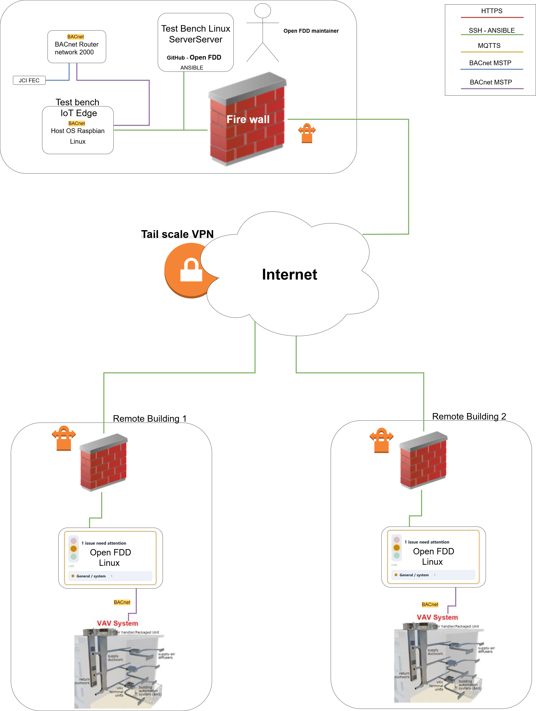

# System overview

Open-FDD on a **git checkout** is an **edge operator product**: four application containers, host Caddy, optional host Ollama, and Ansible deploys like **Acme** and **bensserver**.



---

## Containers (what runs where)

| Image | Port / network | Role |
|-------|----------------|------|
| **`openfdd-bridge`** | `8765` (published) | FastAPI + React SPA: auth, model, Rule Lab API, plots, check-engine, agent routes |
| **`openfdd-commission`** | `8767` | BACnet commission agent (Who-Is, read/write jobs) — talks to field devices |
| **`openfdd-bacnet-poll`** | `network_mode: host` | RPM poll driver → `samples.csv` → feather ingest |
| **`openfdd-mcp-rag`** | `8090` | Doc/skill retrieval for deployment AI (optional) |
| **`ollama/ollama`** | `11434` (optional) | Local LLM for **check-engine** narrative only — see [Local Ollama](local_ollama) |

**On the host (not in app images):** **Caddy** `:80` → bridge; optional **host Ollama** for GPU; **systemd timers** for FDD batch + feather retention (`docker compose exec bridge …`).

**State** lives under **`workspace/`** (bind-mounted): `data/feather_store/`, `data/rules_py/`, `data/model.json`, `bacnet/`, `auth.env.local`.

---

## Data flow (one building)

```text
BACnet devices
    → commission (discover / points.csv)
    → poll (host-network driver)
    → ingest → feather wide frames (Apache Arrow IPC — see [Arrow data plane](architecture/arrow_data_plane))
    → Rule Lab Python rules (batch / timer)
    → fdd_results.json + check-engine (GREEN/YELLOW/RED)
    → dashboard + optional local Ollama summary
```

**BRICK model:** `workspace/data/data_model.ttl` synced from BACnet; bridge exposes SPARQL tree/graph APIs. Rules bind logical inputs via `rules_store.json` + model `fdd_input` keys.

---

## Deploy paths

| Path | When |
|------|------|
| **Docker + Ansible** (recommended) | Acme VM, production edges — [Edge deploy (Docker)](edge_deploy_docker) |
| **Local dev stack** | Laptop/server — `./scripts/openfdd_stack.sh up` |
| **MSTP lab overlay** | `compose.bench.yml` + `workspace/bacnet/commissioning/commission.env` NIC bind |
| **Legacy systemd + rsync** | Pi without Docker — Ansible `deploy.sh all` |

---

## PyPI library (secondary)

`pip install "open-fdd[engine]"` runs **YAML** rules on pandas DataFrames only — no BACnet, no bridge. Use when exporting historian CSVs offline. See [Fault rules (engine)](rules/) and [Expression cookbook (YAML / pandas)](expression_rule_cookbook_yaml).

---

## Related

- [Getting started](getting_started)
- [Arrow data plane](architecture/arrow_data_plane) — historian: built on Arrow vs not
- [Edge stack layout](architecture/edge_stack)
- [Bridge API](appendix/bridge_api)
