# air_handling_unit
Variable volumne air handling unit setup which requires a configuration for the data.

<details>
  <summary>Tutorial for the `config_dict`</summary>

The `config_dict` is a Python data structure containing variables for tuning faults and names of columns in your data that represent components in the AHU, such as sensors and other I/O that drive the unit. It should be fairly self-explanatory, where the naming convention attempts to follow something related to the `BRICK` schema. Tuning variables for the fault equations, such as anything _DEG_ERR_THRES, can be adjusted when a high number of faults occur for a given fault condition equation. You can review the data in the plots and adjust accordingly, making the mechanical engineer's best determination if further investigation needs to happen with the HVAC system at hand. Please feel free to post a GitHub discussion where high numbers of faults can be very confusing. Other fault tuning parameters that may not be very straightforward are:

* **DELTA_OS_MAX**: This is for fault equation 4, which resamples data in an effort to flag tuning or hunting issues in the control system. The fault rule logic under the hood looks at heating/cooling valves and outside air damper positions to determine modes of the AHU such as heating, economizer cooling, economizer plus mechanical cooling, and mechanical cooling only modes. If hunting is happening, a fault on this equation occurs when the operating state changes (`DELTA_OS_MAX`) is greater than this value in one hour. The default value is 7.

* **AHU_MIN_OA_DPR**: AHU minimum outside air damper position expressed as a float between 0 and 1 for percent command. The default value is 0.2 or 20%.

* **OAT_RAT_DELTA_MIN**: This is for fault equation 6, which is used to determine that there is a good delta between the outside air and return air temperatures for running a calculation called an outside air fraction calculation that determines the % outside air between mixing, return, and outside air temperature sensors. The greater the delta temperature, the greater the accuracy of this calculation, where for the fault rule to be enabled, it needs to have a good delta.

* **AIRFLOW_ERR_THRES**: This is used in fault equation 6 as a tuning parameter to compare the calculated fan volume to the actual air volume.

* **AHU_MIN_OA_CFM_DESIGN**: This is used in fault equation 6 as a minimum outside air volume amount, which comes from the design blueprints for how the mechanical design engineer originally intended for a volume of fresh air, most likely based off of ASHRAE 62.1 if in the United States.

* **TROUBLESHOOT_MODE**: Can be set to either `True` or `False`, where if in a `True` mode, there are more print statements in the console that yield minimum and maximum values in the data frame columns as well as data types. Also, see below in the example of the fault rule if `self.troubleshoot_mode` is enabled, there are additional columns in the dataframe that are used in the rule-based calculations that are not removed and can be useful if processed data is saved again to CSV format. You can then open it in Excel or whatever tool one prefers for more elaborate troubleshooting.

* **ROLLING_WINDOW_SIZE**: See below for the fault rule logic. This is a setting where a cumulative value of faults needs to occur before a True fault will be flagged. The idea is to cut down on false positives.

```python
# Configuration dictionary
config_dict = {
    # used for report name
    'AHU_NAME': "MZVAV_1",

    # timestamp column name
    'INDEX_COL_NAME': "timestamp",

    'DUCT_STATIC_COL': "SaStatic",
    'DUCT_STATIC_SETPOINT_COL': "SaStaticSPt",
    'SUPPLY_VFD_SPEED_COL': "Sa_FanSpeed",
    'MAT_COL': "MA_Temp",
    'OAT_COL': "OaTemp",
    'SAT_COL': "SaTempSP",
    'RAT_COL': "RaTemp",
    'HEATING_SIG_COL': "HW_Valve",  
    'COOLING_SIG_COL': "CW_Valve",  
    'ECONOMIZER_SIG_COL': "OA_Damper",
    'SUPPLY_FAN_AIR_VOLUME_COL': None,  # Set to None to potentially skip Fault Condition 6

    'SAT_SETPOINT_COL': "SaTempSPt",
    'CONSTANT_LEAVE_TEMP_SP': False,
    'CONSTANT_LEAVE_TEMP_SP_VAL': 55.0,

    'VFD_SPEED_PERCENT_ERR_THRES': 0.05,
    'VFD_SPEED_PERCENT_MAX': 0.99,
    'DUCT_STATIC_INCHES_ERR_THRES': 0.1,
    'OUTDOOR_DEG_ERR_THRES': 5.0,
    'MIX_DEG_ERR_THRES': 5.0,
    'RETURN_DEG_ERR_THRES': 2.0,
    'SUPPLY_DEG_ERR_THRES': 2.0,
    'DELTA_T_SUPPLY_FAN': 2.0,

    'DELTA_OS_MAX': 7,
    'AHU_MIN_OA_DPR': 0.20,
    'OAT_RAT_DELTA_MIN': 10,
    'AIRFLOW_ERR_THRES': 0.3,
    'AHU_MIN_OA_CFM_DESIGN': 2500,
    'TROUBLESHOOT_MODE': False,
    'ROLLING_WINDOW_SIZE': 5
}
```
</details>

## See `examples` directory 

* This will be the most current working code bases after running a `pip install .` I run the `examples` anywhere on my local machine.

* As of 7/24/24, a new feature has been added: `rolling_sum = df["combined_check"].rolling(window=self.rolling_window_size).sum()`. This feature introduces a rolling sum condition to ensure that a fault is only triggered if 5 consecutive conditions are met in the data. For instance as shown below in the code, if the fan is operating near 100% speed and is not meeting the duct static setpoint, and data is captured every minute, the system requires 5 consecutive faults (or 5 minutes) before officially throwing a fan fault. This helps prevent false positives. The `rolling_window_size` param will be a adjustable value (default of 5) for tuning purposes which can be passed into the fault `FaultCondition` class via the config dictionary. 


## Fault Equation Tutorials

<details>
  <summary>Fault equation 1: Duct static pressure too low with fan operating near 100% speed</summary>

This Python class, `FaultConditionOne`, implements a fault detection algorithm for Air Handling Units (AHU), specifically targeting low duct static pressure fan faults. It utilizes mechanical engineering principles and mathematical calculations to monitor and diagnose faults. The class compares actual duct static pressure (`duct_static_col`) against a setpoint (`duct_static_setpoint_col`) with an error threshold (`duct_static_inches_err_thres`). Simultaneously, it checks if the fan speed (`supply_vfd_speed_col`) exceeds a defined maximum threshold minus an error tolerance (`vfd_speed_percent_max` - `vfd_speed_percent_err_thres`).

```mermaid 
graph TD
    title["Fault Equation 1"]
    caption["Duct static pressure too low with fan at full speed"]
    equation["DSP < DPSP - eDSP and VFDSPD ≥ 99% - eVFDSPD"]

    legend["Legend:"]
    DSP["DSP: Duct Static Pressure"]
    DPSP["DPSP: Duct Static Pressure Setpoint"]
    VFDSPD["VFDSPD: VFD Speed Reference in Percent"]
    eVFDSPD["eVFDSPD: VFD Speed Reference Error Threshold"]

    title --> caption
    caption --> equation
    equation --> legend
    legend --> DSP
    legend --> DPSP
    legend --> VFDSPD
    legend --> eVFDSPD

```



These conditions are combined (combined_check) and a rolling window technique is applied to sum consecutive true conditions (rolling_sum). A fault flag (fc1_flag) is set when the sum within the rolling window equals the window size, indicating persistent fault conditions. 


```python
import pandas as pd
from open_fdd.air_handling_unit.faults.fault_condition import FaultCondition

class FaultConditionOne(FaultCondition):
    """ Class provides the definitions for Fault Condition 1.
        AHU low duct static pressure fan fault.
    """

    def __init__(self, dict_):
        """
        :param dict_:
        """
        self.vfd_speed_percent_err_thres = float
        self.vfd_speed_percent_max = float
        self.duct_static_inches_err_thres = float
        self.duct_static_col = str
        self.supply_vfd_speed_col = str
        self.duct_static_setpoint_col = str
        self.troubleshoot_mode = bool  # default should be False
        self.rolling_window_size = int

        self.set_attributes(dict_)

    def apply(self, df: pd.DataFrame) -> pd.DataFrame:
        if self.troubleshoot_mode:
            self.troubleshoot_cols(df)

        # check analog outputs [data with units of %] are floats only
        columns_to_check = [self.supply_vfd_speed_col]
        self.check_analog_pct(df, columns_to_check)

        df['static_check_'] = (
            df[self.duct_static_col] < df[self.duct_static_setpoint_col] - self.duct_static_inches_err_thres)
        df['fan_check_'] = (
            df[self.supply_vfd_speed_col] >= self.vfd_speed_percent_max - self.vfd_speed_percent_err_thres)

        # Combined condition check
        df["combined_check"] = df['static_check_'] & df['fan_check_']

        # Rolling sum to count consecutive trues
        rolling_sum = df["combined_check"].rolling(window=self.rolling_window_size).sum()
        # Set flag to 1 if rolling sum equals the window size
        df["fc1_flag"] = (rolling_sum == self.rolling_window_size).astype(int)

        if self.troubleshoot_mode:
            print("Troubleshoot mode enabled - not removing helper columns")
            del df["static_check_"]
            del df["fan_check_"]
            del df["combined_check"]

        return df
```

</details>

## AHU fault equation descriptions
* **Fault Condition 1**: Duct static pressure too low with fan operating near 100% speed
* **Fault Condition 2**: Mix temperature too low; should be between outside and return air
* **Fault Condition 3**: Mix temperature too high; should be between outside and return air
* **Fault Condition 4**: PID hunting; too many operating state changes between AHU modes for heating, economizer, and mechanical cooling
* **Fault Condition 5**: Supply air temperature too low should be higher than mix air
* **Fault Condition 6**: OA fraction too low or too high, should equal to design % outdoor air requirement
* **Fault Condition 7**: Supply air temperature too low in full heating
* **Fault Condition 8**: Supply air temperature and mix air temperature should be approx equal in economizer mode
* **Fault Condition 9**: Outside air temperature too high in free cooling without additional mechanical cooling in economizer mode
* **Fault Condition 10**: Outdoor air temperature and mix air temperature should be approx equal in economizer plus mech cooling mode
* **Fault Condition 11**: Outside air temperature too low for 100% outdoor air cooling in economizer cooling mode
* **Fault Condition 12**: Supply air temperature too high; should be less than mix air temperature in economizer plus mech cooling mode
* **Fault Condition 13**: Supply air temperature too high in full cooling in economizer plus mech cooling mode
* **Fault Condition 14**: Temperature drop across inactive cooling coil (requires coil leaving temp sensor)
* **Fault Condition 14**: Temperature rise across inactive heating coil (requires coil leaving temp sensor)

## TODO
* Make chart to represent the operating states (OS) defined by ASHRAE.
* **Economizer diagnostics report** - Word doc report for percentage of time AHU is in mechanical cooling, economizer cooling, economizer + mechanical cooling, or heating mode.

* **Roque zones**: Find in the VAV system and count of `rogue zones` that could be potentially used in tunning trim and respond (T&R) logic.
* **Excessive reheat energy fault**: Find in VAV system via VAV box leaving air temperature sensors or reheat valve positions conditions where AHU is cooling and majority of reheat system is in a heating mode.
* **General AHU Supply Fan Optimization fault**: Find in VAV system via VAV box air damper positions if fan is not adjusting or trimming to meet demand.
* **General AHU Supply Air Temperature Setpoint fault**: Find in VAV system via optimized AHU discharge air setpoint via VAV box zone air temperature and setpoints (sensible loads) and outside air conditions (latent loads) if applicable in areas where dehumidification is required. 
* More? Please post a git issue or discussion! 

