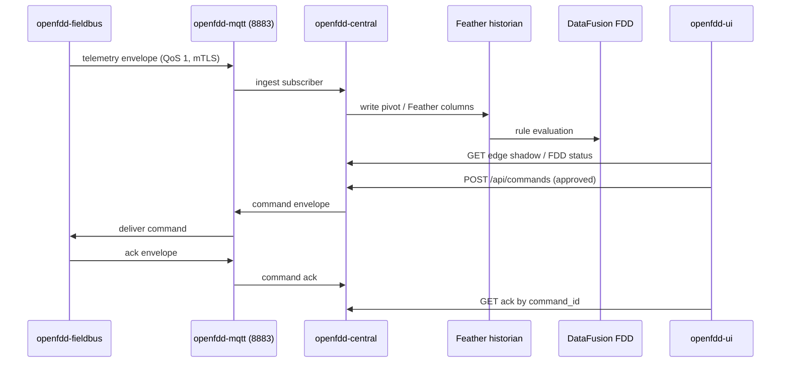

# Compose E2E: MQTTS → Feather → FDD → UI → command ack

End-to-end validation path for the Open-FDD central + fieldbus stack after atomic cutover. Use this as the rehearsal checklist before promoting `nightly` image tags.

## Topology



## Prerequisites

1. **Provision MQTT kits** (central + edge) — see `deploy/mqtt/README.md`.
2. **Pin coordinated image tags** — all four services share the same `sha-*` or semver tag (`docker/VERSION_MANIFEST.md`).
3. **Fieldbus config** — `config/fieldbus/` with hosted device 599999 objects in `objects.csv`.
4. **Workspace** — `OPENFDD_WORKSPACE` mounted for historian/FDD persistence.

## Compose path (standalone)

```bash
export OPENFDD_SITE_ID=local
export OPENFDD_EDGE_ID=fieldbus-1
export OPENFDD_EDGE_KIT_DIR="$PWD/deploy/mqtt/kits/${OPENFDD_SITE_ID}__${OPENFDD_EDGE_ID}"

# File + contract gates (no containers)
./scripts/gates/e2e_mqtts_smoke.sh

# Full path — requires Docker
docker compose -f docker/compose.standalone.yml up -d
```

## E2E steps (full path — `DOCKER_REQUIRED`)

| Step | Action | Pass criteria |
|------|--------|---------------|
| 1 | Fixture publish | Fieldbus emits telemetry on `openfdd/v1/sites/{site}/edges/{edge}/telemetry/bacnet` |
| 2 | Central ingest | `GET /api/ingest/stats` shows recent messages, no quarantine spike |
| 3 | Feather write | Historian pivot/Feather files updated under `workspace/data/historian/` |
| 4 | FDD run | `POST /api/fdd/run` completes; `GET /api/fdd/status` shows rule output |
| 5 | UI display | Dashboard shows edge online, point values, FDD results |
| 6 | Command ack | Approved command returns `accepted`/`executed` ack within TTL |

### 1. Fixture publish

Use fieldbus smoke fixtures or hosted-server points:

```bash
curl -fsS http://127.0.0.1:8081/api/health
# Optional: trigger poll / read via fieldbus local Swagger at http://127.0.0.1:8081/docs
```

Subscribe on central kit (debug):

```bash
mosquitto_sub -h 127.0.0.1 -p 8883 \
  --cafile deploy/mqtt/ca/ca.pem \
  --cert deploy/mqtt/kits/local__central/central.cert.pem \
  --key deploy/mqtt/kits/local__central/central.key.pem \
  -t 'openfdd/v1/sites/local/edges/+/telemetry/#' -v
```

### 2–3. Central ingest + Feather

```bash
curl -fsS http://127.0.0.1:8080/api/health
curl -fsS http://127.0.0.1:8080/api/ingest/stats
ls -la workspace/data/historian/
```

### 4. FDD

```bash
curl -fsS -X POST http://127.0.0.1:8080/api/fdd/run \
  -H 'Content-Type: application/json' \
  -d '{"dry_run": false}'
curl -fsS http://127.0.0.1:8080/api/fdd/status
```

### 5. UI

Open `http://127.0.0.1:3000` — verify login (when `OPENFDD_JWT_SECRET` set), edge fleet, and FDD panels.

### 6. Command + ack

```bash
curl -fsS -X POST http://127.0.0.1:8080/api/commands \
  -H 'Content-Type: application/json' \
  -H 'Authorization: Bearer <JWT>' \
  -d '{
    "edge_id": "fieldbus-1",
    "protocol": "bacnet",
    "target": "bacnet:599999:analog-value:9101",
    "value": 72.0,
    "approved": true
  }'
# Poll GET /api/commands/{command_id}/ack
```

## Negative checks (cutover gates)

- `./scripts/gates/run_all_gates.sh` — architecture, MQTT security, contracts, compose smoke
- `./scripts/migrate/dry_run_migration_report.sh` — no fatal 599999 hosting conflicts
- mTLS rejection: connect without client cert → broker refuses
- Duplicate `message_id` ingest → idempotent, no double-write

## Known gaps (optional hardware path)

- Live BACnet OT traffic (`scripts/fieldbus/bench_test.sh`) — run on bench NIC, not in CI
- Selenium UI rig (`tests/selenium/`) — separate from this compose scaffold
- Remote edge-only compose (`docker/compose.edge.yml`) — rehearse with outbound 8883 only

## Related scripts

| Script | Purpose |
|--------|---------|
| `scripts/gates/e2e_mqtts_smoke.sh` | No-docker scaffold: compose validate + gates |
| `scripts/migrate/backup_pre_cutover.sh` | Pre-cutover workspace backup |
| `scripts/migrate/dry_run_migration_report.sh` | Driver tree migration dry-run |
| `scripts/release/smoke_standalone_mqtts.sh` | File/provision smoke for standalone stack |
| `docs/central-fieldbus-cutover.md` | Atomic cutover + rollback runbook |
